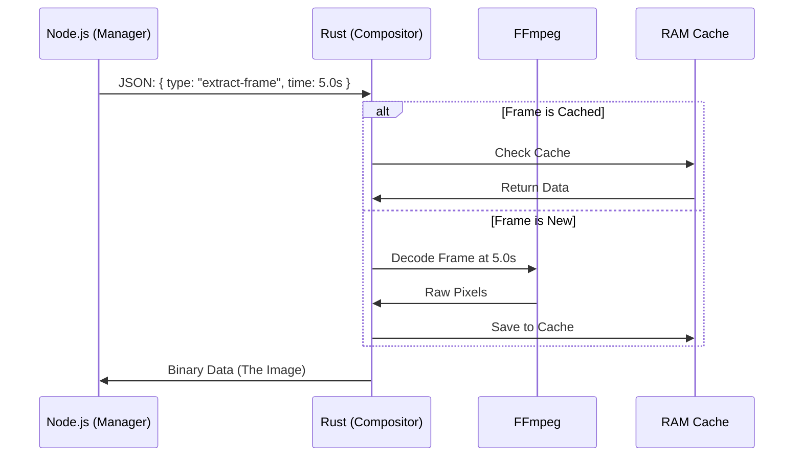

# Chapter 8: The Compositor (Rust)

In the previous chapter, [Media Analysis & Parsing](07_media_analysis___parsing.md), we learned how to read the "table of contents" of a video file to get its duration and metadata.

Knowing *about* a video is useful, but eventually, we need to see the pixels. We need to open a compressed MP4 file, find frame 105, and display it on the screen.

In the browser (Chapter 3), the `<video>` tag does this for us. But when we are rendering a video on a server (Chapter 5 and 6), or when we need high-performance processing, relying on standard web technologies can be slow or memory-intensive.

This is where **The Compositor** comes in.

## The Motivation

Imagine you are rendering a 4K video project. Inside your project, you have a `<Video>` element displaying a heavy file.

**The Problem:**
Node.js (the runtime used for rendering) is single-threaded. It is excellent at managing tasks, but it is not designed to perform the heavy mathematical calculations required to decompress video frames. If Node.js tries to decode 4K video, it might crash or take forever.

**The Solution:**
Remotion offloads this heavy lifting to a specialized backend written in **Rust**.
Rust is a systems programming language known for blazing speed and memory safety.

**The Analogy:**
Think of Node.js as the **Store Manager**. It knows where everything goes and tells people what to do.
Think of The Compositor (Rust) as the **Forklift Driver**. When the Manager says "Move that 2-ton crate," the Forklift Driver does the heavy lifting that the Manager physically cannot do.

## Key Concepts

### 1. The Sidecar Pattern
The Compositor is a standalone program (binary executable). It doesn't run *inside* your JavaScript code. Instead, Node.js starts the Compositor as a separate process and talks to it.

### 2. FFmpeg Integration
Video files are complex compressed containers. To read them, developers use a library called **FFmpeg**. The Compositor links directly to FFmpeg's internal C libraries to read video data as fast as the computer allows.

### 3. Smart Caching
Decoding a video frame takes time. If your animation loops and needs to show "Frame 10" five times, we don't want to decode it five times.
The Compositor keeps a **Frame Cache** in RAM. It remembers recently used images so they can be retrieved instantly.

## How It Works

You rarely interact with the Compositor directly. It works in the shadows. When you use the `<Video />` component in Remotion or render a video, Remotion automatically decides if it needs the Compositor's help.

### High-Level Flow

When the [The Rendering Engine](05_the_rendering_engine.md) needs a specific video frame to draw:

1.  **Node.js** sends a message: "I need Frame 100 of `video.mp4`."
2.  **The Compositor** checks its cache. If missing, it uses FFmpeg to decode the frame.
3.  **The Compositor** sends the raw pixel data back to Node.js.
4.  **Node.js** injects that image into the browser/Puppeteer to be photographed.

## Under the Hood

Let's look at how these two worlds communicate. They talk using **Standard Input/Output (stdio)**, sending JSON messages back and forth.



### Phase 1: The Manager (Node.js)

The file `compositor.ts` is responsible for launching the Rust binary. It uses Node's `spawn` function.

```ts
// packages/renderer/src/compositor/compositor.ts

// 1. Locate the binary file on the disk
const bin = getExecutablePath({ type: 'compositor', ... });

// 2. Spawn the "Forklift" process
const child = spawn(bin, [], {
  cwd: path.dirname(bin),
});

// 3. Listen for data coming back from Rust
child.stdout.on('data', (data) => {
  // Handle the image data received
  onMessage(data);
});
```

To send a command (like "Get Frame"), Node.js writes to the process's standard input.

```ts
// packages/renderer/src/compositor/compositor.ts

const executeCommand = (command, params) => {
  // Create a request with a unique ID (nonce)
  const payload = {
    nonce: makeNonce(), 
    payload: { type: command, params }
  };

  // Send it to Rust
  child.stdin.write(JSON.stringify(payload) + '\n');
};
```

### Phase 2: The Forklift (Rust Main Loop)

On the Rust side (`main.rs`), the program sits in a loop, waiting for instructions.

```rust
// packages/compositor/rust/main.rs

fn main() {
    // 1. Parse startup arguments
    let args = env::args();
    
    // 2. Configure memory limits (e.g., 2GB cache)
    let max_cache = get_ideal_maximum_frame_cache_size();

    // 3. Start the long-running process
    LongRunningProcess::new(max_cache).start();
}
```

The `LongRunningProcess` reads the JSON sent by Node.js and decides which function to call.

### Phase 3: The Heavy Lifting (FFmpeg)

If the command is `extract_frame`, `ffmpeg.rs` takes over. This is where the magic speed comes from.

```rust
// packages/compositor/rust/ffmpeg.rs

pub fn extract_frame(time: f64, src: String, ...) -> Result<Vec<u8>> {
    // 1. Ask the cache manager: "Do we have this?"
    if let Some(cached) = frame_cache_manager.get(time, src) {
        return Ok(cached);
    }

    // 2. If not, ask the Video Manager to decode it
    let video = manager.get_video(&src)?;
    
    // 3. Seek to the exact timestamp
    let position = calc_position(time, video.time_base);
    
    // 4. Decode and return pixels
    return manager.get_frame_id(position, ...);
}
```

### Phase 4: Memory Management

Since video frames are huge (uncompressed 4K is ~24MB per frame), we can't keep them all. `frame_cache.rs` manages this memory. It deletes old frames to make room for new ones.

```rust
// packages/compositor/rust/frame_cache.rs

pub fn add_item(&mut self, item: FrameCacheItem) {
    // 1. Add new frame to list
    self.items.push(item);
    
    // 2. Tell the global manager we used more RAM
    max_cache_size::add_to_current_size(item.size);

    // (Elsewhere, a cleanup function removes old items 
    // if we exceed the limit)
}
```

## Why This Matters for You

As a user, you benefit from the Compositor in three ways:

1.  **Speed:** Rendering happens much faster because Rust decodes video frames in parallel with Node.js running your logic.
2.  **Stability:** Large video files that would crash a pure JavaScript renderer are handled safely by Rust's memory management.
3.  **Features:** It enables advanced features like **Tone Mapping** (converting HDR video to standard colors) and supporting formats like ProRes, which browsers often struggle with.

## Conclusion

This concludes our journey through the architecture of Remotion!

We started with the basics of **React Primitives**, learned to move things with **Animation Utilities**, previewed them in **The Player** and **The Studio**, rendered them with **The Rendering Engine**, scaled up with **Serverless**, analyzed files with **Media Parsing**, and finally, saw how **The Compositor** accelerates the heavy lifting.

You now have a complete understanding of how Remotion turns a simple React component into a professional video engine.

**Happy Rendering!**

---

Generated by [Code IQ](https://github.com/adityasoni99/Code-IQ)