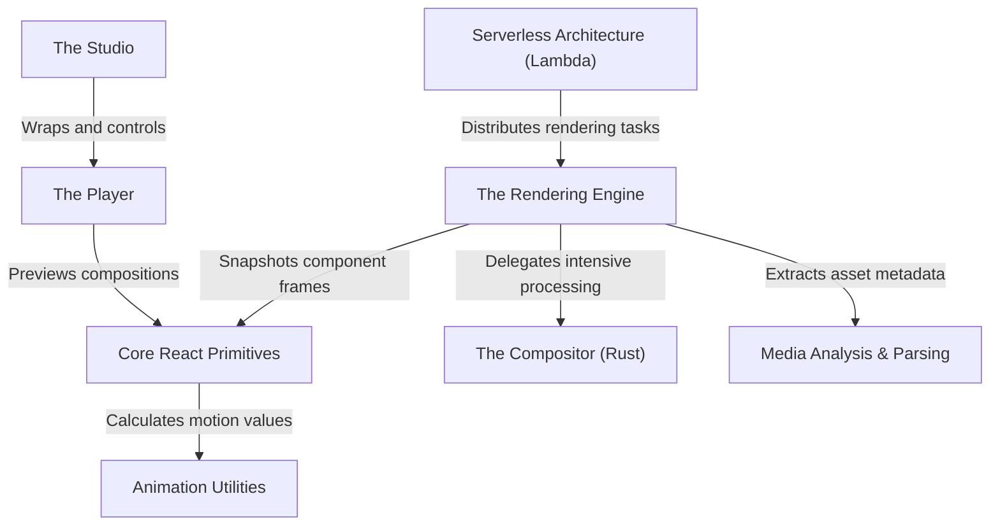

# Tutorial: remotion

Remotion is a toolkit that allows developers to create videos programmatically using **React**. Instead of using traditional video editing software, users write *code* to define sequences, compositions, and animations. The project includes a **Player** and **Studio** for previewing content in the browser, a **Rendering Engine** to generate actual video files (like MP4), and supports massive scaling via **Serverless** architecture.

**Source Repository:** [https://github.com/remotion-dev/remotion](https://github.com/remotion-dev/remotion)

## Chapters

1. [Core React Primitives](01_core_react_primitives.md)
2. [Animation Utilities](02_animation_utilities.md)
3. [The Player](03_the_player.md)
4. [The Studio](04_the_studio.md)
5. [The Rendering Engine](05_the_rendering_engine.md)
6. [Serverless Architecture (Lambda)](06_serverless_architecture__lambda_.md)
7. [Media Analysis & Parsing](07_media_analysis___parsing.md)
8. [The Compositor (Rust)](08_the_compositor__rust_.md)

---

Generated by [Code IQ](https://github.com/adityasoni99/Code-IQ)