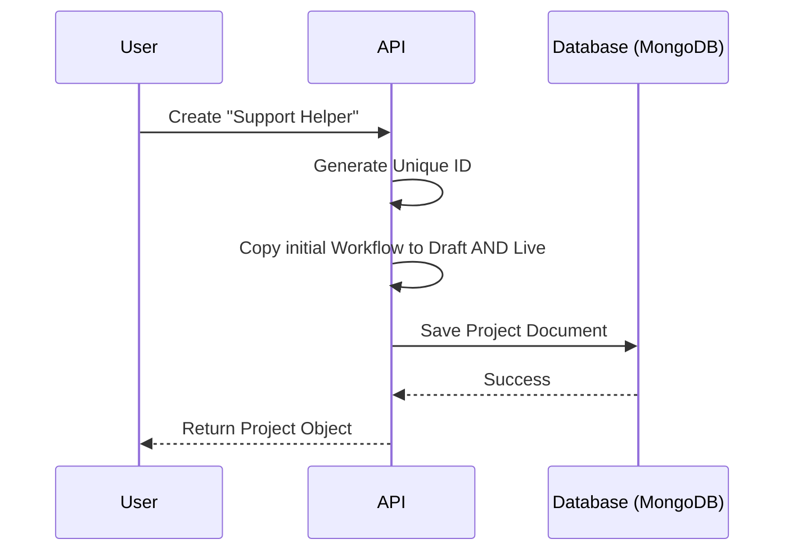

# Chapter 1: Project & Workflow Model (The Blueprint)

Welcome to the world of **rowboat**! 

If you want to build an AI teammate—someone who can handle emails, analyze data, or manage schedules—you can't just start typing code into a void. You need a structure to hold everything together.

In **rowboat**, that structure is the **Project**, and the instructions for how your AI behaves are called the **Workflow**.

This chapter covers the absolute foundation. Before we give our AI a brain or hands, we need to build its "house" and write its "job description."

### The Goal: A Customer Support Helper
Throughout this tutorial, imagine we are building a **Customer Support Helper**. We want this AI to eventually read support tickets and draft replies. 

In this chapter, we will create the container (The Project) for this helper and understand how to manage its configuration (The Workflow).

---

## 1. The Concept: The Container and The Blueprint

This system is built on two core ideas. Let's break them down using a construction analogy.

### The Project (The Container)
Think of a **Project** as the **physical office building**. 
- It has an address (ID).
- It has a sign on the door (Name).
- It has keys (Secrets/API Keys).
- It has owners (User IDs).

Without a Project, your AI has nowhere to live.

### The Workflow (The Blueprint)
Think of the **Workflow** as the **Employee Handbook** inside that building.
- It defines *who* works there (Agents).
- It defines *what* tools they use (Tools).
- It defines *when* they work (Triggers).

### The "Draft" vs. "Live" Safety Net
One of the coolest features of rowboat is that every project has **two** copies of the handbook:
1.  **Draft Workflow:** The version you are editing right now. You can scribble on it, tear out pages, and experiment.
2.  **Live Workflow:** The version that is currently running and doing actual work.

This allows you to safely make changes to your AI without breaking the version that is currently helping customers.

---

## 2. Defining the Model

Let's look at how we define a Project in code. We use a library called `Zod` to define the "shape" of our data (think of it as a bouncer checking IDs).

### The Project Shape
Here is a simplified view of the Project model. Notice how it holds two workflows side-by-side.

```typescript
// src/entities/models/project.ts
import { z } from "zod";

export const Project = z.object({
    id: z.string().uuid(),       // The unique address
    name: z.string(),            // "Customer Support Helper"
    secret: z.string(),          // API Key for external access
    
    // The two handbooks:
    draftWorkflow: Workflow,     // Where we make changes
    liveWorkflow: Workflow,      // What runs in production
});
```

**Explanation:**
When we load a project, we aren't just loading one set of instructions. We load the *state of the entire building*, including the safe-to-edit draft and the production-ready live version.

---

## 3. Under the Hood: Creating a Project

When you click "Create Project" in rowboat, what actually happens? 

We need to ensure that when a project is born, the "Draft" and "Live" versions start exactly the same.

### Sequence Diagram: Project Creation


### The Code Implementation
Let's look at the repository layer (the part of the code that talks to the database). This acts as the "Engine" ensuring our data is saved correctly.

```typescript
// src/infrastructure/repositories/mongodb.projects.repository.ts

async create(data: z.infer<typeof CreateSchema>) {
    const now = new Date();
    const id = crypto.randomUUID(); // Create a unique ID

    // We clone the workflow provided during creation
    const wflow = { ...data.workflow };

    // We assign the SAME workflow to both slots initially
    const doc = {
        ...data,
        _id: id,
        liveWorkflow: wflow,   // Production ready
        draftWorkflow: wflow,  // Ready for editing
    };

    await this.collection.insertOne(doc); // Save to MongoDB
    return { ...doc, id };
}
```

**Explanation:**
1.  We generate a `UUID` (a long, random string) so the project is unique.
2.  We take the initial configuration (`wflow`).
3.  We paste it into *both* `liveWorkflow` and `draftWorkflow`. This ensures the project starts in a synchronized state.

---

## 4. Editing the Blueprint (The Workflow)

Now that our project exists, we want to edit the "Draft" version. 

In the user interface, we need to decide which version to show the user. Are they in "Edit Mode" (Draft) or "View Mode" (Live)?

### Choosing the Workflow to Display
This logic happens in the frontend application. It determines which blueprint creates the interface.

```typescript
// apps/rowboat/app/projects/[projectId]/workflow/app.tsx

// ... inside the component ...
let workflow;

if (autoPublishEnabled) {
    // If auto-publish is on, we are always looking at the draft
    workflow = project?.draftWorkflow;
} else {
    // If manual mode, check if we want to see Live or Draft
    workflow = mode === 'live' ? project?.liveWorkflow : project?.draftWorkflow;
}
```

**Explanation:**
*   `autoPublishEnabled`: If this is true, every change you make is instantly live. We just show the draft because it's effectively the live version.
*   `mode === 'live'`: If you turned off auto-publish, you can toggle a switch to peek at what is currently running in production vs. what you are working on.

### Saving Changes
When you save changes to your agents or tools, you are only updating the `draftWorkflow`.

```typescript
// src/infrastructure/repositories/mongodb.projects.repository.ts

async updateDraftWorkflow(projectId: string, workflow: Workflow) {
    // We only touch the 'draftWorkflow' field in the database
    const result = await this.collection.findOneAndUpdate(
        { _id: projectId },
        {
            $set: {
                draftWorkflow: workflow, // Update ONLY the draft
                lastUpdatedAt: new Date().toISOString(),
            }
        }
    );
    return result;
}
```

**Explanation:**
This is the safety mechanism in action. Even if you accidentally delete all your agents in the draft, the `liveWorkflow` field in the database remains untouched, and your actual assistant keeps working.

---

## 5. What's Inside the Workflow?

We've talked about the Workflow as a "Handbook," but we haven't opened it yet. While we will dive deep into specific parts in later chapters, it's important to know that the Workflow connects everything together.

The Workflow configuration contains:
1.  **Agents:** The personalities (see [Agent Runtime (The Engine)](03_agent_runtime__the_engine_.md)).
2.  **Tools:** The capabilities (see [Tooling & MCP Integrations (The Hands)](04_tooling___mcp_integrations__the_hands_.md)).
3.  **Triggers:** What wakes the agents up (see [Event Stream (The Nervous System)](05_event_stream__the_nervous_system_.md)).

The **Project** is simply the box that holds this configuration secure and accessible.

---

## Conclusion

You have successfully laid the foundation!
1.  We created a **Project** (the container).
2.  We initialized a **Workflow** (the blueprint).
3.  We learned how **Draft vs. Live** modes protect our work.

But an empty office building isn't very useful. Our assistant needs to remember things—like files, past conversations, and facts—to be effective.

In the next chapter, we will give our project a brain.

[Next: Knowledge Graph & File System (The Memory)](02_knowledge_graph___file_system__the_memory_.md)

---

Generated by [Code IQ](https://github.com/adityasoni99/Code-IQ)