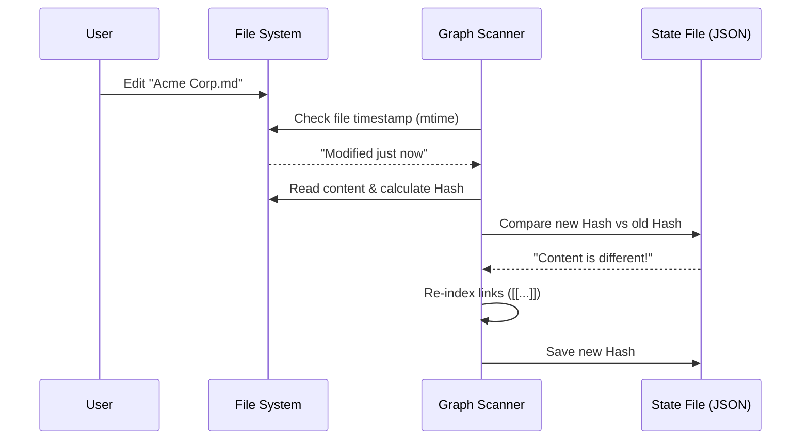

# Chapter 2: Knowledge Graph & File System (The Memory)

In [Chapter 1: Project & Workflow Model (The Blueprint)](01_project___workflow_model__the_blueprint_.md), we built the "office building" (The Project) and wrote the "employee handbook" (The Workflow).

But currently, our Customer Support Helper has a problem: **Amnesia**. 

Every time you start a new chat, the AI starts fresh. It doesn't know who your customers are, what happened in the last meeting, or that "Project X" was renamed to "Project Y."

Most AI tools solve this by hiding data in complex "vector databases" that you can't easily see or edit. **Rowboat** does something different. It gives the AI a **Filing Cabinet** that you can read, edit, and understand.

---

## 1. The Concept: Files as Memory

The core philosophy of Rowboat's memory is simple:
**Your data lives in Markdown files (`.md`) on your local disk.**

If the AI needs to remember something, it writes a file. If it needs to know something, it reads a file. 

### The Knowledge Graph
Just having a pile of files isn't enough. We need to know how they connect. Rowboat borrows a concept from tools like Obsidian or Roam Research called **WikiLinks**.

If you have a file called `Meeting Notes.md`, and you mention a client, you write it like this:
> We discussed the new contract with [[Acme Corp]].

Rowboat scans your files, sees `[[Acme Corp]]`, and understands that there is a **relationship** between `Meeting Notes` and `Acme Corp`. 

This network of files and links is the **Knowledge Graph**.

---

## 2. The Use Case: Remembering a Client

Let's say our Customer Support Helper receives an email from "Alice at Acme Corp." 

**Without Memory:**
> AI: "Who is Acme Corp?"

**With Rowboat Memory:**
1.  The AI checks the file system.
2.  It finds `knowledge/clients/Acme Corp.md`.
3.  It reads the file and sees previous support tickets linked there.
4.  It replies intelligently.

### How to Create Memory (The Code)
In Rowboat, creating memory is as simple as writing a file. We use an internal command called `workspace:writeFile`.

```typescript
// Example: Creating a memory file for a client
await window.ipc.invoke('workspace:writeFile', {
  path: 'knowledge/clients/Acme Corp.md',
  
  // The content is standard Markdown
  data: '# Acme Corp\n\nVIP Client since 2022.\nKey Contact: Alice.',
  
  opts: { encoding: 'utf8' }
});
```
**Explanation:**
This creates a real file on your hard drive. You can open this file in Notepad, VS Code, or Rowboat's built-in editor. It is not hidden inside a database.

---

## 3. Under the Hood: The "Brain" Scanner

How does Rowboat know when you've added a file or changed a note? It can't just guess; it needs to scan the "filing cabinet."

This process runs in the background to ensure the graph is always up to date.

### Sequence Diagram: Updating the Graph


---

## 4. Implementation: Change Detection

Scanning every single file every second would be too slow. Rowboat uses a smart system to check if a file has *actually* changed.

It uses two checks:
1.  **Modified Time (mtime):** Has the file been touched?
2.  **Content Hash:** Did the text actually change?

### The State Tracker
We store a small "receipt" for every file we've processed.

```typescript
// src/knowledge/graph_state.ts

export interface FileState {
    mtime: string; // Last time file was touched
    hash: string;  // Unique fingerprint of content
    lastProcessed: string; 
}
```

### Checking for Changes
Here is the logic that decides if a file needs to be re-read.

```typescript
// src/knowledge/graph_state.ts

export function hasFileChanged(filePath: string, state: GraphState): boolean {
    // 1. Check if the timestamp (mtime) is different
    const stats = fs.statSync(filePath);
    if (stats.mtime.toISOString() === state.processedFiles[filePath]?.mtime) {
        return false; // Fast exit: File hasn't been touched
    }

    // 2. If touched, calculate content fingerprint (Hash)
    const currentHash = computeFileHash(filePath);
    
    // Only return true if the actual text is different
    return currentHash !== state.processedFiles[filePath]?.hash;
}
```

**Explanation:**
1.  **Fast Check:** We look at the file's "Last Modified" date. If it's the same as the last time we looked, we do nothing.
2.  **Deep Check:** If the date changed, we calculate a "Hash" (a unique code based on the text). 
3.  This prevents the AI from re-reading files if you just opened and saved them without changing words.

---

## 5. Building the Relationships (The Links)

Once we know a file has changed, we need to find the connections. This happens in the application layer.

We scan the text for the special `[[WikiLink]]` pattern.

```typescript
// apps/renderer/src/App.tsx (Simplified Logic)

const wikiLinkRegex = /\[\[([^[\]]+)\]\]/g; // Matches [[Text]]

// Scan a file content for links
for (const match of fileContent.matchAll(wikiLinkRegex)) {
    const targetFile = match[1]; // e.g., "Acme Corp"
    
    // Create a connection (Edge)
    edges.push({ 
        source: currentFilePath, 
        target: targetFile 
    });
}
```

**Explanation:**
*   **Regex:** This is a pattern matcher that looks for anything inside double brackets `[[ ]]`.
*   **Edge:** In graph theory, an "edge" is the line connecting two dots. Here, it connects the `Meeting Note` to `Acme Corp`.

### Visualizing the Graph
The result of this process is passed to a visualizer (the `GraphView` component). 

*   **Nodes:** The files.
*   **Lines:** The WikiLinks found by the code above.

This allows the user to visually see clusters of information (e.g., all notes related to "Acme Corp" will cluster together).

---

## Conclusion

We have successfully given our project a memory system!

1.  **Storage:** Plain text Markdown files (Local & Private).
2.  **Structure:** A Knowledge Graph built using `[[WikiLinks]]`.
3.  **Efficiency:** A hashing system that only processes changed files.

Now that our AI has a "Project" to live in and "Memory" to reference, it's time to give it the ability to **think and act**.

In the next chapter, we will look at the brain that processes these files.

[Next: Agent Runtime (The Engine)](03_agent_runtime__the_engine_.md)

---

Generated by [Code IQ](https://github.com/adityasoni99/Code-IQ)