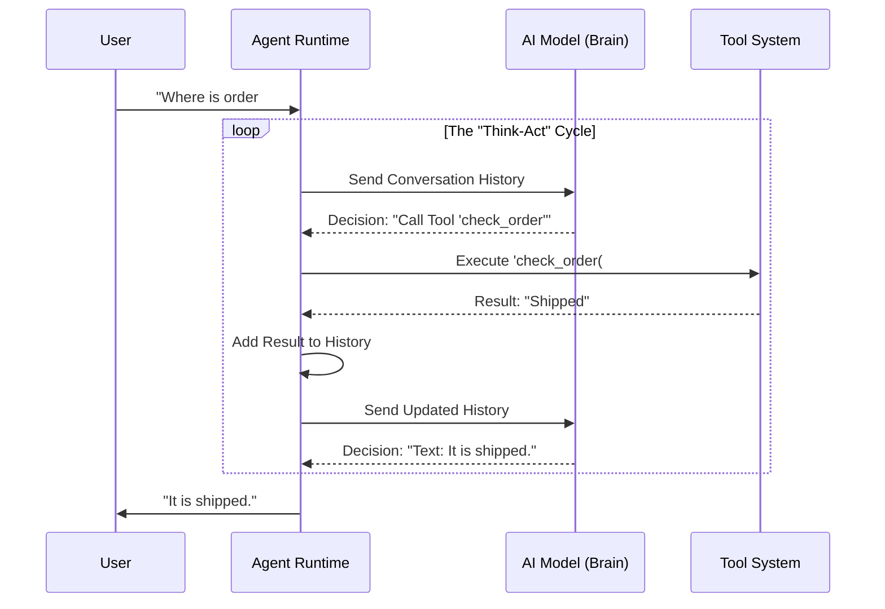

# Chapter 3: Agent Runtime (The Engine)

In [Chapter 2: Knowledge Graph & File System (The Memory)](02_knowledge_graph___file_system__the_memory_.md), we gave our Customer Support Helper a memory. In [Chapter 1: Project & Workflow Model (The Blueprint)](01_project___workflow_model__the_blueprint_.md), we built its office.

Now, we have a fully furnished office and a filing cabinet full of data, but the employee is just sitting there frozen. 

It needs a brain to process information, make decisions, and take action. In **rowboat**, this brain is called the **Agent Runtime**.

---

## 1. The Concept: The Loop

Most people think of AI as "Input Text -> Output Text." You ask a question, and ChatGPT gives an answer.

But an **Agent** is different. An Agent does not just talk; it **does things**. To do this, it runs in a loop, often called the **Think-Act-Observe Loop**.

### The "Turn-Based Game" Analogy
Imagine playing a board game.
1.  **Observe:** You look at the board (The State).
2.  **Think:** You decide on a move.
3.  **Act:** You move your piece or draw a card (Tools).
4.  **Repeat:** You look at the board again to see what changed.

The **Agent Runtime** is the engine that forces the AI to keep taking turns until the job is done.

---

## 2. The Use Case: Handling a Request

Let's look at our Customer Support Helper. 
**User:** "Where is my order #123?"

If this were a simple chatbot, it might hallucinate an answer. But our **Agent Runtime** follows a strict process:

1.  **Cycle 1 (Think):** The AI analyzes the request. It realizes it doesn't know the answer, but it has a tool called `check_order_status`. It decides to use it.
2.  **Cycle 1 (Act):** The Runtime executes the tool `check_order_status("123")`.
3.  **Cycle 2 (Think):** The tool returns "Shipped". The AI looks at this new fact.
4.  **Cycle 2 (Act):** The AI decides it has enough info. It generates text: "Your order has been shipped."
5.  **Stop:** The loop ends.

---

## 3. The Core Object: Agent State

Before the engine can run, it needs to know the "score" of the game. We call this the **State**.

The State tracks everything that has happened in the current conversation (the "Run").

```typescript
// src/agents/runtime.ts (Simplified)

export class AgentState {
    runId: string | null = null;
    agentName: string | null = null;
    
    // The history of the conversation (User, AI, and Tool outputs)
    messages: MessageList = []; 
    
    // Tracking pending actions
    pendingToolCalls: Record<string, true> = {};
}
```

**Explanation:**
*   `messages`: This is the transcript. It grows every time the user speaks, the AI speaks, or a tool returns data.
*   `pendingToolCalls`: If the AI decides to pull a lever, we mark it here until the lever is actually pulled.

---

## 4. Under the Hood: The Execution Loop

How does the engine actually drive the car? It uses a function called `streamAgent`. 

This is a simplified view of the logic flow:



---

## 5. Implementation: The Code

Let's look at the actual code in `src/agents/runtime.ts` that powers this loop. We will break it down into small, digestible chunks.

### Step A: The Loop Structure
The engine runs endlessly (`while (true)`) until the AI decides it is finished or needs human help.

```typescript
// src/agents/runtime.ts

// Inside streamAgent function...
while (true) {
    // 1. Check if we need to stop (e.g., waiting for user permission)
    if (state.getPendingPermissions().length) {
        return; 
    }

    // 2. Execute any tools the AI requested in the previous turn
    // (See Chapter 4 for details on Tools)
    yield* executePendingTools(state); 
    
    // ... logic continues below ...
}
```

**Explanation:**
The loop starts by checking: "Did we decide to do something last time that we haven't finished yet?" If so, it does it.

### Step B: The "Thinking" (Calling the LLM)
If there are no tools to run, we ask the LLM what to do next.

```typescript
// src/agents/runtime.ts

// We use the 'streamText' function from the Vercel AI SDK
const { fullStream } = streamText({
    model: model,                // The specific brain (e.g., GPT-4, Claude)
    messages: state.messages,    // The conversation history
    system: agent.instructions,  // The "Job Description" from Chapter 1
    tools: tools,                // The available hands
});
```

**Explanation:**
*   We bundle up the entire history (`state.messages`) and the Agent's instructions.
*   We send this to the AI provider.
*   The AI returns a stream of events (text or tool calls).

### Step C: Handling the Decision
We listen to what the AI says and update our `State`.

```typescript
// src/agents/runtime.ts

for await (const event of fullStream) {
    if (event.type === "tool-call") {
        // The AI wants to use a tool!
        // We record this intent in our State.
        state.ingest({
            type: "message",
            message: { role: "assistant", content: [event] }
        });
    }
    // If event.type is "text-delta", it's just talking to the user.
}
```

**Explanation:**
This is the critical moment. 
*   If the AI says "Hello!", we show it to the user.
*   If the AI says "Run Query," we **don't** show the user yet. We save that intent into the state so the *next* iteration of the loop can execute it.

---

## 6. Managing Safety (The Stop Switch)

An autonomous loop sounds dangerous. What if the AI deletes all your files?

The Runtime has built-in safety checks. Before executing a sensitive tool, it pauses the loop and asks for permission.

```typescript
// src/agents/runtime.ts

// If a command is blocked (unsafe), we emit a permission request
if (isBlocked(part.arguments.command)) {
    yield* processEvent({
        type: "tool-permission-request",
        toolCall: part,
    });
    // The loop will pause here in the next iteration
}
```

**Explanation:**
Instead of acting immediately, the Runtime raises a flag: "I want to delete a file. Is that okay?" 
It then **exits the loop** and waits for the user to click "Approve" in the UI. When approved, the loop restarts.

---

## Conclusion

The **Agent Runtime** is the heartbeat of your application.
1.  It maintains the **State** (History).
2.  It runs the **Loop** (Think -> Act -> Observe).
3.  It manages **Safety** (Permissions).

However, the Runtime is useless if the Agent doesn't have any ways to interact with the world. Currently, our Agent can "think" about checking an order, but it doesn't have the "hands" to actually do it.

In the next chapter, we will build those hands.

[Next: Tooling & MCP Integrations (The Hands)](04_tooling___mcp_integrations__the_hands_.md)

---

Generated by [Code IQ](https://github.com/adityasoni99/Code-IQ)