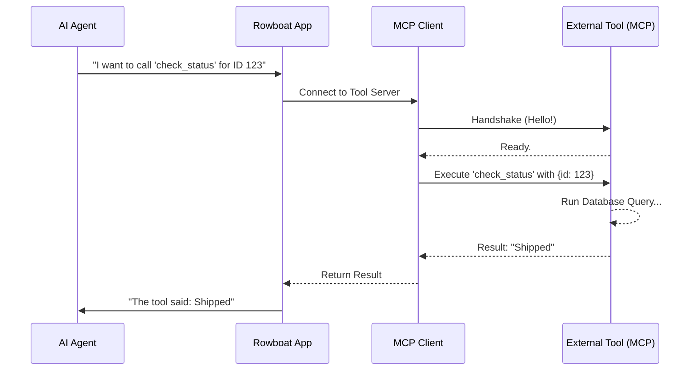

# Chapter 4: Tooling & MCP Integrations (The Hands)

In [Chapter 3: Agent Runtime (The Engine)](03_agent_runtime__the_engine_.md), we built the brain of our AI. We saw how the agent loops through a "Think-Act-Observe" cycle.

However, we left one major question unanswered: **How does the AI actually "Act"?**

Right now, our Customer Support Helper is like a genius trapped in a glass box. It can *think* "I should refund this order," but it cannot reach the "Refund" button in your database.

In this chapter, we will break the glass. We will give the agent **Tools**—the digital hands it needs to interact with the outside world.

---

## 1. The Concept: Breaking the Text Barrier

Large Language Models (LLMs) have a limitation: **They only output text.** They cannot run code, send emails, or query databases directly.

To solve this, we use a trick called **Tool Calling**.

### The "Restaurant Order" Analogy
Imagine the AI is a customer in a restaurant, and the "Tool" is the kitchen.

1.  **The Menu (Tool Definition):** You give the AI a list of things it can order.
    *   *Tool Name:* `send_email`
    *   *Required Inputs:* `to_address`, `subject`, `body`
2.  **The Order (The Trigger):** The AI says, "I would like to order one `send_email` for `alice@example.com`."
3.  **The Kitchen (The Execution):** **Rowboat** takes that order, goes to the kitchen (the code), makes the sandwich (sends the email), and brings the result back to the table.

### The Universal Standard: MCP
In the past, connecting tools was messy. Every tool (Slack, Github, Google Drive) needed custom glue code.

**Rowboat** uses the **Model Context Protocol (MCP)**.
Think of MCP like a **USB port** for AI.
*   You don't need to solder wires to connect a mouse to your computer; you just plug it in.
*   With MCP, you don't write custom glue code for every tool; you just "plug in" an MCP Server.

---

## 2. The Use Case: Checking Order Status

Let's return to our **Customer Support Helper**. A user asks: *"Where is my package?"*

We want the AI to:
1.  Recognize it needs to check the database.
2.  Use a tool called `check_order_status`.
3.  Get the result ("Shipped").
4.  Tell the user.

### Defining the Connection
In **rowboat**, we don't write the tool logic inside the agent itself. We connect the Project to an **MCP Server** that hosts the tools.

Here is how a Project stores a connection to a custom tool server.

```typescript
// src/entities/models/project.ts (Simplified)

export const CustomMcpServer = z.object({
    url: z.string().url(),   // Where the tools live (e.g. localhost:3000)
    name: z.string(),        // "Order Database Tools"
    status: z.enum(["connected", "disconnected"]),
});
```

**Explanation:**
The Project simply holds the "address" (`url`) of where the tools are located. It acts as the bridge between the AI's brain and the external server handling the logic.

---

## 3. Under the Hood: The Handshake

How does Rowboat actually talk to these external tools? It happens in two steps: **Connection** and **Execution**.

Let's look at the flow when an agent decides to use a tool.

### Sequence Diagram: Using a Tool


---

## 4. Implementation: Connecting the Wires

How do we establish that connection in code? We use the official MCP SDK.

Rowboat is smart—it tries modern connection methods first, but falls back to older ones if needed. This ensures maximum compatibility.

### The Connection Logic
This function is responsible for "plugging in the cable."

```typescript
// apps/rowboat/app/lib/mcp.ts

export async function getMcpClient(url: string, name: string) {
    const baseUrl = new URL(url);

    // Attempt 1: Try the modern "Streamable HTTP" method
    try {
        const client = new Client({ name: 'rowboat', version: '1.0' });
        const transport = new StreamableHTTPClientTransport(baseUrl);
        
        await client.connect(transport); // Try to plug in
        return client;
    } catch (error) {
        // If that fails, go to Attempt 2...
    }
}
```

**Explanation:**
We try to connect via `StreamableHTTPClientTransport`. This is like a high-speed data cable. It allows the tool to send data back in chunks (useful if the tool is writing a long report).

### The Fallback (Safety Net)
If the high-speed connection fails (maybe the tool server is older), we switch to a standard connection.

```typescript
// apps/rowboat/app/lib/mcp.ts (Continued)

    // Attempt 2: Fallback to Server-Sent Events (SSE)
    console.log(`[MCP] Falling back to SSE for ${name}`);
    
    const client = new Client({ name: 'rowboat', version: '1.0' });
    const transport = new SSEClientTransport(baseUrl);
    
    await client.connect(transport); // Plug in using older standard
    return client;
}
```

**Explanation:**
`SSE` (Server-Sent Events) is a standard web technology. By supporting both, Rowboat ensures it can talk to almost any MCP-compliant tool builder.

---

## 5. Managing Tools in the Project

In [Chapter 1: Project & Workflow Model (The Blueprint)](01_project___workflow_model__the_blueprint_.md), we learned that the Project acts as a container. Now, we use the Repository to store our list of available tools.

We can add **Custom MCP Servers** (your own code) or **Composio Accounts** (pre-built integrations like Gmail or GitHub).

### Adding a Custom Tool Server
```typescript
// src/infrastructure/repositories/projects.repository.ts

async addCustomMcpServer(projectId: string, data: ServerData) {
    // Find the project and push the new server to the list
    return await this.collection.findOneAndUpdate(
        { _id: projectId },
        { 
            $push: { "integrations.mcpServers": data } 
        }
    );
}
```
**Explanation:**
This saves the configuration. The next time the Agent Runtime (Chapter 3) starts a loop, it will look at this list, connect to the servers, and tell the AI: *"Hey, you now have the ability to use these tools."*

---

## 6. How the AI "Sees" the Tools

You might wonder: "Does the AI see the code?"
No. The AI sees a **Schema** (a description).

When Rowboat connects to the MCP server, it asks: *"What can you do?"*
The server replies with a JSON list like this:

```json
[
  {
    "name": "check_order_status",
    "description": "Look up an order by ID to see if it shipped.",
    "inputSchema": {
      "type": "object",
      "properties": {
        "orderId": { "type": "string" }
      }
    }
  }
]
```

Rowboat feeds this definition into the AI's context. The AI reads the description ("Look up an order...") and decides when to use it based on the user's conversation.

---

## Conclusion

We have successfully given our agent "Hands"!

1.  **The Concept:** Tools allow the text-based AI to trigger code execution.
2.  **The Standard:** We use **MCP** (Model Context Protocol) as a universal plug for these tools.
3.  **The Code:** We implemented a robust client that connects to these tool servers using HTTP or SSE.

Now our agent can **Think** (Runtime), **Remember** (Memory), and **Act** (Tools).

But currently, the agent only acts when *we* talk to it first. It sits idle until a human types a message. A true assistant should be able to wake up when an email arrives or when a scheduled time is reached.

In the next chapter, we will give the agent a "Nervous System" to feel the world around it.

[Next: Event Stream (The Nervous System)](05_event_stream__the_nervous_system_.md)

---

Generated by [Code IQ](https://github.com/adityasoni99/Code-IQ)