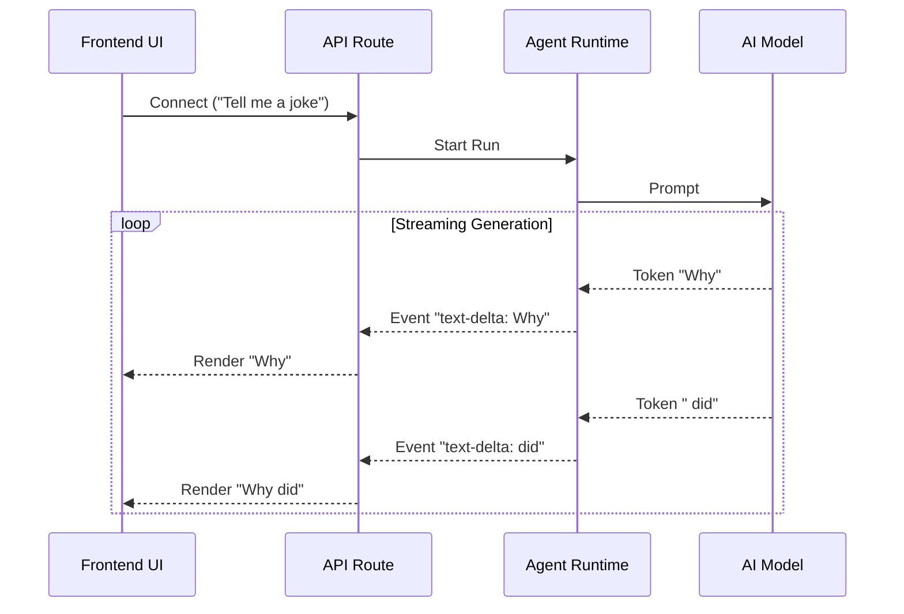

# Chapter 5: Event Stream (The Nervous System)

In [Chapter 4: Tooling & MCP Integrations (The Hands)](04_tooling___mcp_integrations__the_hands_.md), we gave our agent the ability to interact with the world using tools. In [Chapter 3: Agent Runtime (The Engine)](03_agent_runtime__the_engine_.md), we built the brain that decides when to use those tools.

But we have a user experience problem.

When you ask an AI to "Search for my order and draft an email," that process might take 10 or 20 seconds. If the application just freezes and waits for the entire job to finish, the user will think it's broken.

We need a way to send **live updates**—to show the AI typing, thinking, and working in real-time. In **rowboat**, we call this the **Event Stream**, acting as the nervous system that carries signals from the brain to the user interface instantly.

---

## 1. The Concept: Streaming vs. Waiting

To understand why we need an event stream, let's use a coffee shop analogy.

### The "Waiting" Model (Standard HTTP)
1.  You order a coffee.
2.  You stand at the counter in silence for 5 minutes.
3.  Suddenly, the barista hands you a finished cup.
4.  **Problem:** You don't know if they forgot you or if they are working.

### The "Streaming" Model (Event Stream)
1.  You order a coffee.
2.  Barista: "Grinding beans..." (Event 1)
3.  Barista: "Steaming milk..." (Event 2)
4.  Barista: "Pouring..." (Event 3)
5.  Barista: "Here is your coffee." (Finish)
6.  **Benefit:** You feel connected to the process.

In **rowboat**, we don't wait for the full answer. We stream **Events** the moment they happen.

---

## 2. The Anatomy of an Event

An "Event" is a small packet of information. It tells the frontend exactly what just happened inside the brain.

Here are the three most common events our nervous system carries:

1.  **Text Delta:** "The AI just generated the letter 'H'." (Then 'e', then 'l', then 'l', then 'o').
2.  **Tool Call:** "The AI wants to use the `check_order` tool."
3.  **Tool Result:** "The tool returned 'Order Shipped'."

### The JSON Structure
Here is what a single "pulse" in the nervous system looks like. This is a text delta event:

```json
{
  "type": "llm-stream-event",
  "event": {
    "type": "text-delta",
    "delta": "Hello"
  }
}
```

The frontend collects these tiny pieces and glues them together to form words and sentences.

---

## 3. Server-Side: creating the Stream

How do we send data continuously without closing the connection? We use a web standard called **Server-Sent Events (SSE)**.

In our API code, instead of returning a JSON object, we return a `ReadableStream`.

### The Code: sending the Signals
This logic lives in the API route that handles chat messages.

```typescript
// apps/rowboat/app/api/v1/[projectId]/chat/route.ts

// 1. Create a Stream
const readableStream = new ReadableStream({
    async start(controller) {
        const encoder = new TextEncoder();

        // 2. Loop through events generated by the Agent Runtime
        for await (const event of response.stream) {
            
            // 3. Format as SSE (data: {...})
            const message = `data: ${JSON.stringify(event)}\n\n`;
            
            // 4. Send it down the wire immediately
            controller.enqueue(encoder.encode(message));
        }
        controller.close();
    },
});
```

**Explanation:**
*   `response.stream`: This connects to the [Agent Runtime (The Engine)](03_agent_runtime__the_engine_.md). As the engine thinks, it yields events.
*   `controller.enqueue`: This pushes the data to the user *right now*, without waiting for the loop to finish.

---

## 4. Under the Hood: The Flow of Information

Let's visualize how a single letter travels from the LLM (Large Language Model) to your screen.



This loop happens dozens of times per second, creating the illusion of smooth typing.

---

## 5. Client-Side: Listening to the Stream

On the frontend (the user interface), we need to "open our ears" to listen to this stream. We use the browser's built-in `EventSource` API.

### Step A: Connecting
We open a connection to the server.

```typescript
// apps/rowboatx/app/page.tsx

useEffect(() => {
    // 1. Open the connection line
    const eventSource = new EventSource("/api/stream");
    
    // 2. Listen for messages
    eventSource.addEventListener('message', (e) => {
        const event = JSON.parse(e.data);
        handleEvent(event); // Process the signal
    });

    return () => eventSource.close(); // Clean up
}, []);
```

### Step B: Reassembling the Puzzle
When `handleEvent` receives a text delta, it appends it to what is already on screen.

```typescript
// Inside handleEvent function...

if (llmEvent.type === 'text-delta') {
    // Take the previous text and add the new piece
    setCurrentAssistantMessage(prev => prev + llmEvent.delta);
    
    // Tell the UI we are currently streaming
    setStatus('streaming');
}
```

**Explanation:**
*   **Previous:** "Why did the chicken cr"
*   **Delta:** "oss"
*   **Result:** "Why did the chicken cross"

### Step C: Handling Tools
If the event isn't text, but a **Tool Call**, we show a different UI element (like a spinner or a card).

```typescript
// Inside handleEvent function...

else if (llmEvent.type === 'tool-call') {
    // Add a "Tool Block" to the chat history
    setConversation(prev => [...prev, {
        type: 'tool',
        name: llmEvent.toolName, // e.g., "check_status"
        status: 'running',       // Show spinner
    }]);
}
```

This is how **rowboat** visualizes the "Thinking" process described in [Chapter 3](03_agent_runtime__the_engine_.md).

---

## 6. The Result: A Living Interface

By implementing this Nervous System, we transform a static request-response cycle into a living conversation.

1.  **Instant Feedback:** The user sees the AI acknowledge the request immediately.
2.  **Transparency:** The user sees *which* tools are being used.
3.  **Resilience:** If the AI errors out halfway through, the user sees the partial response instead of a generic timeout error.

---

## Conclusion

You have now seen the full cycle of the **rowboat** architecture!

1.  **Project:** The container.
2.  **Memory:** The storage.
3.  **Runtime:** The brain.
4.  **Tools:** The hands.
5.  **Event Stream:** The nervous system connecting it all.

We have all the raw materials to build amazing assistants. But building agents from scratch (writing prompts, configuring tools) is hard work. Wouldn't it be nice if we had an AI **to help us build the AI**?

In the final chapter, we will meet **Copilot**—the meta-agent that lives inside Rowboat to help you build.

[Next: Copilot (The Builder Agent)](06_copilot__the_builder_agent_.md)

---

Generated by [Code IQ](https://github.com/adityasoni99/Code-IQ)