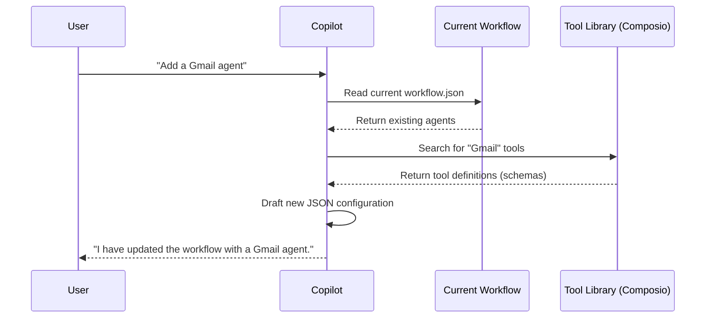

# Chapter 6: Copilot (The Builder Agent)

In [Chapter 5: Event Stream (The Nervous System)](05_event_stream__the_nervous_system_.md), we connected our agent's brain to the user interface, allowing for real-time interaction. Before that, we built the [Agent Runtime (The Engine)](03_agent_runtime__the_engine_.md) and gave it [Tooling & MCP Integrations (The Hands)](04_tooling___mcp_integrations__the_hands_.md).

We have all the pieces to run a powerful AI assistant. But there is one final hurdle: **Configuration**.

Writing the JSON configuration for a complex Workflow—defining agents, linking triggers, and configuring tool schemas—is difficult and error-prone. One missing comma can break the whole project.

Wouldn't it be easier if we could just *ask* someone to write the configuration for us?

Enter the **Copilot**.

---

## 1. The Concept: The Senior Architect

The Copilot is a **Meta-Agent**. This means it is an AI Agent whose job is to build *other* AI Agents.

Think of the Copilot as a **Senior Architect**.
*   **You (The Client):** "I want a kitchen with a big island and a gas stove."
*   **Copilot (The Architect):** Knows the building codes, knows where the pipes go, and draws the precise blueprints (JSON) for the construction crew.

Instead of you manually editing the "Blueprint" (The Workflow from [Chapter 1](01_project___workflow_model__the_blueprint_.md)), you chat with the Copilot, and it edits the file for you.

---

## 2. The Use Case: "Build me a Sales Rep"

Imagine you want to add a new agent to your project that checks emails for leads.

**Without Copilot:**
You have to find the documentation for the Gmail tool, copy the schema, open `workflow.json`, create a new agent object, paste the tool, and ensure the IDs match.

**With Copilot:**
You simply type:
> "Create a new agent named 'Sales Rep'. Give it access to Gmail to read emails."

The Copilot will:
1.  Read your current Workflow.
2.  Search for the correct Gmail tool definition.
3.  Write the JSON configuration to add the agent.

---

## 3. Under the Hood: The Builder's Loop

The Copilot works differently than a standard chat agent. It needs to be aware of the *structure* of your project.

Here is how the Copilot processes a request:



---

## 4. Implementation: Feeding the Context

The most important part of the Copilot is context. If it doesn't know what your project currently looks like, it might overwrite your existing work.

We inject the current state of the project directly into the prompt before sending it to the AI.

### The Context Injector
Located in `src/application/lib/copilot/copilot.ts`, this function prepares the "brief" for the Architect.

```typescript
// src/application/lib/copilot/copilot.ts

function getCurrentWorkflowPrompt(workflow: Workflow): string {
    // We convert the entire JSON workflow into a string
    // This allows the AI to "read" the current blueprint
    return `Context:\n\nThe current workflow config is:
\`\`\`json
${JSON.stringify(workflow)}
\`\`\`
`;
}
```

**Explanation:**
When you send a message, we secretly stick your entire project configuration at the top. This ensures the Copilot knows that "Agent A" already exists and "Agent B" is what needs to be added.

### The System Prompt
The Copilot also needs to know the *rules* of the system (e.g., "Agents must have unique IDs"). We load this into a `SYSTEM_PROMPT`.

```typescript
// src/application/lib/copilot/copilot.ts

const SYSTEM_PROMPT = [
    COPILOT_INSTRUCTIONS_MULTI_AGENT, // The rulebook
    CURRENT_WORKFLOW_PROMPT,          // The current state
].join('\n\n');
```

---

## 5. Implementation: The Copilot's Own Tools

Ideally, the Copilot shouldn't guess tool definitions. If it guesses the inputs for `gmail_send_email`, it might get them wrong.

We give the Copilot its own set of tools (Meta-Tools) to look up information.

### Searching for Tools
The Copilot uses a tool called `search_relevant_tools` to find real integrations (like Composio).

```typescript
// src/application/lib/copilot/copilot.ts

tools: {
    "search_relevant_tools": tool({
        description: "Use this to find tools like Gmail, Slack, etc...",
        parameters: z.object({ query: z.string() }),
        
        execute: async ({ query }) => {
            // 1. Search the external library (Composio)
            const result = await searchRelevantTools(usageTracker, query);
            
            // 2. Return the accurate JSON schema for the tool
            return result;
        },
    }),
    // ... other tools like search_triggers
},
```

**Explanation:**
1.  The User asks for "Gmail".
2.  The Copilot triggers `search_relevant_tools("Gmail")`.
3.  The code calls the Composio API.
4.  The API returns the *exact* technical definition of the Gmail tool.
5.  The Copilot puts that exact definition into your workflow.

---

## 6. Implementation: Streaming the Architect's Thoughts

Just like in [Chapter 5](05_event_stream__the_nervous_system_.md), we stream the Copilot's response so the user can see what's happening.

```typescript
// src/application/lib/copilot/copilot.ts

export async function* streamMultiAgentResponse(...) {
    // 1. Prepare the AI call with context and tools
    const { fullStream } = streamText({
        model: openai('gpt-4'),
        messages: updatedMessages, // Includes workflow context
        tools: copilotTools,       // Includes tool search
        system: SYSTEM_PROMPT,
    });

    // 2. Yield events as they happen
    for await (const event of fullStream) {
        if (event.type === "text-delta") {
            yield { content: event.textDelta }; // Talking to user
        } 
        else if (event.type === "tool-call") {
            yield { type: 'tool-call', ... };   // Searching for tools
        }
    }
}
```

**Explanation:**
This function is the heartbeat of the Copilot. It orchestrates the conversation, giving the AI the ability to pause, search for tools, and then continue writing the configuration.

---

## 7. The User Experience

On the frontend, this looks like a chat box, but it is actually a **Command Center**.

When the Copilot finishes generating the new configuration, the UI updates the "Draft Workflow" (remember [Chapter 1](01_project___workflow_model__the_blueprint_.md)?).

The user sees the changes appear visually in the graph or list view, verifies them, and then hits "Publish" to move them to the Live Workflow.

---

## Conclusion

We have reached the end of our journey!

In this chapter, we built **Copilot**, the intelligent layer that sits on top of everything else. It uses:
1.  The **Project Model** to understand the current state.
2.  **Tools** to discover new capabilities.
3.  **Streaming** to provide a smooth user experience.

### Tutorial Summary
You have now walked through the entire architecture of **rowboat**:

1.  **[Project & Workflow](01_project___workflow_model__the_blueprint_.md):** The blueprint and container.
2.  **[Knowledge Graph](02_knowledge_graph___file_system__the_memory_.md):** The file-based memory system.
3.  **[Agent Runtime](03_agent_runtime__the_engine_.md):** The thinking loop.
4.  **[Tooling & MCP](04_tooling___mcp_integrations__the_hands_.md):** The ability to act on the world.
5.  **[Event Stream](05_event_stream__the_nervous_system_.md):** The real-time feedback loop.
6.  **Copilot:** The builder that makes it all easy to use.

You are now ready to build powerful, autonomous agents. Happy building!

---

Generated by [Code IQ](https://github.com/adityasoni99/Code-IQ)