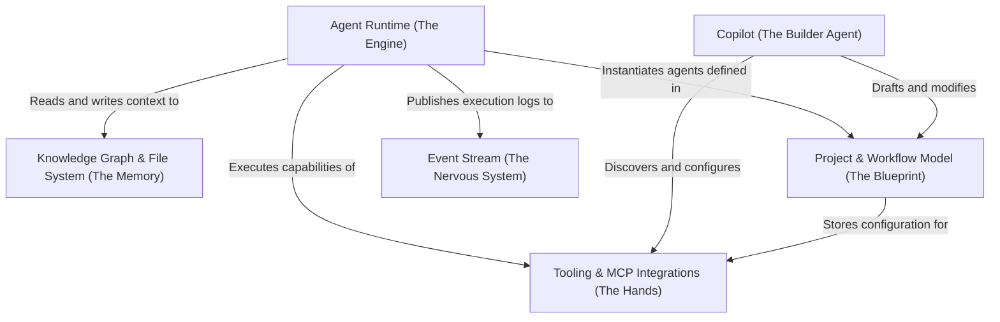

# Tutorial: rowboat

Rowboat is an open-source, **local-first AI coworker** that turns your file system into a structured **Knowledge Graph** stored in plain Markdown. It features an intelligent **Agent Runtime** that executes tasks and manages context, a **Copilot** meta-agent that helps users build and modify assistant configurations using natural language, and a real-time **Event Stream** system to visualize the AI's thought process and *tool interactions*.

**Source Repository:** [https://github.com/rowboatlabs/rowboat](https://github.com/rowboatlabs/rowboat)

## Chapters

1. [Project & Workflow Model (The Blueprint)](01_project___workflow_model__the_blueprint_.md)
2. [Knowledge Graph & File System (The Memory)](02_knowledge_graph___file_system__the_memory_.md)
3. [Agent Runtime (The Engine)](03_agent_runtime__the_engine_.md)
4. [Tooling & MCP Integrations (The Hands)](04_tooling___mcp_integrations__the_hands_.md)
5. [Event Stream (The Nervous System)](05_event_stream__the_nervous_system_.md)
6. [Copilot (The Builder Agent)](06_copilot__the_builder_agent_.md)

---

Generated by [Code IQ](https://github.com/adityasoni99/Code-IQ)