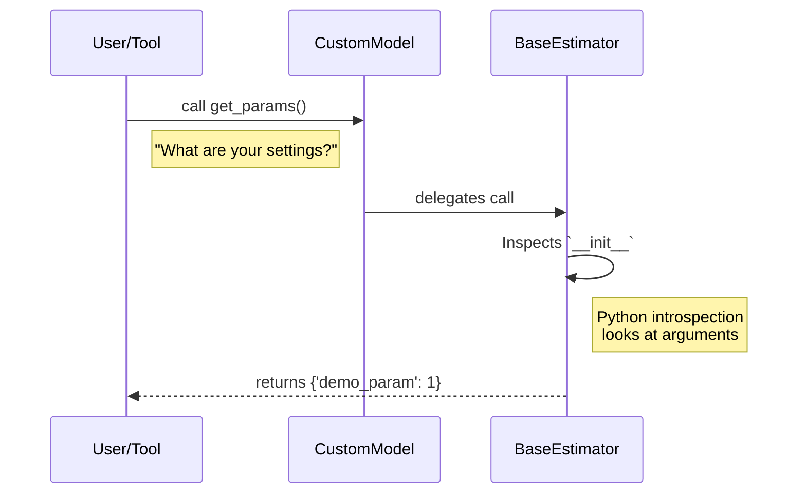

# Chapter 1: Base API

Welcome to the first chapter of your journey into **scikit-learn**!

Before we start building complex machine learning models, we need to understand the foundation they are built upon. In scikit-learn, this foundation is called the **Base API**.

## Motivation: The Universal Plug

Imagine you invented a new type of toaster. If you want people to use it in their homes, you must put a standard electrical plug on it. If you use a custom, weirdly shaped plug, it won't fit into the wall socket, and your toaster is useless.

In scikit-learn, the library provides many powerful tools (like "sockets") that automate training, testing, and tuning.
*   **The Problem:** If you write a machine learning algorithm from scratch, it won't automatically work with these tools.
*   **The Solution:** The **Base API**. It acts as the standard "plug." By following a few simple rules (inheriting from specific classes), your custom model becomes compatible with the entire ecosystem, including [Pipelines](10_pipelines.md) and model selection tools.

### Our Use Case
We want to build a very simple custom classifier called `MajorityClassifier`. It doesn't use complex math; it just learns which class is most common in the training data and predicts that class for everything. We will build this using the Base API to ensure it behaves exactly like a professional scikit-learn model.

## Key Concepts

The Base API helps us organize our code into a standard structure. Here are the building blocks:

1.  **Estimator:** Any object that learns from data. It's the general term for a model.
2.  **BaseEstimator:** The parent class (the blueprint). It gives your model free superpowers, like the ability to save and load its own settings (parameters).
3.  **Mixins:** These are "add-ons" based on what your model does.
    *   **ClassifierMixin:** For models that predict categories (e.g., Cat vs. Dog). Adds a generic `score` method.
    *   **RegressorMixin:** For models that predict numbers (e.g., House Price).
    *   **TransformerMixin:** For models that modify data (e.g., scaling numbers).

## Building Our Custom Estimator

Let's build our `MajorityClassifier` step-by-step.

### Step 1: Setup
We need to import the blueprint (`BaseEstimator`) and the add-on for classifiers (`ClassifierMixin`).

```python
import numpy as np
# Importing the blueprint and the mixin
from sklearn.base import BaseEstimator, ClassifierMixin
from sklearn.utils.validation import check_X_y, check_array, check_is_fitted

# This combination tells scikit-learn: 
# "I am a model, and specifically, I am a classifier."
class MajorityClassifier(BaseEstimator, ClassifierMixin):
    pass
```

### Step 2: Initialization (`__init__`)
The `__init__` method sets up the model's configuration *before* it sees any data.
**Rule:** Do not do any logic or math here. Just store the values.

```python
class MajorityClassifier(BaseEstimator, ClassifierMixin):
    def __init__(self, demo_param=1):
        # We store the parameter exactly as it is passed.
        # This strict rule allows BaseEstimator to read it later.
        self.demo_param = demo_param
```
*Explanation:* We added a dummy parameter `demo_param` just to show how settings are stored.

### Step 3: Learning (`fit`)
The `fit` method is where the learning happens. For our model, "learning" means finding the most frequent number in `y` (the labels).

```python
    def fit(self, X, y):
        # 1. Check that X and y have correct shapes
        X, y = check_X_y(X, y)
        
        # 2. Find the most common value in y (the "mode")
        # specific logic: finding the unique value with max count
        values, counts = np.unique(y, return_counts=True)
        self.majority_class_ = values[np.argmax(counts)]
        
        # 3. Return self (standard scikit-learn practice)
        return self
```
*Explanation:* We calculate `self.majority_class_`. Note the trailing underscore (`_`). In scikit-learn, attributes ending in `_` (like `majority_class_`) represent things the model learned *during* `fit`.

### Step 4: Predicting (`predict`)
Now that the model has learned, we use `predict` to apply that knowledge to new data.

```python
    def predict(self, X):
        # 1. Verify fit() was called
        check_is_fitted(self)
        
        # 2. Validate input array
        X = check_array(X)
        
        # 3. Create an array filled with our majority class
        # If majority is "1", and we have 5 inputs, return [1, 1, 1, 1, 1]
        return np.full(shape=X.shape[0], fill_value=self.majority_class_)
```

### Seeing it in Action

Now, let's pretend we have data where class `1` appears more often than class `0`.

```python
# Create the model
model = MajorityClassifier()

# Training data: Four samples. Three are class '1', one is class '0'.
X_train = [[0], [0], [0], [0]] # Features (dummy data)
y_train = [1, 1, 1, 0]         # Labels

# Teach the model
model.fit(X_train, y_train)

# Output: MajorityClassifier()
```

Now we ask it to predict for new data:

```python
# New data to test
X_new = [[10], [20]] 

# Make prediction
predictions = model.predict(X_new)

print(predictions)
# Output: [1 1]
```
*Result:* The model correctly learned that `1` was the majority class and predicted it for the new inputs.

## Under the Hood: How BaseEstimator Works

You might wonder: *Why did we inherit from `BaseEstimator` if we wrote `fit` and `predict` ourselves?*

The magic happens with methods called `get_params` and `set_params`. You didn't write them, but your class has them because of `BaseEstimator`. Scikit-learn uses these to inspect and clone your model.

### The Inspection Process

When you pass your model to a tool (like a cross-validator), scikit-learn needs to read your settings.



### Internal Implementation Code

This logic resides in `sklearn/base.py`. Here is a simplified view of what happens inside `BaseEstimator.get_params`.

```python
# Simplified concept from sklearn/base.py
import inspect

class BaseEstimator:
    def get_params(self, deep=True):
        # 1. Get the class constructor (__init__)
        init = self.__class__.__init__
        
        # 2. Find the names of all arguments in __init__
        # This is why you must store args with the SAME name in self!
        args = inspect.signature(init).parameters.keys()
        
        # 3. Create a dictionary of current values
        params = {key: getattr(self, key) for key in args if key != 'self'}
        
        return params
```
*Explanation:* The `BaseEstimator` uses Python's `inspect` module to look at the code you wrote in `__init__`. It sees `demo_param`, assumes `self.demo_param` exists, and packages it into a dictionary. This is why standard compliance is so strict!

### Tags

Another feature defined in `sklearn/base.py` is **Tags**. Tags are like metadata flags that tell scikit-learn about the model's capabilities (e.g., "Does this model support missing values?").

You can see a model's tags using `_get_tags()`:

```python
# Inspecting tags
tags = model._get_tags()
print(tags['multioutput']) 
# Output: False (Default for classifiers)
```

## Summary

In this chapter, we learned:
1.  **BaseEstimator** is the universal plug that makes custom models compatible with scikit-learn.
2.  **Mixins** (like `ClassifierMixin`) give our models standard behaviors like `score`.
3.  **Strict Initialization:** We must store parameters in `__init__` exactly as they are named so `BaseEstimator` can find them.

By adhering to this Base API, our simple `MajorityClassifier` is now ready to handle real data!

In the next chapter, we will learn where to get that data.

[Next Chapter: Datasets](02_datasets.md)

---

Generated by [Code IQ](https://github.com/adityasoni99/Code-IQ)