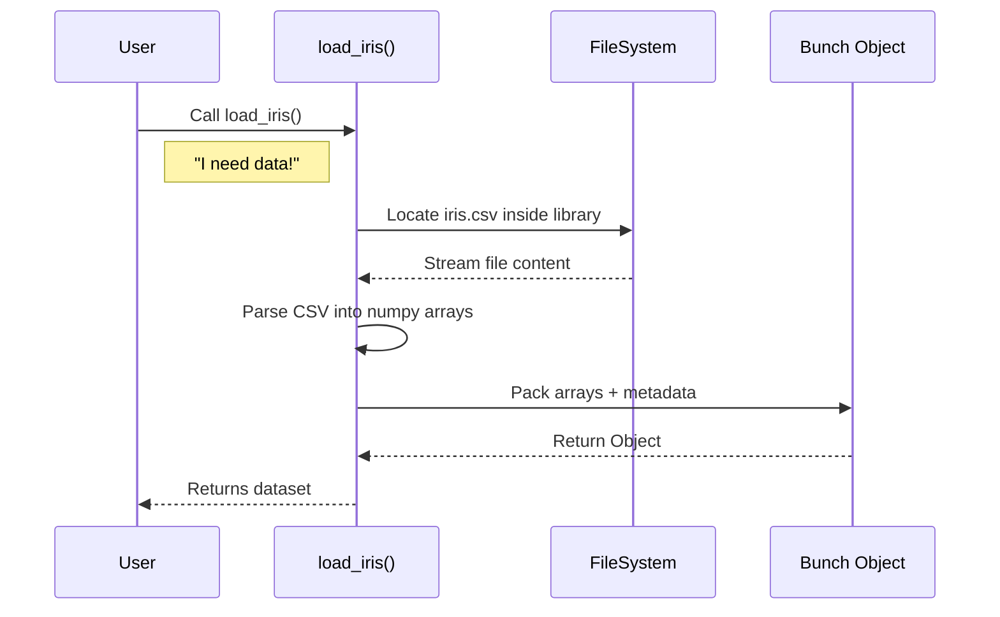

# Chapter 2: Datasets

Welcome to the second chapter of our scikit-learn guide!

In the [Base API](01_base_api.md) chapter, we built the "engine" of a machine learning model (our `MajorityClassifier`). However, an engine without fuel is just a heavy paperweight. In machine learning, that fuel is **data**.

## Motivation: The Ingredients

Imagine you want to practice cooking.
*   **The Hard Way:** You have to go to a farm, harvest wheat, grind it into flour, and then start baking. (This is like scraping data from websites and cleaning messy Excel files).
*   **The Scikit-Learn Way:** You open your pantry, and there is a pre-measured box of ingredients ready to go.

**The Problem:** Finding, downloading, and formatting data into valid numerical arrays (matrices) takes a long time. Beginners often get stuck here before they even train a model.

**The Solution:** Scikit-learn includes the `datasets` module. It allows you to load high-quality "toy" datasets or fetch real-world data with a single line of code.

### Our Use Case
We want to test a classifier, but we don't have a CSV file handy. We want to load the classic **Iris** dataset (measurements of flowers) so we can immediately start working with a model.

## Key Concepts

The `datasets` module offers three main ways to get data:

1.  **Loaders (`load_*`):** Small "toy" datasets that come installed with the library. They load instantly.
    *   *Example:* `load_iris` (flowers), `load_digits` (handwritten numbers).
2.  **Fetchers (`fetch_*`):** Larger, real-world datasets. The first time you call them, scikit-learn downloads them from the internet and saves them to your computer.
    *   *Example:* `fetch_california_housing` (house prices).
3.  **Generators (`make_*`):** Functions that use math to create synthetic random data. Great for testing weird scenarios.
    *   *Example:* `make_blobs` (creates clumps of data points).

## Solving the Use Case

Let's load the Iris dataset. This dataset contains measurements (features) of 150 iris flowers and their species (labels).

### Step 1: Loading the Data
We use the `load_iris` function.

```python
from sklearn.datasets import load_iris

# Load the dataset
# result is a "Bunch" object (similar to a dictionary)
dataset = load_iris()

# Let's see what is inside
print(list(dataset.keys()))
```
*Output:* `['data', 'target', 'frame', 'target_names', 'DESCR', 'feature_names', ...]`

The `dataset` object holds everything we need:
*   `data`: The measurements (the **X**).
*   `target`: The species labels (the **y**).
*   `DESCR`: A description of the data.

### Step 2: Getting X and y directly
Most of the time, we just want the data matrices (`X`) and the labels (`y`) to feed into our `fit()` function from [Chapter 1](01_base_api.md). We can ask scikit-learn to return just these two.

```python
# return_X_y=True separates the features and labels automatically
X, y = load_iris(return_X_y=True)

# X is a matrix (150 flowers, 4 measurements each)
print(f"X shape: {X.shape}") 
# y is a vector (150 labels)
print(f"y shape: {y.shape}")
```
*Output:* 
`X shape: (150, 4)`
`y shape: (150,)`

We now have perfectly formatted numerical arrays ready for a model!

## Under the Hood: How it Works

When you call `load_iris()`, it feels like magic, but it is simply reading a file stored deep inside the scikit-learn installation folder.

### The Loading Process

Here is what happens when you ask for a toy dataset:



### The `Bunch` Object
You noticed the function returned a `Bunch`. A `Bunch` is a custom object defined in `sklearn/utils/_bunch.py`. It is essentially a Python dictionary that allows you to access keys with a dot (`.`).

Instead of writing `data['target']`, you can write `data.target`.

### Internal Implementation Code

Let's look at a simplified version of how a loader works inside `sklearn/datasets/_base.py`.

```python
# Simplified logic similar to sklearn/datasets/_base.py
import csv
import numpy as np
from sklearn.utils import Bunch
from os.path import join

def load_simple_data(file_name):
    # 1. Locate the CSV file inside the package
    module_path = "sklearn/datasets/data" # (Conceptual path)
    full_path = join(module_path, file_name)
    
    # 2. Read the data (often using numpy or python csv)
    # This converts text files into number arrays
    data = np.loadtxt(full_path, delimiter=',')
    
    # 3. separate features (X) and target (y)
    # Assuming last column is the target
    return Bunch(data=data[:, :-1], target=data[:, -1])
```
*Explanation:* 
1.  **Locate:** The function finds where scikit-learn is installed on your hard drive.
2.  **Load:** It reads the CSV file or a compressed `.gzip` file.
3.  **Wrap:** It wraps the raw numbers into the helpful `Bunch` object.

### Fetchers and Metadata
For larger datasets (`fetch_*`), the internal code checks a local folder (usually `~/scikit_learn_data`) before downloading.
1.  Check if file exists locally.
2.  If yes, load it.
3.  If no, download from a repository (like OpenML), save it, then load it.

## Summary

In this chapter, we learned:
1.  **Don't reinvent the wheel:** Use built-in datasets for learning and prototyping.
2.  **Loaders:** `load_iris` gives us small, instant data.
3.  **Fetchers:** `fetch_*` downloads larger real-world data.
4.  **Bunch:** The result is a dictionary-like object containing `data` (X) and `target` (y).

Now that we have the **Base API** (the blueprint) and **Datasets** (the fuel), we are ready to build our first mathematical model to actually solve a problem.

[Next Chapter: Linear Models](03_linear_models.md)

---

Generated by [Code IQ](https://github.com/adityasoni99/Code-IQ)