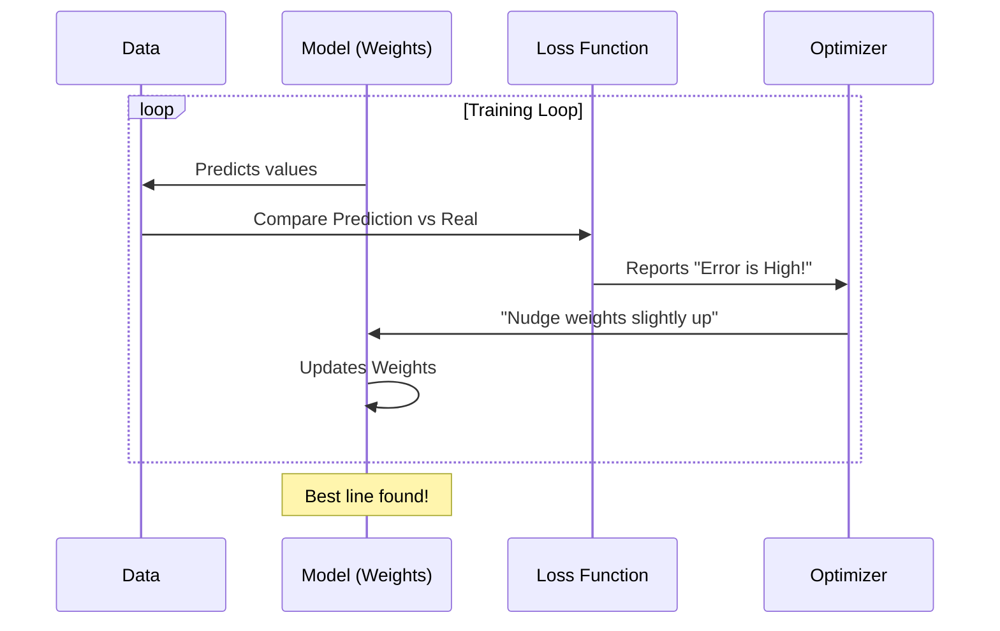

# Chapter 3: Linear Models

Welcome to Chapter 3!

In [Chapter 1: Base API](01_base_api.md), we learned how to build a model structure. In [Chapter 2: Datasets](02_datasets.md), we learned how to load data. Now, we are going to combine them to build our first **real** machine learning models using math.

## Motivation: The Magic Ruler

Imagine you are trying to predict the price of a house based on its size. You plot your data on a chart:
*   Small houses cost a little.
*   Big houses cost a lot.

**The Problem:** You have a new house size, but no price tag. How do you guess the price?

**The Solution:** You take a ruler and draw a **straight line** through the middle of your data points. To predict the price, you just look at where the new house size falls on that line.

In scikit-learn, this family of algorithms is called **Linear Models**. They are simple, fast, and often the first thing you should try.

### Our Use Case
We will look at two problems:
1.  **Prediction (Regression):** Predicting a specific number (e.g., "This pizza costs $12.50").
2.  **Classification:** Predicting a category (e.g., "This email is Spam").

## Key Concepts

Linear models are all about finding the best formula that looks like this:

$$ y = w \times X + b $$

Don't worry about the math symbols! Here is the translation:
*   **$y$ (Target):** What we want to predict (Price).
*   **$X$ (Feature):** The input data (Size).
*   **$w$ (Weight):** How important the feature is. (e.g., for every extra square foot, add $100).
*   **$b$ (Bias/Intercept):** The starting point. (e.g., even a size 0 house costs $5,000 for the land).

The model's job is to figure out the best **$w$** and **$b$** so the line fits your data perfectly.

### The Two Main Types
1.  **Linear Regression:** Draws a line to predict a quantity. Used when $y$ is a number.
2.  **Logistic Regression:** Draws a line to separate two groups. Used when $y$ is a label (Yes/No). *Note: Despite the name "Regression," this is used for Classification.*

## 1. Linear Regression (Predicting Numbers)

Let's predict pizza prices based on their diameter (in inches).

### Step 1: Prepare Data
We have 3 pizzas.
*   6 inch -> $7
*   8 inch -> $9
*   10 inch -> $13 (A bit expensive!)

```python
from sklearn.linear_model import LinearRegression
import numpy as np

# X must be a 2D array (list of lists)
X_train = [[6], [8], [10]] 
y_train = [7, 9, 13]
```

### Step 2: Fit the Model
We instantiate the model and call `fit()`. The model will now try to draw the best line through these three points.

```python
# Create the "Ruler"
model = LinearRegression()

# Find the best line
model.fit(X_train, y_train)
```

### Step 3: Predict
Now we ask: How much should a 12-inch pizza cost?

```python
# Predict for 12 inches
prediction = model.predict([[12]])

print(f"Predicted Price: ${prediction[0]:.2f}")
# Output: Predicted Price: $14.33
```
*Explanation:* The model looked at the trend and extended the line to 12 inches.

### Inspecting the Model
We can peek inside to see the math the model learned.

```python
print(f"Weight (w): {model.coef_[0]}")
print(f"Bias (b): {model.intercept_}")
```
*   **Weight (approx 1.5):** Means "Each inch adds $1.50 to the price."
*   **Bias (approx -2.3):** The math offset to make the line straight.

## 2. Logistic Regression (Classifying)

Now, let's predict if a student passes an exam based on hours studied.
*   **Linear Regression** isn't good here because it might predict "Pass score 1.5," which doesn't make sense. We need "Pass" or "Fail."

### Step 1: Prepare Data
*   1 hour -> Fail (0)
*   2 hours -> Fail (0)
*   4 hours -> Pass (1)
*   5 hours -> Pass (1)

```python
from sklearn.linear_model import LogisticRegression

# 0 = Fail, 1 = Pass
X_train = [[1], [2], [4], [5]]
y_train = [0, 0, 1, 1]
```

### Step 2: Fit and Predict
This creates a "Decision Boundary." If you fall on one side of the line, you are "Fail"; on the other, "Pass."

```python
clf = LogisticRegression()
clf.fit(X_train, y_train)

# Predict for someone who studied 3 hours
result = clf.predict([[3]])
print(f"Prediction: {'Pass' if result[0] == 1 else 'Fail'}")
```
*Output:* Likely `Fail` (depending on the exact math boundary), as 3 is closer to the failing students (1 and 2) than the passing ones (4 and 5).

## Under the Hood: How does it find the line?

You might wonder: *How does the computer know exactly where to put the line? Why didn't it draw a different one?*

This involves an **Optimizer**. The model plays a game called "Minimize the Error."

### The Error Game
1.  **Guess:** The model draws a random line.
2.  **Measure:** It checks how far the line is from the real data points (the Error).
3.  **Adjust:** It nudges the line slightly to reduce the error.
4.  **Repeat:** It keeps nudging until the error stops getting smaller.



### Coordinate Descent and `_cd_fast.pyx`

For simple Linear Regression, there is a direct mathematical formula to find the answer instantly. But for more complex models (like Lasso or ElasticNet), scikit-learn uses an algorithm called **Coordinate Descent**.

Imagine you are tuning a radio that has 100 knobs (weights). You want to get the clearest signal (lowest error).
*   **Standard approach:** Turn all 100 knobs a tiny bit at the same time. This is hard to coordinate.
*   **Coordinate Descent:** Pick Knob 1. Turn it until the signal is perfect. Stop. Pick Knob 2. Turn it until the signal is perfect. Repeat.

This "one knob at a time" approach is very fast, but doing it in Python loops is slow.

### Internal Implementation Code

To make this fast, scikit-learn implements this loop in **Cython** (C-Extension for Python). The file is located at `sklearn/linear_model/_cd_fast.pyx`.

Here is a simplified Python representation of what happens inside that C-file:

```python
# Conceptual logic of Coordinate Descent
def coordinate_descent(X, y, weights, n_iterations):
    n_features = X.shape[1]
    
    for i in range(n_iterations):
        # Loop over each feature (knob) one by one
        for feature_idx in range(n_features):
            
            # 1. Calculate error with current weights
            current_prediction = predict(X, weights)
            error = y - current_prediction
            
            # 2. Update ONLY this specific weight to minimize error
            # (Math simplified for clarity)
            weights[feature_idx] += correlation(error, X[:, feature_idx])
            
    return weights
```
*Explanation:*
1.  The outer loop controls how long we train.
2.  The inner loop fixes every weight except one, and optimizes that single weight.
3.  Because `_cd_fast.pyx` is compiled to machine code, this loop runs millions of times per second, allowing scikit-learn to fit huge datasets quickly.

## Summary

In this chapter, we learned:
1.  **Linear Models** draw straight lines (or planes) through data.
2.  **LinearRegression** predicts quantities (How much?).
3.  **LogisticRegression** predicts classes (Yes/No?), despite its name.
4.  **Weights and Bias:** The internal numbers the model learns to position the line.
5.  **Coordinate Descent:** An efficient "one knob at a time" strategy used under the hood, optimized using Cython for speed.

Now that our model has made predictions, how do we know if they are actually correct? Is being off by $2 good or bad?

We will find out in the next chapter.

[Next Chapter: Metrics](04_metrics.md)

---

Generated by [Code IQ](https://github.com/adityasoni99/Code-IQ)