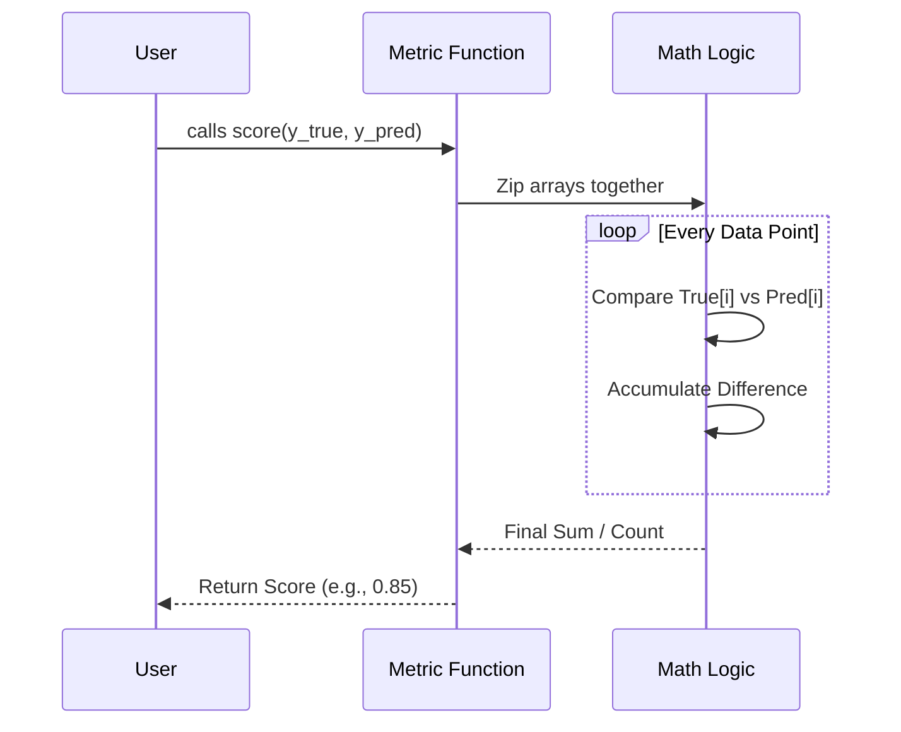

# Chapter 4: Metrics

Welcome to Chapter 4!

In [Chapter 3: Linear Models](03_linear_models.md), we built models that could predict pizza prices and classify students. We saw the model output numbers, but we were left with a burning question: **Is the model actually any good?**

Just because a model produces an answer doesn't mean it's the *right* answer. In this chapter, we will learn how to "grade" our models using **Metrics**.

## Motivation: The Report Card

Imagine you just took a difficult math exam. You hand it to the teacher, and they hand it back immediately with no marks, just a nod. You have no idea if you passed or failed!

*   **The Problem:** A model makes predictions (e.g., `[0, 1, 0, 1]`), but raw predictions don't tell you if the model is useful.
*   **The Solution:** **Metrics**. These are functions that compare the **Model's Answers (Predictions)** against the **Answer Key (True Data)** and give you a score.

### Our Use Case
We will grade the two models we conceptually built in the previous chapter:
1.  **The Pizza Estimator:** We need to know how many dollars our price guess is off by.
2.  **The Spam Filter:** We need to know what percentage of emails we correctly identified.

## Key Concepts

Scikit-learn groups metrics into different categories based on the type of problem.

1.  **Regression Metrics:** Used when predicting numbers (Prices, Temperature).
    *   *Goal:* We want the error to be close to **0**.
    *   *Example:* Mean Absolute Error (MAE).
2.  **Classification Metrics:** Used when predicting categories (Cat/Dog, Spam/Not Spam).
    *   *Goal:* We want the accuracy to be close to **1.0 (100%)**.
    *   *Example:* Accuracy Score, Confusion Matrix.
3.  **Pairwise Metrics:** Used to calculate the "distance" or similarity between data points (often used internally or for Clustering).

## Grading Our Models

Let's use the `sklearn.metrics` module to grade our work.

### 1. Regression: How much did we miss by?

For our Pizza Price model, we want to know the **Mean Absolute Error (MAE)**. This simply calculates the average difference between the real price and our predicted price.

```python
from sklearn.metrics import mean_absolute_error

# 1. The "Answer Key" (Real Prices)
y_true = [10.00, 12.00, 15.00, 20.00]

# 2. The "Student's Answers" (Model Predictions)
y_pred = [10.50, 11.50, 15.00, 25.00]
```

Now, let's calculate the score:

```python
# Calculate the average error
mae = mean_absolute_error(y_true, y_pred)

print(f"Average Error: ${mae:.2f}")
# Calculation: (|0.5| + |-0.5| + |0| + |5|) / 4 = 1.5
# Output: Average Error: $1.50
```
*Result:* On average, our model is off by $1.50. This is easy to understand and explain to a boss!

### 2. Classification: Did we pass?

For our Spam Filter, we want **Accuracy**.

```python
from sklearn.metrics import accuracy_score

# 0 = Not Spam, 1 = Spam
y_true = [0, 1, 1, 0, 1] # The reality
y_pred = [0, 1, 0, 0, 1] # The prediction
```

Notice the third item? The model predicted `0` (Not Spam), but it was actually `1` (Spam). That is a mistake.

```python
# Calculate accuracy
accuracy = accuracy_score(y_true, y_pred)

print(f"Accuracy: {accuracy * 100}%")
# Output: Accuracy: 80.0%
```

### 3. The Confusion Matrix

Sometimes "80% accuracy" isn't enough detail. Did we accidentally mark a real email as spam? Or did we let a spam email through? The **Confusion Matrix** tells us exactly where we were confused.

```python
from sklearn.metrics import confusion_matrix

# Generate the matrix
cm = confusion_matrix(y_true, y_pred)

print(cm)
# Output:
# [[2, 0],  <- True Negatives (2), False Positives (0)
#  [1, 2]]  <- False Negatives (1), True Positives (2)
```
*Explanation:*
*   **Top Left (2):** Correctly identified 2 safe emails.
*   **Bottom Right (2):** Correctly identified 2 spam emails.
*   **Bottom Left (1):** We missed 1 spam email (called it safe).

## Under the Hood: How Metrics Work

At a high level, almost every metric function follows the same simple recipe: Loop through the two lists (`y_true` and `y_pred`) and compare them index by index.



### The Heavy Lifting: Pairwise Distances

While counting correct answers is fast, some metrics (and algorithms like Clustering) need to measure the **Distance** between points.

Imagine you have 1,000 cities. You want to know the distance between **every possible pair** of cities to find which ones are close neighbors.
*   1,000 cities = $1,000 \times 1,000$ pairs = 1,000,000 calculations.
*   If you use a standard Python `for` loop, this is incredibly slow.

### `_pairwise_fast.pyx`

To solve this speed problem, scikit-learn implements distance math in a file called `_pairwise_fast.pyx`. The `.pyx` extension means it is written in **Cython**, which allows Python code to be compiled into super-fast C machine code.

Here is a conceptual simplification of what happens inside that file when calculating Euclidean (straight-line) distance:

```python
# Conceptual logic of _pairwise_fast.pyx
# This runs in C, not Python, making it 100x faster

def fast_euclidean_distance(X, Y):
    n_samples_X = X.shape[0]
    n_samples_Y = Y.shape[0]
    distances = zeros(n_samples_X, n_samples_Y)

    # In Python, this nested loop is slow.
    # In Cython/C, this is instant.
    for i in range(n_samples_X):
        for j in range(n_samples_Y):
            # Calculate distance between row i and row j
            diff = X[i] - Y[j]
            dist = sqrt(dot_product(diff, diff))
            distances[i, j] = dist
            
    return distances
```

When you call `sklearn.metrics.pairwise_distances`, scikit-learn silently hands your data to this optimized C-code helper to ensure you don't have to wait minutes for your answer.

## Summary

In this chapter, we learned:
1.  **Metrics** are the "teachers" that grade our models.
2.  **Regression Metrics** (like MAE) measure "How far off is the number?"
3.  **Classification Metrics** (like Accuracy) measure "Did we pick the right category?"
4.  **Optimization:** Calculating distances between many points is computationally heavy, so scikit-learn uses compiled Cython code (`_pairwise_fast.pyx`) to speed it up.

Now that we understand how to calculate distances and similarities between points, we can look at a type of machine learning that relies entirely on grouping similar items together.

[Next Chapter: Clustering](05_clustering.md)

---

Generated by [Code IQ](https://github.com/adityasoni99/Code-IQ)