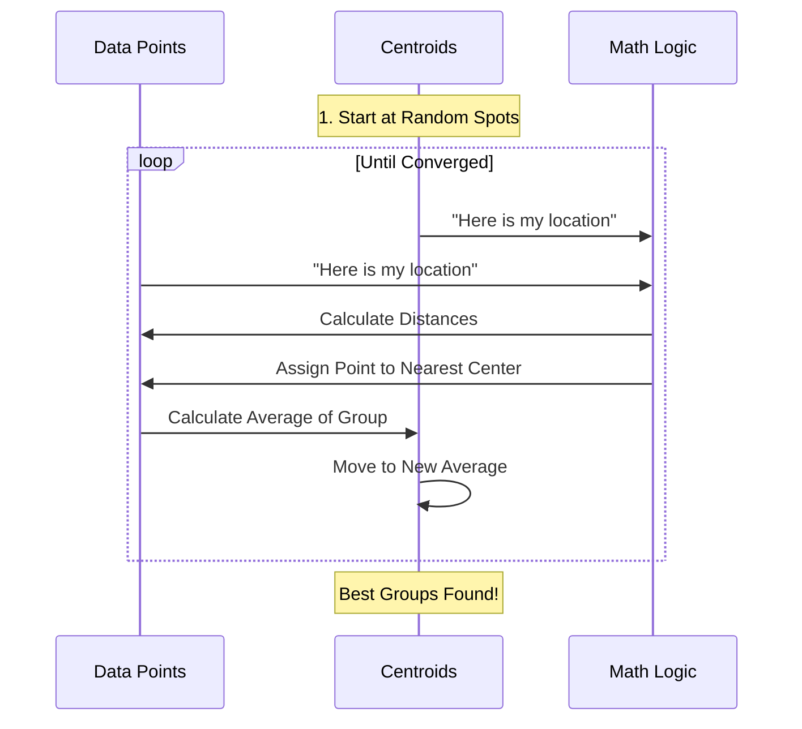

# Chapter 5: Clustering

Welcome to Chapter 5!

In [Chapter 3: Linear Models](03_linear_models.md), we learned how to predict an answer when we have a "teacher" (labels like Price or Species). In [Chapter 4: Metrics](04_metrics.md), we learned how to measure distances between points.

But what if we have data without any labels? What if we don't have a teacher?

## Motivation: The Unlabeled Pile

Imagine you run a T-shirt factory. A machine dumps 1,000 shirts into a pile.
*   **The Problem:** The shirts don't have size tags yet. You have small, medium, and large shirts all mixed together.
*   **The Goal:** You need to organize them into 3 piles so you can sew the tags on.

You can't use a classifier because you don't have training examples (no `y`). You just have the raw measurements of the shirts (the `X`).

**The Solution:** **Clustering**. You look at the pile and say, "These ones look similar, I'll put them here. Those ones look huge, I'll put them there."

### Our Use Case
We are a bank. We have a list of customers with two features:
1.  Annual Income.
2.  Spending Score (1-100).

We want to find distinct "groups" of customers so we can offer them specific credit cards. We don't know what the groups are yet; we just want the algorithm to find them.

## Key Concepts

Clustering is a type of **Unsupervised Learning** (learning without labels).

1.  **Centroid:** The center point of a cluster. Think of this as the "average customer" in that group.
2.  **K:** The number of clusters (groups) we want to find. We have to tell the model this number.
3.  **K-Means:** The most popular clustering algorithm. It works by moving the Centroids around until they sit perfectly in the middle of their groups.

## Solving the Use Case

We will use `KMeans` from scikit-learn.

### Step 1: Create the Data
We'll generate some dummy data representing our customers.

```python
import numpy as np
# We use make_blobs to create clumps of data
from sklearn.datasets import make_blobs

# Generate 3 distinct groups of customers
# X contains [Income, Spending Score]
X, _ = make_blobs(n_samples=15, centers=3, random_state=42)

print(f"Customer 1 data: {X[0]}")
```
*Output:* `Customer 1 data: [-2.5, 9.0]` (Just dummy numbers for now). Note that we ignore the second return value (`_`) because we pretend we don't know the labels!

### Step 2: Initialize and Fit
We must tell the model how many groups (`n_clusters`) to look for.

```python
from sklearn.cluster import KMeans

# We suspect there are 3 types of customers
model = KMeans(n_clusters=3, random_state=42)

# Notice: We only pass X! There is no y.
model.fit(X)
```
*Explanation:* The model has now analyzed the geometry of the data and found the best 3 spots to place its centers.

### Step 3: Predict Groups
Now we can ask the model: "Which group does each customer belong to?"

```python
# Assign each customer to a group (0, 1, or 2)
labels = model.predict(X)

print("Group assignments:", labels)
# Output: [2 1 0 1 2 ...]
```
*Result:* The model successfully sorted the customers. All customers labeled `2` are similar to each other, and different from those labeled `0`.

### Step 4: Inspect the Centers
We can see the "average" customer for each group.

```python
# The coordinates of the 3 cluster centers
centers = model.cluster_centers_

print("Center of Group 0:", centers[0])
```
*Explanation:* This point is the mathematical center of the first cluster.

## Under the Hood: How K-Means Works

K-Means is an iterative algorithm. It plays a game of "Hot or Cold" to find the centers.

### The Algorithm Loop

1.  **Guess:** Pick 3 random points as starting centers.
2.  **Assign:** For every customer, check which center is closest (using Distance from [Chapter 4](04_metrics.md)). Assign the customer to that team.
3.  **Update:** Move the center point to the exact average position of its team members.
4.  **Repeat:** Keep doing steps 2 and 3 until the centers stop moving.



### Internal Implementation Code

The heavy lifting happens in `sklearn/cluster/_kmeans.py`.

However, calculating the distance between every point and every center millions of times is slow in pure Python. Scikit-learn optimizes this using **Cython**.

The core logic resides in a file called `_k_means_common.pyx`.

```python
# Simplified concept of the Cython implementation
def k_means_single_step(X, centers):
    new_centers = zeros_like(centers)
    counts = zeros(n_clusters)
    
    # Iterate over every data point
    for i in range(n_samples):
        # Find nearest center (e.g., center 0, 1, or 2)
        best_center_idx = nearest_center(X[i], centers)
        
        # Add this point's values to the running total for that center
        new_centers[best_center_idx] += X[i]
        counts[best_center_idx] += 1
        
    # Calculate average (The "Mean" in K-Means)
    return new_centers / counts
```

### Dealing with Huge Data: `MiniBatchKMeans`

If you have 10 million customers, waiting for the standard K-Means to check *every* customer before moving the center takes too long.

Scikit-learn offers `MiniBatchKMeans`.
*   **Difference:** Instead of checking all 10 million people, it grabs a random 1,000 people (a "batch"), calculates the move, and updates the center immediately.
*   **Benefit:** It is much faster.
*   **Trade-off:** The result might be slightly less perfect, but usually good enough.

```python
from sklearn.cluster import MiniBatchKMeans

# Faster version for huge datasets
fast_model = MiniBatchKMeans(n_clusters=3, batch_size=100)
fast_model.fit(X)
```

## Summary

In this chapter, we learned:
1.  **Unsupervised Learning:** Finding patterns in data without labels (no `y`).
2.  **K-Means:** An algorithm that groups data by finding central points (Centroids).
3.  **The Process:** Assign points to the nearest center, then move the center to the average. Repeat.
4.  **Optimization:** Heavy calculations are offloaded to Cython (`_k_means_common.pyx`) or sped up using `MiniBatchKMeans`.

We have successfully grouped our customers! But what if we want to make decisions based on a series of Yes/No questions instead of distances?

In the next chapter, we will learn about **Decision Trees**.

[Next Chapter: Trees](06_trees.md)

---

Generated by [Code IQ](https://github.com/adityasoni99/Code-IQ)