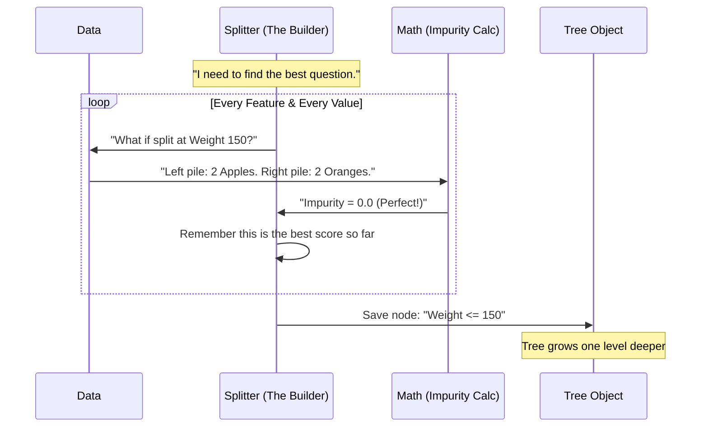

# Chapter 6: Trees

Welcome to Chapter 6!

In [Chapter 5: Clustering](05_clustering.md), we learned how to group data without any labels. Before that, in [Chapter 3: Linear Models](03_linear_models.md), we learned how to draw straight lines to make predictions.

But what if the answer isn't a straight line? What if the logic is more like a game of "20 Questions"?

## Motivation: The Flowchart

Imagine you are a doctor trying to diagnose a patient. You don't do a complex mathematical calculation immediately. Instead, you ask a series of **Yes/No** questions:
1.  "Do you have a fever?" (Yes/No)
2.  *If Yes:* "Is it above 100°F?" (Yes/No)
3.  *If No:* "Does your throat hurt?" (Yes/No)

This logic forms a **Tree**. You start at the top (the Root) and travel down different branches based on the answers until you reach a diagnosis (a Leaf).

**The Problem:** Writing out these rules by hand ("If X > 5 and Y < 2...") is tedious and prone to error.
**The Solution:** **Decision Trees**. We give the computer the data, and *it* figures out the best questions to ask to separate the data perfectly.

### Our Use Case
We want to distinguish between **Apples** and **Oranges** based on two features:
1.  **Weight** (in grams).
2.  **Texture** (1 = Bumpy, 10 = Smooth).

We want the model to build a flowchart that can tell us which fruit we are holding.

## Key Concepts

A Decision Tree is built of three main parts:

1.  **Root Node:** The very first question the tree asks (e.g., "Is Weight < 150g?").
2.  **Internal Nodes:** Follow-up questions (e.g., "Is Texture < 5?").
3.  **Leaf Nodes:** The final answer. No more questions are asked here.

### Impurity (The "Messiness" Score)
How does the tree decide which question to ask? It looks for "Purity."
*   **Pure:** A bucket containing *only* Apples. (Great!)
*   **Impure:** A bucket with 5 Apples and 5 Oranges mixed. (Bad!)

The tree tries to find a question that splits a mixed bucket into two purer buckets. This is measured using a metric called **Gini Impurity**.

## Solving the Use Case

Let's build a `DecisionTreeClassifier`.

### Step 1: Create the Data
We have 4 fruits.
*   Oranges are usually heavy and bumpy.
*   Apples are usually light and smooth.

```python
from sklearn.tree import DecisionTreeClassifier

# Features: [Weight, Texture]
X = [[160, 1], [170, 2], [140, 10], [130, 9]]

# Labels: 0 = Orange, 1 = Apple
y = [0, 0, 1, 1]
```

### Step 2: Fit the Model
We instantiate the class and fit it, just like in previous chapters.

```python
# Create the Tree model
clf = DecisionTreeClassifier()

# Teach the tree to distinguish fruits
clf.fit(X, y)
```

### Step 3: Make a Prediction
Now we have a new fruit: Weight 150g, Texture 8 (Smooth).

```python
# Predict for [150g, Smooth]
prediction = clf.predict([[150, 8]])

# 0 is Orange, 1 is Apple
print("Fruit is:", "Apple" if prediction[0] == 1 else "Orange")
# Output: Fruit is: Apple
```

### Step 4: Visualize the Thinking
The best part about Trees is that they aren't "black boxes." We can see exactly *why* it made that decision.

```python
from sklearn.tree import plot_tree
import matplotlib.pyplot as plt

# Draw the tree
plot_tree(clf, feature_names=['Weight', 'Texture'], filled=True)
plt.show()
```
*Result:* You will see a diagram. The top box likely says `Weight <= 150.0`.
*   If True (Left): It goes to a blue box (Apples).
*   If False (Right): It goes to an orange box (Oranges).

The tree learned that **Weight** was the most important factor to distinguish these fruits.

## Under the Hood: How the Tree Grows

You might wonder: *How did it know to pick 150.0 as the cutoff number? Why not 145? Why not ask about Texture first?*

The algorithm used is called **CART** (Classification and Regression Trees). It uses a "Greedy" strategy.

### The Splitting Loop
1.  **Scan:** Look at *every* feature (Weight, Texture).
2.  **Test:** Try *every* possible cutoff number (split point).
3.  **Measure:** For each trial, calculate the Gini Impurity (how mixed are the resulting piles?).
4.  **Pick:** Choose the single best split that reduces impurity the most.
5.  **Repeat:** Do this again for the left pile and the right pile.



### The Engine: `_tree.pyx`

Checking *every* split point for *every* feature is computationally expensive. If you have 1 million rows, a Python loop would take forever.

To solve this, scikit-learn implements the core logic in **Cython**. The file is `sklearn/tree/_tree.pyx`. This allows the code to run at C-speed.

The internal structure relies on two main helper classes:
1.  **Tree:** A container that stores the arrays of nodes (the structure).
2.  **Splitter:** The worker that finds the best cut.

### Simplified Internal Code

Here is a conceptual Python version of what the fast Cython `Splitter` does.

```python
# Conceptual logic inside sklearn/tree/_tree.pyx
# (This actually runs in compiled C code)

def find_best_split(X, y):
    best_gini = 1.0
    best_split = None
    
    # Loop 1: Go through every feature (Weight, Texture)
    for feature_index in range(n_features):
        
        # Loop 2: Go through every unique value in that feature
        possible_thresholds = unique_values(X[:, feature_index])
        
        for threshold in possible_thresholds:
            # Try splitting here
            left_y, right_y = split_data(y, feature_index, threshold)
            
            # Calculate impurity (messiness)
            gini = calculate_gini(left_y, right_y)
            
            # Keep the winner
            if gini < best_gini:
                best_gini = gini
                best_split = (feature_index, threshold)
                
    return best_split
```
*Explanation:*
*   The **Tree Builder** calls this function recursively.
*   Once `best_split` is found, it creates a Node and repeats the process for the data on the left and right.

## Summary

In this chapter, we learned:
1.  **Decision Trees** are like flowcharts that the computer builds for us.
2.  **Nodes and Leaves:** The tree asks questions at Nodes and gives answers at Leaves.
3.  **Impurity:** The tree tries to create "pure" groups where all items are the same class.
4.  **Interpretability:** Unlike many models, we can draw a tree and easily understand its logic.
5.  **Performance:** Finding the perfect split requires checking everything, so scikit-learn uses high-performance **Cython** code (`_tree.pyx`) to do it fast.

Trees are powerful, but they have a weakness: they can easily over-complicate things (overfitting). What if, instead of one tree, we asked a committee of 100 trees to vote on the answer?

That is the topic of the next chapter.

[Next Chapter: Ensembles](07_ensembles.md)

---

Generated by [Code IQ](https://github.com/adityasoni99/Code-IQ)