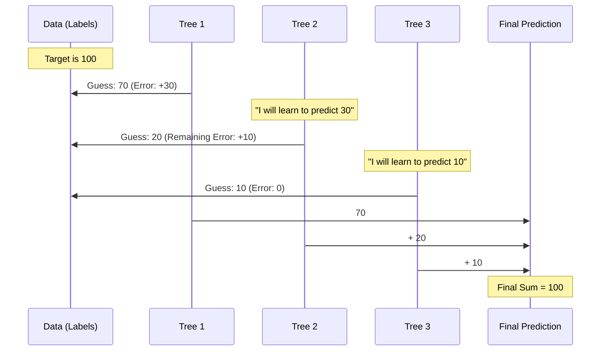

# Chapter 7: Ensembles

Welcome to Chapter 7!

In [Chapter 6: Trees](06_trees.md), we learned how to build a Decision Tree. It asks a series of Yes/No questions to make a prediction. While trees are easy to understand, a single tree has a flaw: it can be stubborn. If it learns a wrong rule from the training data, it keeps making that mistake forever.

But what if, instead of asking just one tree, we asked a committee of 100 trees and combined their answers?

## Motivation: The Wisdom of Crowds

Imagine you are guessing how many jellybeans are in a jar.
*   **One Person:** Might guess way too high or way too low.
*   **The Crowd:** If you ask 100 people and take the average, the answer is usually frighteningly accurate.

In machine learning, this technique is called an **Ensemble**. Instead of relying on one "expert" model, we build a team of models.

**The Problem:** A single Decision Tree often "overfits" (memorizes the training data too closely) or makes simple errors on complex data.
**The Solution:** Combine many weak trees to create one strong predictor.

### Our Use Case
We want to classify a complex dataset where a straight line (Linear Model) or a simple flowchart (Decision Tree) fails. We want to use **Gradient Boosting**, a powerful ensemble technique that treats the model like a team where every new member fixes the mistakes of the previous ones.

## Key Concepts

Ensembles come in two main flavors:

1.  **Bagging (Bootstrap Aggregating):** Build 100 trees independently. Let them vote. The majority wins. (Example: Random Forest).
2.  **Boosting:** Build trees one by one.
    *   Tree 1 guesses.
    *   Tree 2 looks at the *errors* of Tree 1 and tries to fix them.
    *   Tree 3 looks at the remaining errors and fixes them.
    *   **Gradient Boosting** is the most popular version of this.

### The Golf Analogy
Think of Boosting like playing golf:
1.  **Shot 1 (Tree 1):** You hit the ball towards the hole. It lands 20 yards short.
2.  **Shot 2 (Tree 2):** You don't start over. You hit the ball *from where it landed* to correct the 20-yard error.
3.  **Result:** The sum of your shots gets the ball into the hole.

## Solving the Use Case

We will use `GradientBoostingClassifier` located in `sklearn.ensemble`.

### Step 1: Create Data
We'll create a small dataset.

```python
from sklearn.ensemble import GradientBoostingClassifier
from sklearn.datasets import make_classification

# Generate 20 samples, 2 classes (0 or 1)
X, y = make_classification(n_samples=20, random_state=42)

# X is the data, y is the label
print(f"Data shape: {X.shape}")
```
*Output:* `Data shape: (20, 20)`

### Step 2: Fit the Ensemble
We tell the model how many "shots" (trees) to take using `n_estimators`.

```python
# Create a team of 10 trees
clf = GradientBoostingClassifier(n_estimators=10, learning_rate=1.0)

# Train the team
clf.fit(X, y)
```
*Explanation:* The model didn't just build one tree. It built 10 small trees sequentially, each one correcting the previous one.

### Step 3: Predict
We use the ensemble just like any other model.

```python
# Predict for the first data point
prediction = clf.predict(X[:1])

print(f"Prediction: {prediction[0]}")
```
*Result:* The model aggregates the result of all 10 internal trees to give the final answer.

## Advanced: HistGradientBoosting

Standard Gradient Boosting is accurate, but if you have 10 million rows of data, it is slow.

Why? Because for every question the tree asks ("Is value > 0.5?"), it has to sort all your numbers.

**The Solution:** **Binning**.
Instead of looking at exact numbers (e.g., 0.52, 0.53, 0.59), we group them into integer buckets (e.g., Bucket 0, Bucket 1, Bucket 2). Sorting 255 integers is much faster than sorting millions of floating-point numbers.

This is available as `HistGradientBoostingClassifier`.

```python
# The modern, fast version for big data
from sklearn.ensemble import HistGradientBoostingClassifier

# Usage is identical
hgb = HistGradientBoostingClassifier().fit(X, y)
print(f"HGB Score: {hgb.score(X, y)}")
```

## Under the Hood: How Boosting Works

The magic of Gradient Boosting is in the "Correction Loop."

### The Process

1.  **Initial Guess:** The model starts by guessing the average (e.g., "0.5").
2.  **Calculate Residuals:** It measures the error. (Real value - Guess = Residual).
3.  **Fit to Residuals:** The next tree doesn't predict the label (Cat/Dog). It predicts the *Error*.
4.  **Update:** The model adds this new tree's prediction to the total.



### Internal Implementation Code

The code for standard Gradient Boosting resides in `sklearn/ensemble/_gb.py`.

Here is a simplified Python representation of the loop that happens inside `fit()`:

```python
# Simplified logic of Gradient Boosting
import numpy as np
from sklearn.tree import DecisionTreeRegressor

class SimpleGradientBoosting:
    def fit(self, X, y):
        self.estimators_ = []
        # 1. Start with an initial guess (e.g., average of y)
        current_prediction = np.mean(y)
        
        for i in range(10): # n_estimators=10
            # 2. Calculate the error (residual)
            error = y - current_prediction
            
            # 3. Train a tree to predict the ERROR, not y
            tree = DecisionTreeRegressor(max_depth=3)
            tree.fit(X, error)
            
            # 4. Add tree to our list
            self.estimators_.append(tree)
            
            # 5. Update our guess for the next round
            current_prediction += tree.predict(X)
```
*Explanation:*
*   We use a loop (`range(10)`).
*   We calculate `error`.
*   Crucially, we `fit(X, error)`. We are training the tree to identify the mistakes of the past.
*   We add the new tree's knowledge to `current_prediction`.

### HistGradientBoosting Implementation

For `HistGradientBoosting`, the code is in `sklearn/ensemble/_hist_gradient_boosting/`. It uses a Histogram-based algorithm (similar to LightGBM).

Before the loop starts, it runs a "Binner":

```python
# Conceptual logic of Binning
def bin_data(X):
    # Convert continuous numbers (0.1, 0.5, 0.9) 
    # into integers (0, 1, 2)
    return np.digitize(X, bins=256)
```

Because the data is now small integers, the trees can be built incredibly fast using a specialized structure, bypassing the slower sorting methods used in standard trees.

## Summary

In this chapter, we learned:
1.  **Ensembles** combine multiple models to create a stronger one.
2.  **Boosting** is a strategy where models work sequentially: each new tree fixes the errors of the previous one.
3.  **GradientBoosting** is the standard way to do this in scikit-learn.
4.  **HistGradientBoosting** is a faster, modern version that groups data into "bins" (buckets) to speed up training on large datasets.

We have now covered numbers (Regression), categories (Classification), groups (Clustering), and teams of models (Ensembles).

But what if your data isn't numbers at all? What if your data is **Text**?

[Next Chapter: Text Feature Extraction](08_text_feature_extraction.md)

---

Generated by [Code IQ](https://github.com/adityasoni99/Code-IQ)