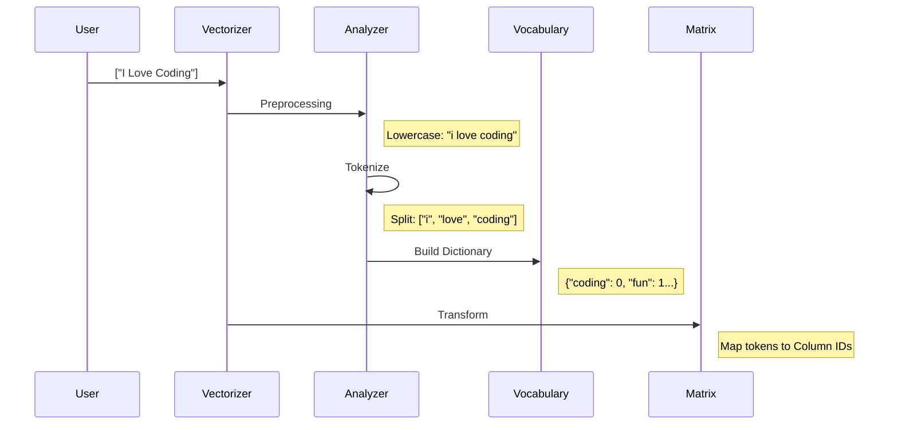

# Chapter 8: Text Feature Extraction

Welcome to Chapter 8!

In [Chapter 7: Ensembles](07_ensembles.md), we built powerful teams of trees to make predictions. But there was a hidden assumption in every chapter so far: our data was always **numbers**. We had house sizes, flower measurements, and pixel intensities.

But what if your data is an email, a tweet, or a book?

## Motivation: The Language Barrier

Machine Learning models are essentially big calculators. They can multiply, add, and subtract.
*   **The Problem:** You cannot multiply "Cat" by 5. You cannot subtract "Hello" from "World".
*   **The Solution:** We must translate text into numbers before the model can read it.

This process is called **Feature Extraction** (or Vectorization). We turn a sentence (a sequence of words) into a vector (a row of numbers).

### Our Use Case
We want to analyze two simple sentences:
1.  "I love coding."
2.  "Coding is fun."

We want to turn these into a numerical matrix so we can feed them into a classifier (like the ones from [Chapter 3](03_linear_models.md)).

## Key Concepts

The most common way to do this is the **Bag of Words** approach.

1.  **Tokenization:** Chop the sentence into individual words (tokens).
2.  **Vocabulary:** Make a list of *every unique word* found in all the documents.
3.  **Counting:** For each sentence, count how many times each word from the Vocabulary appears.
4.  **Loss of Order:** Notice we call it a "Bag" of words. If you shake a bag, the words get jumbled. The model knows *which* words are present, but usually loses the grammar/order.

## 1. CountVectorizer (The Counter)

The simplest method is just counting. If the word "Coding" appears twice, put a `2` in that column.

### Step 1: The Data
We have a list of strings (the "Corpus").

```python
# Our text data
corpus = [
    "I love coding",
    "Coding is fun"
]
```

### Step 2: Learning the Vocabulary
We use `CountVectorizer`. When we call `fit`, it scans the text to find all unique words.

```python
from sklearn.feature_extraction.text import CountVectorizer

# Create the vectorizer
vectorizer = CountVectorizer()

# Learn the vocabulary dictionary
vectorizer.fit(corpus)

# See what words it found
print(vectorizer.get_feature_names_out())
# Output: ['coding' 'fun' 'is' 'love']
```
*Note:* It automatically lowercased the words and sorted them alphabetically. "I" was removed because single letters are usually ignored by default.

### Step 3: Transform to Numbers
Now we turn the text into a matrix.

```python
# Transform the text into numbers
X = vectorizer.transform(corpus)

# Convert to an array so we can see it
print(X.toarray())
```

**Output:**
```text
[[1 0 0 1]   <- "I love coding" (Contains 'coding' and 'love')
 [1 1 1 0]]  <- "Coding is fun" (Contains 'coding', 'fun', 'is')
```
*Explanation:*
*   Column 0 is "coding". Both sentences have it (1).
*   Column 3 is "love". Only the first sentence has it.

## 2. TfidfVectorizer (The Weighter)

Counting has a flaw. Words like "the", "a", and "is" appear frequently, so they get huge numbers (e.g., 500). But they are boring! They don't tell us what the topic is. Rare words (like "Quantum" or "Ensemble") are much more important.

**TF-IDF** stands for **Term Frequency - Inverse Document Frequency**.
*   **TF:** Count the word (like before).
*   **IDF:** If a word appears in *every* document, punish it (lower its score). If it appears in only *one*, boost it.

```python
from sklearn.feature_extraction.text import TfidfVectorizer

# Create the Tfidf object
tfidf_vec = TfidfVectorizer()

# Learn and transform in one step
X_tfidf = tfidf_vec.fit_transform(corpus)

# Print the weighted scores
print(X_tfidf.toarray())
```

**Output (Simplified):**
```text
[[0.6 0.0 0.0 0.8]  <- 'love' (0.8) is more unique than 'coding' (0.6)
 [0.5 0.7 0.7 0.0]]
```
*Result:* In the first sentence, "coding" (which appears in both sentences) gets a lower score than "love" (which is unique to this sentence). The model now knows "love" is the keyword here.

## Under the Hood: How it Works

Scikit-learn doesn't actually store the zeros you saw in `X.toarray()`.

Real text data is **Sparse**. If you have a vocabulary of 100,000 words (English language), but a tweet only has 10 words, your row would be 10 numbers and 99,990 zeros. Storing those zeros is a waste of RAM.

Scikit-learn produces a **Sparse Matrix**. It only stores the coordinates of non-zero values: `(Row 0, Col 3) = 1`.

### The Pipeline Steps

When you call `fit_transform`, the text goes through a pipeline:



### Internal Implementation Code

The logic resides in `sklearn/feature_extraction/text.py`.

Here is a conceptual simplification of how `CountVectorizer` builds its vocabulary dictionary.

```python
# Simplified concept of vocabulary building
class SimpleVectorizer:
    def fit(self, raw_documents):
        self.vocabulary_ = {}
        
        for doc in raw_documents:
            # 1. Simple Tokenization (split by space)
            tokens = doc.lower().split()
            
            for token in tokens:
                # 2. Assign a new ID if word is new
                if token not in self.vocabulary_:
                    new_id = len(self.vocabulary_)
                    self.vocabulary_[token] = new_id
                    
        return self

# Example usage
vec = SimpleVectorizer()
vec.fit(["Apple Banana", "Apple"])
print(vec.vocabulary_) 
# Output: {'apple': 0, 'banana': 1}
```

### The Analyzer
The real power is in the **Analyzer**. You can customize how it splits words.
*   **N-grams:** Instead of just "coding", you can track pairs like "love coding". This captures some context!
    *   `CountVectorizer(ngram_range=(1, 2))`
*   **Stop Words:** You can tell it to ignore "is", "the", "at" automatically.
    *   `CountVectorizer(stop_words='english')`

## Summary

In this chapter, we learned:
1.  **Models need Numbers:** We cannot feed raw text to a model.
2.  **Bag of Words:** We ignore grammar and just look at which words are present.
3.  **CountVectorizer:** Creates a matrix of word counts.
4.  **TfidfVectorizer:** Creates a matrix of weighted scores, downplaying common words like "the".
5.  **Sparse Matrices:** Efficiently storing mostly-empty matrices by ignoring the zeros.

Now we have a problem. We know how to handle numerical data (Chapter 3), and we know how to handle text data (Chapter 8).

But real-world databases are messy. They contain *both* text columns and number columns mixed together. How do we process them at the same time?

[Next Chapter: Column Transformer](09_column_transformer.md)

---

Generated by [Code IQ](https://github.com/adityasoni99/Code-IQ)