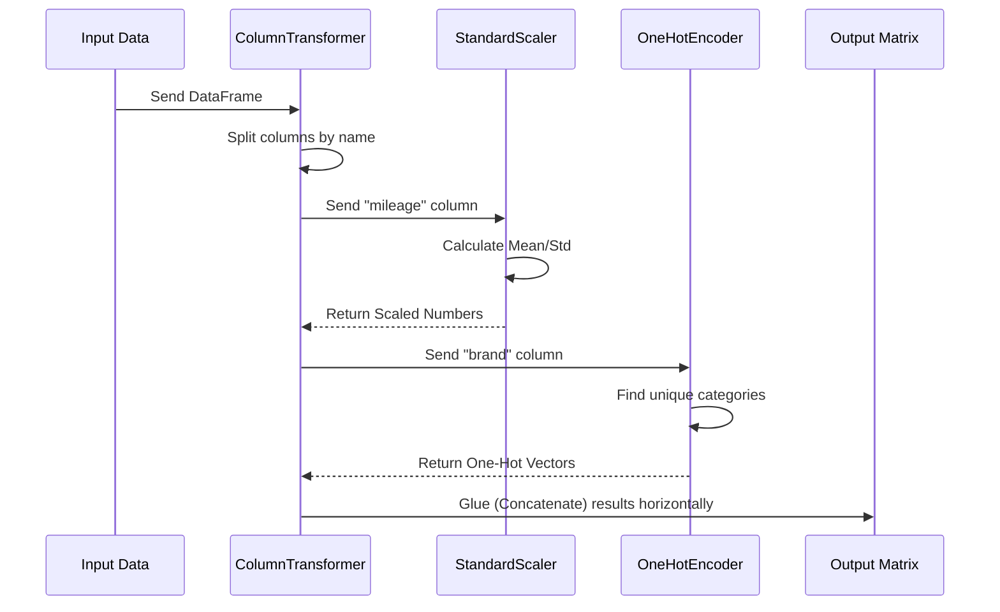

# Chapter 9: Column Transformer

Welcome to Chapter 9!

In [Chapter 3: Linear Models](03_linear_models.md), we learned how to predict numbers using numerical data (like house sizes). In [Chapter 8: Text Feature Extraction](08_text_feature_extraction.md), we learned how to turn text (like emails) into numbers.

But real-world data is messy. A single Excel file or database usually contains **both** types of data mixed together.

## Motivation: The Recycling Center

Imagine you are managing a recycling center. A truck dumps a pile of mixed trash: glass bottles, cardboard boxes, and plastic jugs.
*   **The Problem:** You cannot put cardboard into the glass furnace (it will burn). You cannot put glass into the paper shredder (it will break the machine).
*   **The Solution:** You need a **Sorter**.
    1.  Send glass to the glass processor.
    2.  Send cardboard to the paper processor.
    3.  Send plastic to the plastic processor.
    4.  Finally, pack all the processed raw materials onto one outgoing truck.

In scikit-learn, this Sorter is called the **Column Transformer**. It allows you to apply specific transformations to specific columns, all in a single step.

### Our Use Case
We want to predict the price of a Used Car. Our dataset has two columns:
1.  **Mileage:** A number (e.g., 50,000 miles). We need to scale this.
2.  **Brand:** A category (e.g., "Toyota", "Ford"). We need to encode this (turn "Toyota" into `[1, 0]`).

If we try to feed "Toyota" directly into a Linear Regression, it will crash. We need to process these columns separately but combine the results.

## Key Concepts

The `ColumnTransformer` takes a list of tasks. Each task is a tuple (group of 3 items) that looks like this:

`('name_of_step', TransformerObject, ['List', 'of', 'Columns'])`

1.  **Name:** A nickname for the step (e.g., "num" for numeric).
2.  **Transformer:** The tool we want to use (e.g., `StandardScaler`).
3.  **Columns:** Which columns this tool should touch.

### Remainder
What happens to columns you *don't* mention? By default, `ColumnTransformer` drops them (throws them away). You can change this setting to `remainder='passthrough'` to keep them as-is.

## Solving the Use Case

Let's build our car processor.

### Step 1: The Mixed Data
We will use a pandas DataFrame because it allows us to have named columns with different types.

```python
import pandas as pd

# Create a mixed dataset
data = pd.DataFrame({
    'mileage': [50000, 10000, 100000],   # Numbers
    'brand':   ['Toyota', 'Ford', 'Ford'] # Text/Category
})

print(data)
```
*Output:*
```text
   mileage   brand
0    50000  Toyota
1    10000    Ford
2   100000    Ford
```

### Step 2: Define the Transformers
We need two tools: one for numbers, one for text.

```python
from sklearn.preprocessing import StandardScaler, OneHotEncoder

# 1. Scale the mileage so big numbers don't confuse the model
numeric_transformer = StandardScaler()

# 2. Turn brands into binary flags (0 or 1)
# sparse_output=False makes it easier to read the output for this tutorial
categorical_transformer = OneHotEncoder(sparse_output=False)
```

### Step 3: Create the Column Transformer
Now we create the "Sorter" that assigns the right tool to the right column.

```python
from sklearn.compose import ColumnTransformer

# The list of (Name, Transformer, Columns)
preprocessor = ColumnTransformer(
    transformers=[
        ('num', numeric_transformer, ['mileage']),
        ('cat', categorical_transformer, ['brand'])
    ]
)
```

### Step 4: Fit and Transform
Just like a normal model, we call `fit_transform`.

```python
# Process the data
X_processed = preprocessor.fit_transform(data)

print(X_processed)
```

**Output:**
```text
[[ -0.26   0.     1. ]   <- Mileage scaled, Ford=0, Toyota=1
 [ -1.09   1.     0. ]   <- Mileage scaled, Ford=1, Toyota=0
 [  1.35   1.     0. ]]  <- Mileage scaled, Ford=1, Toyota=0
```

*Explanation:* 
*   **Column 0:** This is the transformed `mileage`. `50000` became `-0.26` (Standardized).
*   **Column 1 & 2:** These are the encoded `brand`. "Ford" became `[1, 0]` and "Toyota" became `[0, 1]`.

The `ColumnTransformer` glued these results together side-by-side. We now have a pure numerical matrix ready for a Machine Learning model!

## Under the Hood: How it Works

The `ColumnTransformer` is essentially a loop that splits your data, processes the pieces, and stacks them back together.

### The Flow



### Internal Implementation Code

The logic resides in `sklearn/compose/_column_transformer.py`. It uses a function called `hstack` (Horizontal Stack) from the numpy library to glue the results.

Here is a simplified Python version of what happens inside `fit_transform`:

```python
# Simplified logic of ColumnTransformer
import numpy as np

class SimpleColumnTransformer:
    def __init__(self, transformers):
        self.transformers = transformers
        
    def fit_transform(self, X):
        results = []
        
        # Loop through each transformer tuple
        for name, transformer, columns in self.transformers:
            
            # 1. Slice the data to get only relevant columns
            subset = X[columns]
            
            # 2. Apply the specific transformer
            transformed_subset = transformer.fit_transform(subset)
            
            # 3. Store the result
            results.append(transformed_subset)
            
        # 4. Glue them together side-by-side
        # axis=1 means "horizontal"
        return np.hstack(results)
```

### Why is this better than doing it manually?
1.  **Safety:** If you manually split your data into `X_num` and `X_cat`, process them, and glue them back, you might accidentally glue row 1 of `X_num` to row 5 of `X_cat` if you aren't careful with sorting. `ColumnTransformer` guarantees the rows stay aligned.
2.  **Automation:** It remembers the column names. When you get new data (e.g., `X_test`), you just call `transform()`, and it automatically finds "mileage" and "brand" again.

## Summary

In this chapter, we learned:
1.  **Mixed Data:** Real data often has numbers and text together.
2.  **ColumnTransformer:** Acts as a router that sends different columns to different transformers.
3.  **Specification:** We define a list of `(Name, Transformer, ColumnList)`.
4.  **Concatenation:** The results are automatically glued together into a single matrix.

We have now successfully preprocessed our data. We have a matrix of numbers. In the next step, we want to feed this matrix into a classifier (like Logistic Regression).

Do we have to run `preprocessor.fit_transform`, save the variable, and *then* run `model.fit`? That sounds tedious. Is there a way to bundle the **Preprocessing** and the **Model** into one single object?

Yes! That is the topic of the next chapter.

[Next Chapter: Pipelines](10_pipelines.md)

---

Generated by [Code IQ](https://github.com/adityasoni99/Code-IQ)