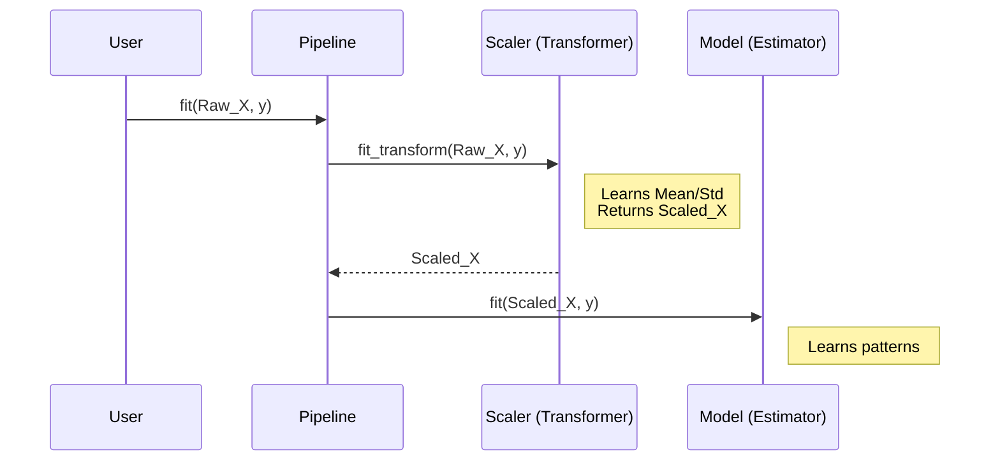
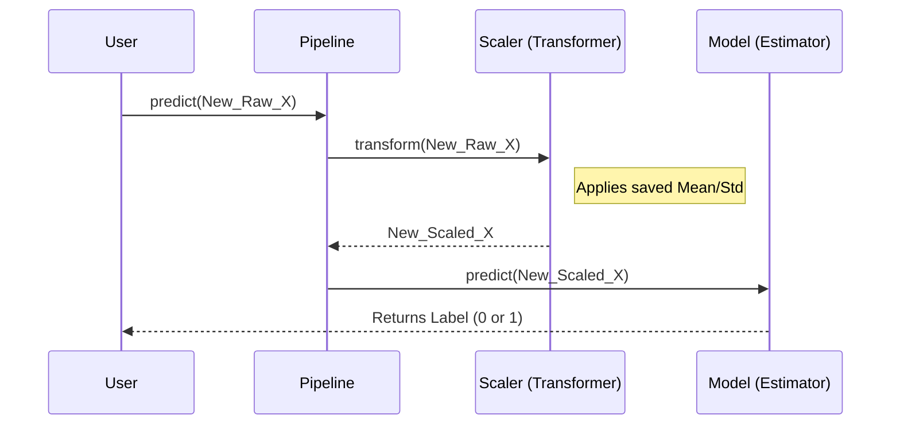

# Chapter 10: Pipelines

Welcome to Chapter 10!

In [Chapter 9: Column Transformer](09_column_transformer.md), we learned how to process messy data (numbers and text) into a clean matrix. In earlier chapters like [Chapter 3: Linear Models](03_linear_models.md), we learned how to train a model.

Up until now, we have been doing these as separate steps.
1.  Clean the data.
2.  Save the cleaned data to a variable.
3.  Feed that variable into the model.

This works for homework, but in the real world, it is messy and dangerous.

## Motivation: The Assembly Line

Imagine you own a sandwich shop.
*   **The Manual Way:** You have a station for slicing bread, a station for adding cheese, and a station for wrapping. You carry the sandwich manually between stations. If you trip, the sandwich is ruined.
*   **The Pipeline Way:** You install a conveyor belt. You put raw ingredients at the start, and a wrapped sandwich comes out the end. You don't touch it in between.

**The Problem:**
1.  **Code Clutter:** You have to manually call `transform()` every time you get new data.
2.  **Data Leakage (The Big Danger):** If you calculate the average (for scaling) using *all* your data before splitting it into Train/Test, you have "cheated." Your model has peeked at the test data's average.

**The Solution:** The `Pipeline`. It bundles all your preprocessing steps and your final model into a single object.

### Our Use Case
We want to build a classifier that:
1.  **Scales** the data (Standardizes it).
2.  **Classifies** it using Logistic Regression.

We want to treat this entire process as **one single model**.

## Key Concepts

A Pipeline is a list of steps performed in order.

1.  **Transformers:** All steps *except* the last one must be transformers (they change the data). They must have a `fit` and `transform` method.
    *   *Example:* `StandardScaler`, `PCA`, or our `ColumnTransformer` from the previous chapter.
2.  **Estimator:** The final step is usually a model. It must have `fit`.
3.  **The Contract:** When you call `fit()` on the Pipeline, it automatically manages the flow of data through the steps.

## Solving the Use Case

Let's chain a Scaler and a Classifier together.

### Step 1: Setup
We import the parts we need.

```python
from sklearn.pipeline import Pipeline
from sklearn.preprocessing import StandardScaler
from sklearn.linear_model import LogisticRegression

# Dummy data: 3 samples, 2 features
X_train = [[10.0, 200.0], [10.5, 210.0], [50.0, 500.0]]
y_train = [0, 0, 1]
```

### Step 2: Define the Pipeline
A Pipeline is defined as a list of tuples: `('Name', Object)`.

```python
# Create the "conveyor belt"
pipe = Pipeline([
    ('scaler', StandardScaler()),      # Step 1: Scale
    ('clf', LogisticRegression())      # Step 2: Classify
])
```

### Step 3: Fit the Pipeline
This is the magic part. We treat `pipe` exactly like a standard model.

```python
# We feed RAW data into the pipeline
# It scales it internally, then trains the classifier
pipe.fit(X_train, y_train)

print("Pipeline is trained!")
```

### Step 4: Make Predictions
Now we have new data. We do **not** need to scale it manually. The pipeline remembers the scale from the training step and applies it automatically.

```python
# New, raw data
X_new = [[12.0, 205.0]]

# The pipeline scales this, then predicts
prediction = pipe.predict(X_new)

print(f"Prediction: {prediction[0]}")
# Output: 0
```
*Result:* Clean code, no manual variable handling, and no risk of forgetting a step!

## Feature Union (Briefly)
While `Pipeline` chains steps **sequentially** (Step 1 -> Step 2), there is a sibling called `FeatureUnion` that runs steps **parallel** (Step A and Step B at the same time) and joins the results.

This is similar to the `ColumnTransformer` we saw in [Chapter 9](09_column_transformer.md), but more general.

## Under the Hood: How the Data Flows

The Pipeline acts as a traffic controller. It differentiates between Training (`fit`) and Predicting (`predict`).

### The Training Flow (`fit`)

When you call `pipe.fit(X, y)`:



### The Prediction Flow (`predict`)

When you call `pipe.predict(X)`:



### Internal Implementation Code

The code for this resides in `sklearn/pipeline.py`. It is essentially a loop that passes the output of one step as the input to the next.

Here is a simplified Python conceptualization of the `fit` method inside the Pipeline class:

```python
# Simplified logic from sklearn/pipeline.py
class SimplePipeline:
    def __init__(self, steps):
        self.steps = steps # List of (name, object)

    def fit(self, X, y):
        # 1. Loop through all steps EXCEPT the last one
        for name, transformer in self.steps[:-1]:
            # Fit this step and transform the data
            # The output (Xt) becomes the input for the next loop
            X = transformer.fit_transform(X, y)
            
        # 2. Get the final step (the model)
        last_step = self.steps[-1][1]
        
        # 3. Fit the model using the fully transformed data
        last_step.fit(X, y)
        return self
```
*Explanation:*
1.  The `for` loop iterates through your transformers (like Scalers).
2.  It updates `X` at every step. The `X` that leaves step 1 enters step 2.
3.  Finally, the transformed `X` reaches the Estimator.

### Metadata Routing (Advanced Note)
Sometimes, steps need extra information (like "sample weights" for weighted scoring). Modern scikit-learn pipelines support **Metadata Routing**. This allows you to pass extra arguments like `sample_weight` into `fit()`, and the Pipeline intelligently routes them only to the steps that requested them.

## Summary

In this chapter, we learned:
1.  **Pipelines** chain multiple steps into a single unit.
2.  **Sequential Flow:** Data flows through Transformers and lands in an Estimator.
3.  **Safety:** Pipelines prevent data leakage by ensuring preprocessing parameters (like Mean/Std) are learned *only* during `fit` and strictly applied during `predict`.
4.  **Simplicity:** We can replace 50 lines of manual data wrangling with one `pipe.fit()` and `pipe.predict()`.

Now we have built sophisticated Pipelines. But how do we know they are robust? How do we verify that our code doesn't break when edge cases happen?

We need to learn how to test our tools.

[Next Chapter: Testing Utilities](11_testing_utilities.md)

---

Generated by [Code IQ](https://github.com/adityasoni99/Code-IQ)