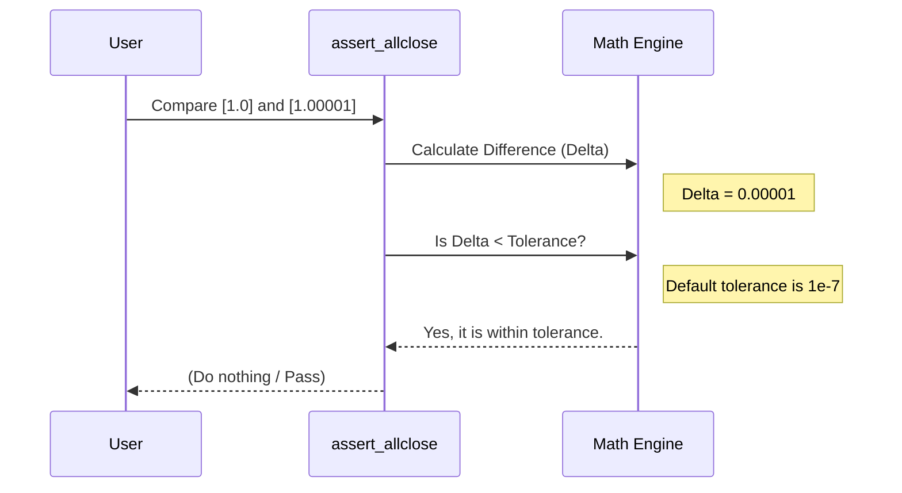

# Chapter 11: Testing Utilities

Welcome to Chapter 11!

In [Chapter 10: Pipelines](10_pipelines.md), we learned how to chain multiple complex steps into a single "conveyor belt" of machine learning. We have built custom models, processed text, and handled mixed data types.

But there is one scary question we haven't asked yet: **How do we know our code isn't broken?**

## Motivation: The Crash Test

Imagine you are a car manufacturer. You build a new car. Do you just sell it immediately? No. You crash it into a wall to ensure the airbag deploys. You drive it in the rain to ensure the wipers work.

In software, this is called **Testing**.

**The Problem:**
1.  **Floating Point Math:** Computers are bad at decimals. Sometimes `0.1 + 0.2` equals `0.30000000000000004`. If you check `if result == 0.3`, your test fails!
2.  **Error Handling:** If a user puts text into a calculator, the program *should* crash (raise an Error). We need to test that it crashes correctly.

**The Solution:** Scikit-learn provides **Testing Utilities** in `sklearn.utils._testing`. These are special helper functions designed specifically to test machine learning code.

### Our Use Case
We want to verify the math of a simple function.
1.  We want to check if two arrays of numbers are "close enough" to be considered equal.
2.  We want to ensure our function screams (raises an error) if we give it bad input.

## Key Concepts

We will use functions that start with `assert_`. In programming, an "assertion" is a statement that says: *"I bet this is true. If I am wrong, stop everything and yell at me."*

1.  **`assert_array_equal`:** Checks if two lists of integers or strings are exactly the same.
2.  **`assert_allclose`:** Checks if two lists of floats are *approximately* the same (ignores tiny computer math errors).
3.  **`assert_raise_message`:** Checks if a specific error message is printed when things go wrong.

## solving the Use Case

Let's write a test script using these utilities.

### 1. Handling "Close Enough" Math

Computers often make tiny rounding errors. Let's see how scikit-learn handles this.

```python
import numpy as np
from sklearn.utils._testing import assert_allclose

# The "True" value
expected = [1.0, 2.0, 3.0]

# The "Calculated" value (slightly off due to math)
calculated = [1.0, 2.0000000001, 2.9999999999]

# This passes because they are "close enough"
assert_allclose(expected, calculated)
print("Test Passed: The numbers are effectively equal!")
```
*Explanation:* If we used `assert expected == calculated`, it would fail. `assert_allclose` knows that `2.9999999999` is basically `3.0`.

### 2. Checking for Exact Matches

For integers (like counting apples) or strings (like class names), we expect exact matches.

```python
from sklearn.utils._testing import assert_array_equal

# True labels vs Predicted labels
y_true = ["cat", "dog", "cat"]
y_pred = ["cat", "dog", "cat"]

# This checks exact equality
assert_array_equal(y_true, y_pred)
print("Test Passed: Arrays are identical.")
```

### 3. Testing for Failure

This sounds weird, but sometimes we *want* our code to fail. If a user tries to predict the price of a house using the word "Banana" as the size, our model should shout "Invalid Input!".

We use `assert_raise_message` to verify the shouting happens.

```python
from sklearn.utils._testing import assert_raise_message

def calculate_square_root(x):
    if x < 0:
        raise ValueError("Input must be positive")
    return np.sqrt(x)

# We expect a ValueError containing the text "positive"
# when we pass -5
with assert_raise_message(ValueError, "positive"):
    calculate_square_root(-5)

print("Test Passed: The function correctly raised an error.")
```
*Explanation:* The code inside the `with` block *must* crash. If `calculate_square_root(-5)` accidentally worked and returned a number, the test would fail!

### 4. Ignoring Warnings

Sometimes, we know our code generates a warning (like "Function X is deprecated"), but we want our test output to be clean. We can tell the test suite to shut up about it.

```python
from sklearn.utils._testing import ignore_warnings

@ignore_warnings(category=UserWarning)
def noisy_function():
    import warnings
    warnings.warn("This is a loud warning!")
    return True

# Run it. No warning will be printed to the console.
noisy_function()
print("Test Passed: Silence achieved.")
```

## Under the Hood: How Testing Utilities Work

These utilities are wrappers around the popular `numpy.testing` module and the standard Python `unittest` framework. They act as "judges" for your code.

### The Judgment Process

When you call `assert_allclose`, a detailed comparison happens:



If the math said "No, Delta is too big," `Utility` would raise an `AssertionError`, stopping your program.

### Internal Implementation Code

The code for these utilities resides in `sklearn/utils/_testing.py`.

Here is a simplified Python concept of how `assert_raise_message` is implemented. It uses a Python feature called a **Context Manager** (`__enter__` and `__exit__`).

```python
# Simplified logic of assert_raise_message
class SimpleAssertRaise:
    def __init__(self, expected_error, expected_msg):
        self.expected_error = expected_error
        self.expected_msg = expected_msg

    def __enter__(self):
        # Start listening
        return self

    def __exit__(self, exc_type, exc_value, traceback):
        # 1. Check if an error occurred at all
        if exc_type is None:
            raise AssertionError("No error was raised!")
            
        # 2. Check if it was the RIGHT error (e.g., ValueError)
        if not issubclass(exc_type, self.expected_error):
            raise AssertionError(f"Wrong error type: {exc_type}")

        # 3. Check if the message matches
        if self.expected_msg not in str(exc_value):
            raise AssertionError("Message didn't match!")
            
        return True # Suppress the actual error so testing continues
```
*Explanation:*
1.  **`__enter__`**: The test starts.
2.  **`__exit__`**: This runs after the code block finishes (or crashes).
3.  **The Checks**: It verifies that (A) an error happened, (B) it was the right type, and (C) it had the right text.

### Testing Custom Estimators

In [Chapter 1: Base API](01_base_api.md), we built a `MajorityClassifier`. To test it properly, we wouldn't just write one test. We would check:
1.  Does `fit` work with a valid array? (`assert_array_equal` on shapes).
2.  Does `predict` return the expected class?
3.  Does it raise an error if `X` is empty? (`assert_raise_message`).

Scikit-learn developers use these utilities every day to ensure that when they add a new feature (like the Ensembles from [Chapter 7](07_ensembles.md)), they don't accidentally break the Linear Models from [Chapter 3](03_linear_models.md).

## Summary

In this chapter, we learned:
1.  **Testing is Crucial:** We must verify our models work before using them.
2.  **Floating Point Safety:** `assert_allclose` helps us compare decimal numbers without worrying about tiny math errors.
3.  **Error Verification:** `assert_raise_message` ensures our models complain correctly when fed garbage.
4.  **Wrappers:** These utilities are friendly wrappers around `numpy` and `unittest` tools.

We have learned how to write *our own* tests. But wouldn't it be nice if scikit-learn had a built-in checklist to verify that our custom model follows all the rules of the library?

It does! It's called **Common Tests**.

[Next Chapter: Common Tests](12_common_tests.md)

---

Generated by [Code IQ](https://github.com/adityasoni99/Code-IQ)