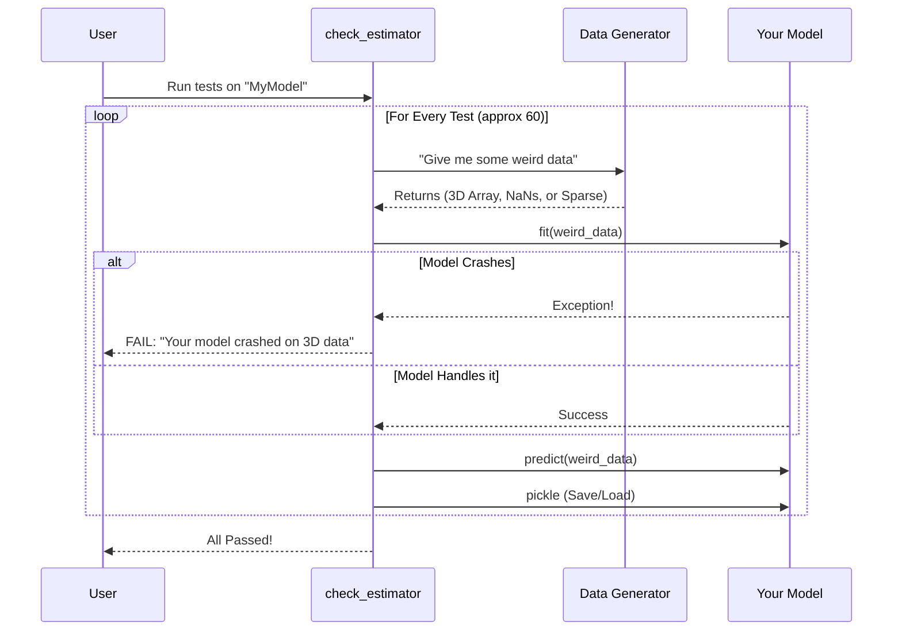

# Chapter 12: Common Tests

Welcome to Chapter 12!

In [Chapter 11: Testing Utilities](11_testing_utilities.md), we learned how to write manual tests for our code. We checked if our math was correct and if our errors raised the right messages.

But here is the problem: **You don't know what you don't know.**

You might have tested your model with a list of numbers, but did you test it with a numpy array? A pandas DataFrame? A read-only memory buffer? A sparse matrix? Scikit-learn models are expected to handle *all* of these.

## Motivation: The DMV Road Test

Imagine you taught yourself how to drive in an empty parking lot. You feel confident. But to get your license, you have to go to the DMV and pass the **Official Road Test**.
*   The examiner checks things you might have forgotten: Parallel parking, using turn signals, checking mirrors.

In scikit-learn, **Common Tests** are the official road test.

**The Problem:** If you build a custom model (like our `MajorityClassifier` from [Chapter 1](01_base_api.md)), it might work for you, but crash when someone tries to use it inside a [Pipeline](10_pipelines.md) or with [GridSearchCV](11_testing_utilities.md).
**The Solution:** Scikit-learn provides a utility called `check_estimator`. It runs over 60 standardized tests on your model to ensure it follows the rules of the library perfectly.

### Our Use Case
We want to take the `MajorityClassifier` we built in Chapter 1 and prove that it is a "legal" scikit-learn citizen. We want to run the full suite of compliance tests on it.

## Key Concepts

1.  **Compliance:** Scikit-learn has strict rules. For example:
    *   All estimators must accept `y` even if they don't use it.
    *   All estimators must return `self` after fitting.
    *   Estimators must not change the input data (unless specified).
2.  **`check_estimator`:** This is the function that runs the tests. It generates random data (integers, floats, negative numbers, zeros) and throws it at your model to see if it breaks.

## Solving the Use Case

Let's bring back a simplified version of our model and see if it passes the test.

### Step 1: Define the Model
Here is a very basic classifier. Note that we are intentionally being lazy and skipping some validation steps to see what happens.

```python
from sklearn.base import BaseEstimator, ClassifierMixin
import numpy as np

class LazyClassifier(BaseEstimator, ClassifierMixin):
    def fit(self, X, y):
        # We perform no checks on X or y! 
        # This is dangerous.
        self.classes_ = np.unique(y)
        return self

    def predict(self, X):
        # Just return zeros roughly the size of X
        return np.zeros(len(X))
```

### Step 2: Run the Check
We import `check_estimator` from the utils package.

```python
from sklearn.utils.estimator_checks import check_estimator

# We create an instance of our lazy model
model = LazyClassifier()

# This function creates a generator of checks
checks = check_estimator(model, generate_only=True)
```
*Note:* We use `generate_only=True` here so we can loop through them one by one for this tutorial. Usually, you just run `check_estimator(model)`.

### Step 3: See it Fail
Let's run the first few checks.

```python
try:
    for estimator, check_func in checks:
        # Run the specific test
        check_func(estimator)
        
except Exception as e:
    print(f"FAILED TEST: {e}")
```

**Output:**
`FAILED TEST: AttributeError: 'LazyClassifier' object has no attribute 'n_features_in_'`

*Explanation:* The test failed! Scikit-learn rules say: "After `fit` is called, a model *must* store how many features it saw in an attribute called `n_features_in_`." Our lazy model didn't do that.

### Step 4: Fix the Model
To pass the test, we need to use the helper functions we learned in [Chapter 1: Base API](01_base_api.md).

```python
from sklearn.utils.validation import check_X_y, check_array

class GoodClassifier(BaseEstimator, ClassifierMixin):
    def fit(self, X, y):
        # 1. This check automatically sets n_features_in_
        X, y = check_X_y(X, y) 
        self.classes_ = np.unique(y)
        return self

    def predict(self, X):
        # 2. Validate input for prediction
        X = check_array(X)
        return np.zeros(X.shape[0])
```

Now if we run `check_estimator(GoodClassifier())`, it runs silently. Silence means success!

## Under the Hood: The Test Suite

When you run `check_estimator`, you aren't running one function. You are running a massive loop of scenarios.

### The Testing Workflow



### What is it testing?
Here are just a few of the things it checks automatically:
1.  **`check_estimators_dtypes`:** Does your model crash if I give it integers instead of floats?
2.  **`check_fit_score_takes_y`:** Does your `score` function accept a `y` argument?
3.  **`check_estimators_pickle`:** Can I save your model to a file and load it back without losing information?
4.  **`check_methods_subset_invariance`:** If I predict on just the first 10 rows, is the result the same as predicting on all rows? (It should be!).

### Internal Implementation Code

The code for these tests lives in `sklearn/utils/estimator_checks.py`.

It works by maintaining a list of check functions. Here is a simplified version of how the checking logic works internally:

```python
# Simplified logic from sklearn/utils/estimator_checks.py

def check_estimator(estimator):
    # 1. List of all standard tests
    all_checks = [
        check_fit_idempotent,
        check_dtypes,
        check_parameters_default_constructible,
        # ... 50 more checks ...
    ]
    
    for check_func in all_checks:
        # 2. Clone the estimator so previous tests don't affect this one
        estimator_copy = clone(estimator)
        
        try:
            # 3. Run the specific check
            check_func(estimator_copy)
        except Exception as e:
            # 4. Report failure
            raise RuntimeError(f"Check {check_func.__name__} failed!") from e
```

### Tags: "I have a doctor's note"

Sometimes, your model *can't* pass a test, and that's okay.
*   *Example:* A text classifier cannot handle negative numbers.
*   *The Test:* `check_estimator` tries to feed it negative numbers.

You can use **Tags** to tell the test runner to skip certain exams.

```python
class TextOnlyModel(BaseEstimator):
    def _get_tags(self):
        # Tell the exam proctor: "I require positive X values only"
        return {'requires_positive_X': True}
```

When `check_estimator` sees this tag, it will skip the negative number test.

## Summary

In this chapter, we learned:
1.  **Don't Assume:** Just because your model works on your laptop doesn't mean it follows the API standards.
2.  **`check_estimator`:** The tool that runs ~60 checks to verify compliance.
3.  **Strictness:** It checks for pickling, data types, shapes, and attribute naming (`n_features_in_`).
4.  **Validation Helpers:** Using `check_X_y` and `check_array` (from [Chapter 1](01_base_api.md)) is the easiest way to pass these tests.

We have now designed, built, and rigorously tested our machine learning tools. We have a robust, standard-compliant model.

The final step is understanding how all these pieces—the Python code, the Cython extensions, and the metadata—are compiled into the library you install.

[Next Chapter: Build System](13_build_system.md)

---

Generated by [Code IQ](https://github.com/adityasoni99/Code-IQ)