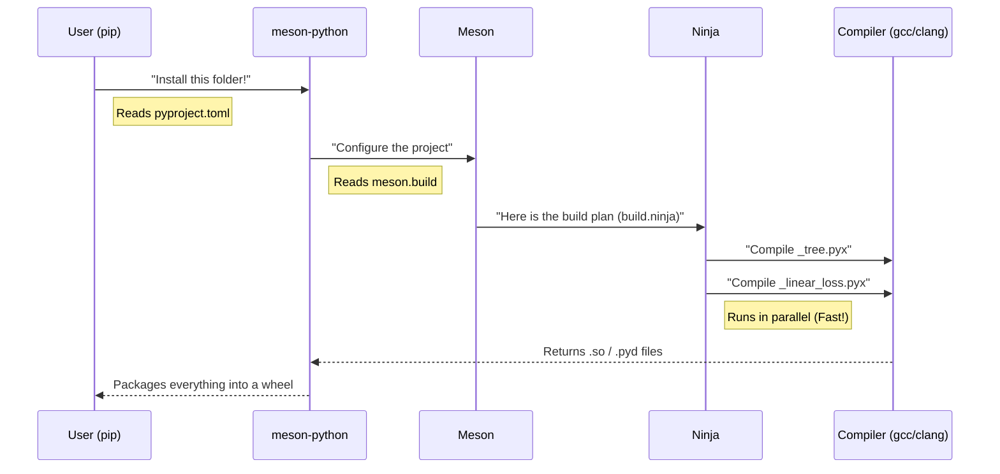

# Chapter 13: Build System

Welcome to the final chapter of our tutorial series!

In [Chapter 12: Common Tests](12_common_tests.md), we ensured our Python code logic was correct. In earlier chapters like [Chapter 3: Linear Models](03_linear_models.md) and [Chapter 6: Trees](06_trees.md), we mentioned that scikit-learn uses special files (ending in `.pyx`) to make math run incredibly fast.

But Python cannot run `.pyx` or C++ files directly. They need to be translated into machine code first. This chapter explains the factory that performs that translation: the **Build System**.

## Motivation: The Translation Layer

Imagine you write a letter in English (Python), but your high-performance machine only reads Binary (Machine Code).
*   **The Problem:** You have high-speed code written in Cython or C++, but Python interprets code line-by-line and doesn't know how to execute raw C++.
*   **The Solution:** You need a **Compiler** to translate the code, and a **Build System** to manage the translation process.

In scikit-learn, we use a modern build system called **Meson**.

### Our Use Case
We want to compile scikit-learn from source.
1.  We have the source code (thousands of Python and Cython files).
2.  We want to turn it into an installable package where the "heavy lifting" math is already compiled into binary.

## Key Concepts

1.  **Extension Modules:** These are the compiled files. On Windows, they end in `.pyd`; on Linux/Mac, they end in `.so`. Python treats them like normal modules you can `import`, but inside, they are optimized machine code.
2.  **Meson:** The "Architect." It reads a recipe file (`meson.build`) to understand how the project is structured and what needs to be compiled.
3.  **Ninja:** The "Construction Worker." Meson gives the blueprints to Ninja, and Ninja actually runs the compiler commands (like `gcc` or `clang`) extremely fast.
4.  **pyproject.toml:** The "Project ID." This file tells tools like `pip` how to start the build process.

## The Recipe: `meson.build`

Every folder in scikit-learn that contains C or Cython code has a file named `meson.build`. This is the recipe.

### Step 1: The Root Recipe
At the very top of the project, the `meson.build` file sets up the basics.

```python
# Simplified content of the root meson.build
project('scikit-learn', 'c', 'cpp', 'cython',
  version: '1.4.0',
  license: 'BSD-3',
)

# Tell Meson to look into the 'sklearn' folder next
subdir('sklearn')
```
*Explanation:* This tells Meson: "We are building a project named scikit-learn. We use C, C++, and Cython. Go look in the `sklearn` folder for more instructions."

### Step 2: The Extension Recipe
Inside a specific folder (e.g., `sklearn/tree`), we need to tell Meson to turn `_tree.pyx` into a binary file.

```python
# Simplified content of sklearn/tree/meson.build

# We define a python extension module
py.extension_module(
    '_tree',               # The name of the result
    ['_tree.pyx'],         # The source file
    dependencies: [np_dep],# It needs NumPy to work
    install: true          # Please install the result
)
```
*Explanation:* This translates to: "Take `_tree.pyx`. Link it with NumPy. Compile it. Name the result `_tree`."

## The Entry Point: `pyproject.toml`

How does `pip` know to use Meson? It looks at `pyproject.toml`. This is the modern standard for defining Python projects.

```toml
[build-system]
# We need these tools to build the project
requires = [
    "meson-python>=0.13.0",
    "Cython>=3.0",
    "numpy>=2.0"
]
# Use meson-python as the builder
build-backend = "mesonpy"
```

*Explanation:*
1.  **requires:** "Before you start, download Meson, Cython, and NumPy."
2.  **build-backend:** "Use the `mesonpy` tool to coordinate the build."

## Solving the Use Case

To actually build the project (solve our use case), you act as the User. You don't run Meson directly; you let `pip` handle it.

### Step 1: The Command
Open your terminal in the scikit-learn folder.

```bash
# The dot (.) means "this current directory"
pip install . --verbose
```

### Step 2: What Happens (The Output)
You will see a flurry of text. Here is the translation of what you see:

1.  `Getting requirements to build wheel...` -> (Reading `pyproject.toml`)
2.  `The Meson build system...` -> (Meson is reading `meson.build` files)
3.  `Compiling...` -> (The compiler is turning `.pyx` into `.so`)
4.  `Successfully installed scikit-learn` -> (The binary files are moved to your Python library folder).

## Under the Hood: The Build Pipeline

The build process is a relay race between different tools.

### The Sequence



### Internal Implementation Details

Scikit-learn moved to Meson (from `setuptools` + `numpy.distutils`) because Meson is much faster and reliable.

The integration logic relies on **Generator Expressions** in `meson.build`.

For example, Cython files often need to generate C++ files first. Meson handles this two-step process automatically.

```python
# Conceptual logic inside a meson.build file
# for generating C++ from Cython

cython_gen = generator(cython,
  arguments : ['-3', '--fast-fail', '@INPUT@', '-o', '@OUTPUT@'],
  output : '@BASENAME@.c',
  name : 'Cython Source Generator'
)

# Use the generator
sources = cython_gen.process('my_model.pyx')
```
*Explanation:*
1.  We define a `generator` that knows how to run the `cython` command.
2.  We process `my_model.pyx`.
3.  Meson creates `my_model.c`.
4.  Meson then compiles `my_model.c` using the standard C compiler.

### Handling NumPy

Almost every module in scikit-learn depends on NumPy (see [Chapter 2: Datasets](02_datasets.md)). Compiling against NumPy requires finding its header files (`numpy/arrayobject.h`).

In the old days, this was hard. With Meson, it's a dependency lookup:

```python
# Inside meson.build
py = import('python').find_installation(pure: false)

# Ask Python: "Where is NumPy?"
incdir_numpy = run_command(py,
  ['-c', 'import numpy; print(numpy.get_include())'],
  check: true
).stdout().strip()

# Create a dependency object to use later
np_dep = declare_dependency(include_directories: incdir_numpy)
```
*Explanation:* Meson runs a tiny Python script to ask NumPy where it lives, then saves that path so the C compiler can find the instructions for creating arrays.

## Summary

In this final chapter, we learned:
1.  **Compilation:** Python needs help to run fast. We compile `.pyx` files into binary extension modules.
2.  **Meson:** The modern build system scikit-learn uses to organize this complex process.
3.  **pyproject.toml:** The entry point that tells `pip` to use Meson.
4.  **Ninja:** The tool that actually executes the compilation commands in parallel.

### Conclusion of the Tutorial

Congratulations! You have completed the **Beginner's Guide to Scikit-Learn Architecture**.

We started with the **Base API** (the blueprint), learned how to load **Datasets** (the fuel), and built **Linear Models**, **Trees**, and **Ensembles**. We learned how to measure success with **Metrics**, process **Text**, and handle messy data with **Pipelines**. Finally, we learned how to ensure quality with **Tests** and how the library is physically **Built**.

You now possess a deep understanding of not just *how* to use scikit-learn, but *how it works* internally.

**Happy Coding!**

---

Generated by [Code IQ](https://github.com/adityasoni99/Code-IQ)