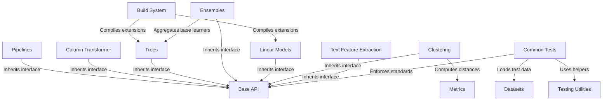

# Tutorial: scikit-learn

**Scikit-learn** is a comprehensive Python library designed for *machine learning* and data analysis. It provides a unified interface to apply various algorithms—such as **Linear Models**, **Trees**, and **Clustering**—and tools to organize workflows into efficient **Pipelines**. It also includes robust utilities for evaluating performance with **Metrics** and handling **Datasets**.

**Source Repository:** [https://github.com/scikit-learn/scikit-learn](https://github.com/scikit-learn/scikit-learn)

## Chapters

1. [Base API](01_base_api.md)
2. [Datasets](02_datasets.md)
3. [Linear Models](03_linear_models.md)
4. [Metrics](04_metrics.md)
5. [Clustering](05_clustering.md)
6. [Trees](06_trees.md)
7. [Ensembles](07_ensembles.md)
8. [Text Feature Extraction](08_text_feature_extraction.md)
9. [Column Transformer](09_column_transformer.md)
10. [Pipelines](10_pipelines.md)
11. [Testing Utilities](11_testing_utilities.md)
12. [Common Tests](12_common_tests.md)
13. [Build System](13_build_system.md)

---

Generated by [Code IQ](https://github.com/adityasoni99/Code-IQ)