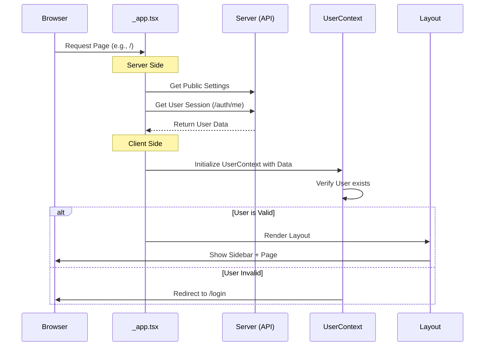

# Chapter 1: Frontend Context & State Management

Welcome to the first chapter of the **seerr** project tutorial! Before we dive into databases or external APIs, we need to build the "frame" of our application.

## The Motivation: The "Dashboard" Analogy

Imagine you are driving a modern car. No matter where you drive (the destination), the dashboard remains the same. The speedometer, fuel gauge, and steering wheel are always there. You don't need to install a new steering wheel just because you turned left onto a different street.

In a web application like **seerr**:
1.  **The Dashboard** is your **Layout** (Sidebar, Search Bar, Header). It should stay visible on every page.
2.  **The Driver** is the **User Session**. The car needs to know *who* is driving to adjust the seat and mirrors (user settings).
3.  **The Destination** is the **Specific Page** (e.g., a movie details page, or the settings page).

**The Problem:** How do we keep the "Dashboard" and the "Driver" information available everywhere without copying and pasting code onto every single page?

**The Solution:** Global **Context** and a wrapping **Layout**.

---

## Key Concepts

### 1. The Root Wrapper (`_app.tsx`)
In Next.js, `_app.tsx` is the absolute parent of every page. It wraps every view you see. This is where we load global settings, styles, and data providers.

### 2. The Context (`UserContext`)
React components are usually isolated. Passing data (like "Is the user logged in?") from the very top down to a tiny button at the bottom is difficult. **Context** acts like a Wi-Fi signal; any component within the house can "connect" to it to get data without wires.

### 3. The Layout
This is the visual frame. It draws the sidebar and the top bar, and leaves a blank space in the middle for the specific page content to fill.

---

## How It Works: The "Frame"

Let's look at how we construct this frame. We will look at `src/pages/_app.tsx`. This file runs before any specific page code.

### Step 1: Providing the Data
We wrap our application in "Providers". These providers broadcast data to the whole app.

```tsx
// src/pages/_app.tsx (Simplified)
// ... imports

return (
  // SWRConfig handles data fetching settings
  <SWRConfig value={{ ... }}> 
    {/* LanguageContext provides translation data */}
    <LanguageContext.Provider value={{ locale, setLocale }}>
      {/* SettingsProvider provides app settings (like titles) */}
      <SettingsProvider currentSettings={currentSettings}>
         {/* ... Interaction and Toast providers ... */}
         {/* The View Logic starts here */}
      </SettingsProvider>
    </LanguageContext.Provider>
  </SWRConfig>
);
```
*Explanation:* Think of this like an onion. We wrap the app in layers of data. Now, any button deep inside the app can ask "What language is selected?" or "What is the application title?".

### Step 2: The User Context
Inside those providers, we specifically handle the User.

```tsx
// src/pages/_app.tsx (Inside the providers)

<UserContext initialUser={user}>
   {component} 
</UserContext>
```
*Explanation:* We pass the `user` (loaded from the server) into the `UserContext`. Now the app knows who you are immediately. `{component}` represents the specific page you are trying to visit.

### Step 3: The Visual Layout
Finally, unless we are on the login page, we wrap the specific page component in our visual Layout.

```tsx
// src/pages/_app.tsx (Logic for rendering)

if (router.pathname.match(/(login|setup)/)) {
  // If logging in, just show the login box (no sidebar)
  component = <Component {...pageProps} />;
} else {
  // Otherwise, wrap the page in the main Layout
  component = (
    <Layout>
      <Component {...pageProps} />
    </Layout>
  );
}
```
*Explanation:* If you are already logged in, the app renders the `<Layout>`, and puts the `<Component>` (the page) inside it.

---

## Using the Abstraction

Now that the frame is built, how do we use it?

### Scenario: Checking who is logged in
Let's say you are building a new page and want to say "Hello, [Name]". You don't need to fetch the user from the database again. You just "hook" into the context we created.

```tsx
import { useUser } from '@app/hooks/useUser';

const MyPage = () => {
  // We hook into the context setup in _app.tsx
  const { user } = useUser();

  if (!user) return <div>Loading...</div>;

  return <h1>Hello, {user.email}!</h1>;
};
```

### Scenario: The Visual Result
When you create a simple page like `src/pages/index.tsx`:

```tsx
// src/pages/index.tsx
const Index = () => {
  return <Discover />; // Just the content!
};
export default Index;
```

Because of our setup in `_app.tsx`, the user will actually see:
1.  The **Sidebar** (from `Layout`)
2.  The **Search Bar** (from `Layout`)
3.  The **Discover Component** (from `index.tsx`)

---

## Under the Hood: Implementation Details

How does the app ensure the user is secure and the layout is consistent?

### The Flow Sequence



### 1. Server-Side Initialization (`_app.tsx`)
Before the browser even shows the page, Next.js runs `getInitialProps`. This is the "boot up" sequence.

```tsx
// src/pages/_app.tsx (getInitialProps)

CoreApp.getInitialProps = async (initialProps) => {
  // 1. Get settings from the API
  const settingsRes = await axios.get('.../api/v1/settings/public');
  
  // 2. Try to get the current user
  try {
    const userRes = await axios.get('.../api/v1/auth/me', { ...cookieHeader });
    user = userRes.data;
  } catch (e) {
    // If getting user fails, we might redirect to login
  }

  return { user, currentSettings, ... };
};
```
*Explanation:* This code runs on the server. It pre-fetches the user data so the page doesn't "flicker" between logged-out and logged-in states when it loads.

### 2. The Security Guard (`UserContext.tsx`)
The `UserContext` isn't just for storing data; it acts as a security guard (bouncer).

```tsx
// src/context/UserContext.tsx
export const UserContext = ({ initialUser, children }: UserProps) => {
  const { user, error } = useUser({ initialData: initialUser });
  const router = useRouter();

  useEffect(() => {
    // If not on login page AND no user found...
    if (!router.pathname.match(/(setup|login)/) && (!user || error)) {
      // Kick them out!
      location.href = '/login';
    }
  }, [router, user, error]);

  return <>{children}</>;
};
```
*Explanation:* The `useEffect` runs constantly. If the user logs out, or their session expires while using the app, this code detects it immediately and forces a redirect to the login page.

### 3. The Consistent Frame (`Layout/index.tsx`)
The Layout handles the responsive design logic.

```tsx
// src/components/Layout/index.tsx
const Layout = ({ children }: LayoutProps) => {
  // State for mobile menu
  const [isSidebarOpen, setSidebarOpen] = useState(false);

  return (
    <div className="flex h-full bg-gray-900">
      {/* The Sidebar is always rendered here */}
      <Sidebar open={isSidebarOpen} ... />
      
      {/* The specific page content goes here */}
      <main className="relative ...">
          {children} 
      </main>
    </div>
  );
};
```
*Explanation:* The `{children}` prop is the magic placeholder where the specific page content (like `src/pages/index.tsx`) is injected.

---

## Conclusion

In this chapter, we learned how **seerr** maintains a seamless experience. By using `_app.tsx` as a master controller, `UserContext` as a global state manager, and `Layout` as a visual frame, we ensure that:
1.  The user's session is checked on every page load.
2.  The navigation sidebar is always available.
3.  We don't repeat code across pages.

Now that we have our frontend structure set up, how does the application actually talk to the database or verify that user session?

[Next Chapter: API Routing & Controllers](02_api_routing___controllers.md)

---

Generated by [Code IQ](https://github.com/adityasoni99/Code-IQ)