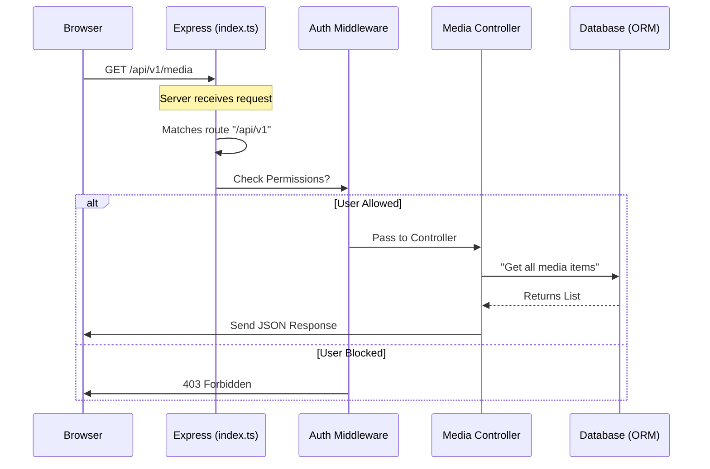

# Chapter 2: API Routing & Controllers

Welcome to the second chapter of the **seerr** tutorial!

In the previous chapter, [Frontend Context & State Management](01_frontend_context___state_management.md), we built the visual "Dashboard" of our car. We learned how the frontend displays buttons and sidebars. But when you press a button like "Request Movie," how does the car actually know to move?

That is the job of the **API (Application Programming Interface)**.

## The Motivation: The "Traffic Control Center"

Imagine **seerr** is a busy city.
1.  **The Frontend** (your browser) is a car trying to get somewhere.
2.  **The Backend** is the destination city.
3.  **The Data** (movies, users) are the buildings in that city.

When the Frontend sends a request (a car drives in), we need a **Traffic Control Center** to answer three questions:
1.  **Where are you going?** (Routing)
2.  **Are you allowed to go there?** (Middleware/Security)
3.  **What happens when you arrive?** (Controllers)

Without this system, every request would be a chaotic pile-up, and unauthorized users could walk right into the bank vault (your settings).

---

## The Use Case: "Show Me the Media"

Let's focus on one simple task: **The user wants to see a list of all requested movies.**

The frontend sends a signal (an HTTP Request) to this address:
`GET /api/v1/media`

We need to write the backend code to receive this signal and send back the list of movies.

---

## Key Concepts

### 1. The Server (`Express`)
This is the foundation. We use a library called **Express** to listen for incoming traffic. It runs 24/7, waiting for cars (requests) to arrive.

### 2. The Router
Think of the Router as the **Signposts**. When a request hits `/api/v1/media`, the router sees the word "media" and points the traffic down the "Media Highway."

### 3. Middleware (The Bouncers)
Before you reach your destination, you might pass a checkpoint. In **seerr**, this is the `isAuthenticated` check. It looks at your ID (session) and decides if you are allowed to pass.

### 4. The Controller
This is the destination. It is a function that performs the actual work—like fetching data from the database—and sends a response back to the frontend.

---

## How It Works: Creating a Route

Let's look at how **seerr** handles the "Show Me the Media" request in `server/routes/media.ts`.

### Step 1: Grouping the Traffic
First, we create a specific router just for media-related tasks. This keeps our code organized.

```typescript
// server/routes/media.ts
import { Router } from 'express';

// Create a new "Signpost" group for media
const mediaRoutes = Router();
```

### Step 2: Defining the Endpoint
Now we tell the router what to do when someone visits the root (`/`) of this media highway.

```typescript
// server/routes/media.ts

// When a GET request comes to '/', run this function
mediaRoutes.get('/', async (req, res, next) => {
  
  // Logic to get media goes here...
  
  // Send the result back to the browser
  return res.status(200).json(results);
});
```

### Step 3: Adding the Bouncer (Middleware)
Some routes are private. For example, deleting a request requires specific permissions. We add `isAuthenticated` to stop unauthorized users.

```typescript
// server/routes/media.ts

mediaRoutes.delete(
  '/:id', // The specific ID to delete
  isAuthenticated(Permission.MANAGE_REQUESTS), // The Bouncer!
  async (req, res, next) => {
     // If the bouncer lets us through, delete the item
  }
);
```
*Explanation:* If `isAuthenticated` fails, the code inside the `async` function never runs. The request is turned away immediately.

---

## Under the Hood: The Request Journey

What exactly happens from the moment the server starts to when a user gets data?

### The Flow Sequence



### Implementation Deep Dive

Let's look at the actual files to see how this pipeline is constructed.

#### 1. The Entry Point (`server/index.ts`)
This is where the application starts. We create the server and attach the main router.

```typescript
// server/index.ts

// 1. Create the web server
const server = express();

// 2. Apply global settings (like reading JSON bodies)
server.use(express.json());

// 3. Direct all traffic starting with '/api/v1' to our routes
server.use('/api/v1', routes);

// 4. Start listening on port 5055
server.listen(5055, () => {
    logger.info('Server ready on port 5055');
});
```
*Explanation:* This acts like the main gate of the city. It says "All official business (API calls) goes to the `routes` department."

#### 2. The Route Manager (`server/routes/index.ts`)
(Note: While not shown in the snippets, `routes` acts as a central hub). It connects `/media` traffic to `mediaRoutes` and `/settings` traffic to `settingsRoutes`.

#### 3. The Controller Logic (`server/routes/media.ts`)
Here is the actual logic for fetching media. We use a **Repository** (which we will cover in the next chapter) to talk to the database.

```typescript
// server/routes/media.ts (Simplified)

mediaRoutes.get('/', async (req, res, next) => {
  // 1. Get the "tool" to access Media in the database
  const mediaRepository = getRepository(Media);

  try {
    // 2. Ask the database for the list
    const [media, count] = await mediaRepository.findAndCount({
      take: 20, // Limit to 20 items (pagination)
    });

    // 3. Send the data back as JSON
    return res.status(200).json({ results: media, count });
  } catch (e) {
    // 4. If it breaks, tell the next error handler
    next({ status: 500, message: e.message });
  }
});
```
*Explanation:* 
1.  **`getRepository(Media)`**: This prepares the connection to the database table specifically for Media.
2.  **`findAndCount`**: A helper function that gets the data rows and the total number of items.
3.  **`res.json`**: This converts the JavaScript objects into text (JSON) that the frontend can read.

#### 4. The Security Guard (`server/middleware/auth.ts`)
How does the `isAuthenticated` check work?

```typescript
// server/middleware/auth.ts

export const isAuthenticated = (permissions) => {
  // This function runs on every request protecting a route
  return (req, res, next) => {
    
    // Check if user exists AND has the right permission
    if (req.user && req.user.hasPermission(permissions)) {
      next(); // All good! Move to the controller.
    } else {
      // Stop right there.
      res.status(403).json({ error: 'Access Denied' });
    }
  };
};
```
*Explanation:* The `next()` function is the key. If called, the traffic moves forward. If not, the traffic stops, and an error is sent back.

---

## Conclusion

In this chapter, we learned how **seerr** directs traffic:
1.  **Express** listens for requests.
2.  **Routers** categorize requests (Media vs. Settings).
3.  **Middleware** ensures only authorized users pass.
4.  **Controllers** execute the logic and return data.

You noticed in the Controller section that we called `getRepository(Media)` to fetch data. But what *is* `Media`? How does the application know how to structure that data in the database?

To answer that, we need to define our entities.

[Next Chapter: Data Models & ORM (Entities)](03_data_models___orm__entities_.md)

---

Generated by [Code IQ](https://github.com/adityasoni99/Code-IQ)