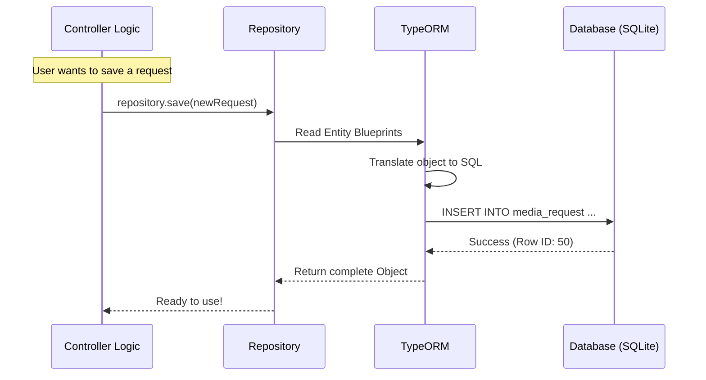

# Chapter 3: Data Models & ORM (Entities)

Welcome to the third chapter of the **seerr** tutorial!

In the previous chapter, [API Routing & Controllers](02_api_routing___controllers.md), we built the "Traffic Control Center." We learned how to catch a user's request (like "Get me the media list") and send a response.

But where does that list of media come from? And when a user requests a new movie, where does that information go? We can't just keep it in the computer's RAM, or it will disappear if we restart the server. We need a permanent memory: **The Database**.

## The Motivation: The "Blueprint" Analogy

Computers store data in databases (like tables in Excel). However, our code is written in TypeScript (Objects and Classes).

1.  **The Database** speaks SQL: `SELECT * FROM users WHERE id = 1`.
2.  **The Code** speaks Objects: `user.email`.

**The Problem:** Translating between SQL tables and TypeScript objects manually is tedious, error-prone, and messy.

**The Solution:** An **ORM (Object-Relational Mapper)**.
Think of the ORM as a bilingual translator. You speak TypeScript to the ORM, and the ORM speaks SQL to the database.

To make this work, we need **Entities**. Think of Entities as **Blueprints**. Just as a blueprint tells a construction crew where to put walls and windows, an Entity file tells the ORM: "This is what a User looks like," or "This is how a Media Request connects to a User."

---

## The Use Case: Defining a "User"

Let's focus on a core requirement: **We need to store users so they can log in and request movies.**

We need to tell the database that a `User` consists of:
*   An ID (to identify them)
*   An Email
*   A Username
*   A relationship to the Requests they make

---

## Key Concepts

### 1. The Entity Class
This is a standard TypeScript class. It represents one row in your database table. If you have a `User` class, you will have a `user` table in your database.

### 2. Decorators (`@`)
You will see symbols like `@Entity()`, `@Column()`, and `@OneToMany()`. These are "tags" or sticky notes attached to the code. They tell **TypeORM** (our ORM library) how to handle that specific piece of data.

### 3. The Repository
If the Entity is the *blueprint*, the **Repository** is the *manager*. You ask the Repository to "Find," "Save," or "Delete" entities based on the blueprint.

---

## How It Works: Creating a Blueprint

Let's look at `server/entity/User.ts`. We will break down how we define a user.

### Step 1: The Class Definition
We start by declaring the class and tagging it.

```typescript
// server/entity/User.ts
import { Entity, PrimaryGeneratedColumn, Column } from 'typeorm';

@Entity() // <--- Tells TypeORM: "This class is a database table"
export class User {
  
  @PrimaryGeneratedColumn() // <--- Auto-incrementing ID (1, 2, 3...)
  public id: number;

  @Column({ unique: true }) // <--- A standard column, must be unique
  public email: string;
}
```
*Explanation:*
*   **`@Entity()`**: This creates a table named `user`.
*   **`@PrimaryGeneratedColumn()`**: Every row needs a unique ID. The database handles creating this number automatically.
*   **`@Column()`**: This tells the database to create a column for `email`.

### Step 2: Adding Relationships
A User doesn't exist in a vacuum. They make requests. We need to link the **User** blueprint to the **MediaRequest** blueprint.

```typescript
// server/entity/User.ts

// ... inside the User class
@OneToMany(() => MediaRequest, (request) => request.requestedBy)
public requests: MediaRequest[];
```
*Explanation:*
*   **`@OneToMany`**: One User can make *Many* requests.
*   **`() => MediaRequest`**: This points to the other file (blueprint) we are connecting to.
*   **`requests: MediaRequest[]`**: In our code, `user.requests` will be an array (list) of request objects.

### Step 3: The Other Side (The Request)
Now let's look at the other side of this relationship in `server/entity/MediaRequest.ts`.

```typescript
// server/entity/MediaRequest.ts
import { ManyToOne } from 'typeorm';
import { User } from './User';

@Entity()
export class MediaRequest {
    // ... id and status columns ...

    @ManyToOne(() => User, (user) => user.requests)
    public requestedBy: User;
}
```
*Explanation:*
*   **`@ManyToOne`**: *Many* requests can belong to *One* User.
*   **`requestedBy`**: In our code, `mediaRequest.requestedBy` will give us the full User object (email, username, etc.) of the person who asked for the movie.

---

## Under the Hood: The Translation Process

What happens when we actually try to save data using these blueprints?

### The Flow Sequence



### Implementation Deep Dive

Let's look at the actual code that powers this system.

#### 1. The Construction Manager (`server/datasource.ts`)
Before we can use entities, we need to connect to the database. This file handles the connection settings.

```typescript
// server/datasource.ts (Simplified)
import { DataSource } from 'typeorm';

// Define settings for SQLite (Development)
const devConfig = {
  type: 'sqlite',
  database: 'config/db/db.sqlite3',
  entities: ['server/entity/**/*.ts'], // Where are the blueprints?
  synchronize: true, // Auto-create tables based on blueprints
};

const dataSource = new DataSource(devConfig);
export default dataSource;
```
*Explanation:*
*   **`entities`**: This points to the folder containing our `User.ts` and `MediaRequest.ts`. It loads them all up.
*   **`synchronize: true`**: This is a powerful feature for beginners. If you add a new `@Column()` to a file and restart the server, TypeORM automatically modifies the database table to match your code.

#### 2. The Logic Inside Entities (`Fat Models`)
In **seerr**, entities aren't just for data storage; they also contain logic. This is known as a "Fat Model."

Look at `server/entity/User.ts` specifically the `getQuota` method.

```typescript
// server/entity/User.ts

public async getQuota(): Promise<QuotaResponse> {
  // 1. Get global settings
  const { main: { defaultQuotas } } = getSettings();
  
  // 2. Access the repository helper
  const requestRepository = getRepository(MediaRequest);

  // 3. Count how many requests this user made recently
  const movieQuotaUsed = await requestRepository.count({
      where: { requestedBy: { id: this.id } } // ... + date logic
  });

  return { movie: { used: movieQuotaUsed, ... } };
}
```
*Explanation:* instead of writing this logic in a Controller, we put it directly on the User. Now, anywhere in the app, we can just call `user.getQuota()` to see if they are allowed to request more movies.

#### 3. Complex Operations (`server/entity/MediaRequest.ts`)
Sometimes creating an entity involves a lot of work. The `MediaRequest` entity has a static method called `request`.

```typescript
// server/entity/MediaRequest.ts (Simplified)

public static async request(body, user): Promise<MediaRequest> {
  // 1. Check if user has permission
  if (!user.hasPermission(Permission.REQUEST)) {
      throw new Error('No permission');
  }

  // 2. Check for duplicates
  const existing = await getRepository(MediaRequest).findOne({ ... });
  if (existing) throw new Error('Already requested!');

  // 3. Create the object
  const newRequest = new MediaRequest({
      type: MediaType.MOVIE,
      requestedBy: user,
      status: MediaRequestStatus.PENDING
  });

  // 4. Save to DB
  return getRepository(MediaRequest).save(newRequest);
}
```
*Explanation:* This method acts like a factory. It checks permissions, quotas, and duplicates *before* it allows the blueprint to be stamped into the database.

---

## Conclusion

In this chapter, we learned that:
1.  **Entities** are the blueprints that define our data structure (`User`, `MediaRequest`).
2.  **TypeORM** translates our TypeScript code into SQL commands.
3.  **Relationships** (like `@OneToMany`) let us link users to their requests easily.
4.  **Datasource** connects our application to the physical database file.

We now have a Frontend (Dashboard), an API (Traffic Control), and a Database (Memory). But a media requester is useless if it can't talk to the media servers (like Radarr or Sonarr) to actually download the content.

How do we connect our app to other software?

[Next Chapter: External Service Integrations (The "Connectors")](04_external_service_integrations__the__connectors__.md)

---

Generated by [Code IQ](https://github.com/adityasoni99/Code-IQ)