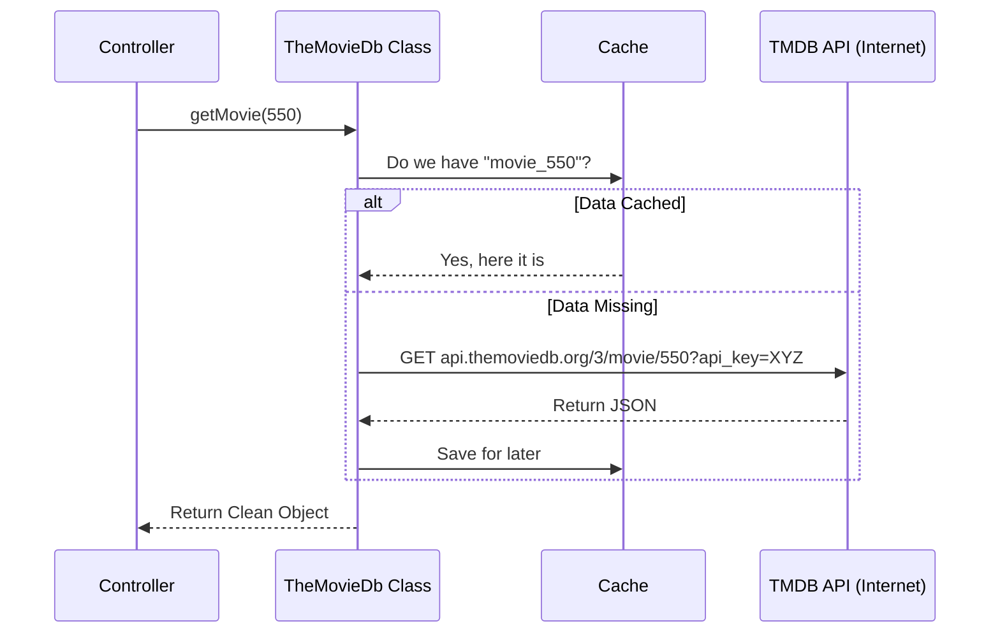

# Chapter 4: External Service Integrations (The "Connectors")

Welcome to the fourth chapter of the **seerr** tutorial!

In the previous chapter, [Data Models & ORM (Entities)](03_data_models___orm__entities_.md), we built the application's "memory" (the database). We defined what a `User` and a `MediaRequest` look like.

However, a database is just an empty warehouse. When a user searches for "The Matrix," our database doesn't know what that is yet. We need to ask someone who does. Furthermore, when a user requests that movie, our app doesn't download it; it needs to tell another program (like Radarr) to do it.

## The Motivation: The "Diplomat" Analogy

Your application is like a country that speaks its own language (TypeScript/JavaScript).
*   **TMDB** (The Movie Database) is a foreign library containing all movie knowledge.
*   **Sonarr/Radarr** are foreign factories that manufacture (download) the media.

Each of these foreign services has its own strict rules of etiquette (API protocols):
1.  You must show an ID card (API Key).
2.  You must speak their specific dialect (JSON structure).
3.  You cannot shout too many questions at once (Rate Limiting).

**The Problem:** If we write code to "Add API Key" and "Format JSON" inside every single controller, our code becomes messy and hard to read.

**The Solution:** We create **Connectors** (Service Integrations).
Think of these classes as **Diplomats**. The rest of your app simply says "Get me the movie details," and the Diplomat handles the API keys, the URLs, and the translation behind the scenes.

---

## The Use Case: "Search & Request"

We will look at two specific tasks to understand how connectors work:
1.  **Fetching Metadata:** The user types "Breaking Bad". We need to ask TMDB for the cover image and plot.
2.  **Sending Commands:** The user clicks "Request". We need to tell Sonarr to add the show to its download queue.

---

## Key Concepts

### 1. The Base Class (`ExternalAPI`)
This is the Diplomat's handbook. It contains the shared logic for making HTTP requests (using a library like `axios`), handling caching (so we don't ask the same question twice), and managing headers.

### 2. The Metadata Provider (`TheMovieDb`)
This connector specializes in talking to The Movie Database. It knows exactly which URL to hit to find a movie's cast, director, or age rating.

### 3. The Service Integration (`SonarrAPI` / `RadarrAPI`)
These connectors talk to your local media servers. They are more complex because they don't just *fetch* data; they *send* data (commands) to manage your library.

---

## How It Works: Using the Diplomats

Let's see how we use these classes in our code. We don't worry about URLs or HTTP methods here; we just call simple functions.

### Scenario 1: Getting Movie Details
When we want details about a specific movie, we instantiate the TMDB class and call `getMovie`.

```typescript
// server/api/themoviedb/index.ts usage

const tmdb = new TheMovieDb();

// We just pass the ID. The class handles the rest.
const movie = await tmdb.getMovie({ 
    movieId: 550 // Fight Club
});

console.log(movie.title); // Output: "Fight Club"
```

### Scenario 2: Adding a Show to Sonarr
When sending a show to Sonarr, we need to format the data exactly how Sonarr expects it. The Connector handles this complexity.

```typescript
// server/api/servarr/sonarr.ts usage

const sonarr = new SonarrAPI({ url: 'http://localhost:8989', apiKey: '...' });

// We call a friendly method 'addSeries'
await sonarr.addSeries({
  tvdbid: 121361, // Game of Thrones
  title: 'Game of Thrones',
  qualityProfileId: 1,
  rootFolderPath: '/tv',
  monitored: true
});
```
*Explanation:* The `sonarr` object takes our simple inputs and translates them into the complex JSON payload that the Sonarr server requires.

---

## Under the Hood: The Request Journey

What happens inside the connector when we call these methods?

### The Flow Sequence



### Implementation Deep Dive

Let's look at the actual code in `server/api/themoviedb/index.ts` to see how it constructs the request.

#### 1. The Setup (Constructor)
The class initializes with the specific settings required for TMDB (the base URL and the API key).

```typescript
// server/api/themoviedb/index.ts

class TheMovieDb extends ExternalAPI {
  constructor() {
    // 1. Call the parent (ExternalAPI) with URL and Key
    super(
      'https://api.themoviedb.org/3',
      {
        api_key: '431a87...', // The ID Card
      },
      {
        nodeCache: cacheManager.getCache('tmdb').data, // The memory
      }
    );
  }
}
```
*Explanation:* `super` calls the constructor of the parent class `ExternalAPI`. It sets up the default "ID Card" (API Key) so we don't have to send it manually with every request.

#### 2. fetching Data (The `getMovie` method)
Here is how the class wraps the HTTP request.

```typescript
// server/api/themoviedb/index.ts

public getMovie = async ({ movieId, language }: Options) => {
  try {
    // 1. Make the request to the specific endpoint
    const data = await this.get<TmdbMovieDetails>(
      `/movie/${movieId}`, 
      {
        params: {
          language,
          // Ask for extra info (credits, videos) in one go
          append_to_response: 'credits,videos,release_dates', 
        },
      }
    );

    return data;
  } catch (e) {
    throw new Error(`Failed to fetch movie: ${e.message}`);
  }
};
```
*Explanation:*
1.  **`this.get`**: This uses the internal `axios` instance set up in the constructor.
2.  **`append_to_response`**: TMDB allows us to ask for the movie details *and* the cast list in a single internet trip. This makes the app faster.

### Implementation Deep Dive: Sonarr

Now let's look at `server/api/servarr/sonarr.ts`. This is more complex because it involves *changing* data on the remote server.

#### The `addSeries` Logic
This method is a "Smart" wrapper. It doesn't just send data; it checks if the show already exists to decide if it should `update` or `create`.

```typescript
// server/api/servarr/sonarr.ts (Simplified)

public async addSeries(options: AddSeriesOptions): Promise<SonarrSeries> {
  // 1. Check if the show is already in Sonarr
  const series = await this.getSeriesByTvdbId(options.tvdbid);

  if (series.id) {
    // 2. If yes, UPDATE the existing show
    const newSeriesResponse = await this.axios.put('/series', {
        ...series, 
        monitored: options.monitored 
    });
    return newSeriesResponse.data;
  }

  // 3. If no, CREATE a new show
  const createdSeriesResponse = await this.axios.post('/series', {
      tvdbId: options.tvdbid,
      title: options.title,
      rootFolderPath: options.rootFolderPath,
      // ... more options mapped here
  });

  return createdSeriesResponse.data;
}
```
*Explanation:*
*   **Abstraction**: The Controller calling this doesn't need to know *how* to check for duplicates. It just says "Add this," and the Connector figures out if it needs to `POST` (create) or `PUT` (update).
*   **`this.axios.post`**: This sends the command to Sonarr.

---

## Conclusion

In this chapter, we learned how **seerr** talks to the outside world.
1.  **Connectors** act as diplomats, hiding the complexity of API keys and URLs.
2.  **TMDB Integration** allows us to fetch rich metadata effortlessly.
3.  **Sonarr Integration** allows us to manage downloads with simple commands like `addSeries`.

Now we have all the pieces: The Frontend (Ch 1), The API (Ch 2), The Database (Ch 3), and The Connectors (Ch 4).

It is time to put them all together. How does a user's click flow through the API, save to the database, and trigger a connector in one smooth motion?

[Next Chapter: Media Request Workflow](05_media_request_workflow.md)

---

Generated by [Code IQ](https://github.com/adityasoni99/Code-IQ)