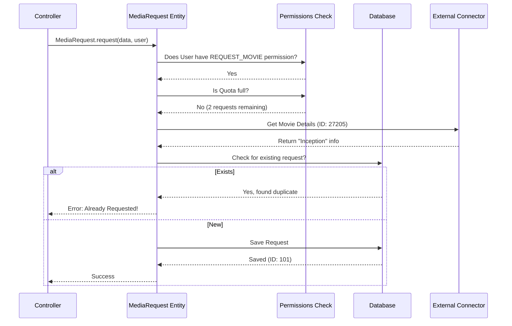

# Chapter 5: Media Request Workflow

Welcome to the fifth chapter of the **seerr** tutorial!

In the previous chapter, [External Service Integrations (The "Connectors")](04_external_service_integrations__the__connectors__.md), we learned how to build "Diplomats" that can talk to external services like TMDB (for data) and Radarr/Sonarr (for downloads).

Now we have the tools, but we need a manager to use them. We can't just let every user send commands directly to Radarr. What if they request a movie that is already downloaded? What if they request 100 movies in one minute?

We need a central logic handler. We call this the **Media Request Workflow**.

## The Motivation: The "Concierge" Analogy

Imagine staying at a luxury hotel. If you want a specific meal, you don't run into the kitchen and start cooking, nor do you call the grocery store yourself. You call the **Concierge**.

The Concierge performs a complex workflow behind the scenes:
1.  **Verification:** Are you actually a guest in room 302?
2.  **Permissions:** Is your credit card valid?
3.  **Availability:** Is the kitchen open?
4.  **Redundancy:** Did your roommate already order this meal 5 minutes ago?
5.  **Execution:** If all checks pass, the concierge places the order with the kitchen.

In **seerr**, the **Media Request Workflow** acts as this Concierge. It stands between the user clicking "Request" and the system actually adding the movie to the download queue.

---

## The Use Case: "I Want to Watch 'Inception'"

Let's follow the journey of a user requesting the movie "Inception".
1.  **Frontend:** User clicks "Request" on the interface.
2.  **API:** The request hits the server.
3.  **Workflow (Concierge):**
    *   Check: Does the user have permission to request movies?
    *   Check: Has the user used up their weekly quota?
    *   Check: Is "Inception" already on the server?
4.  **Result:** If successful, the request is saved to the database.

---

## Key Concepts

### 1. The "Fat Model"
In many applications, the logic is stored in the **Controller** (the traffic cop). In **seerr**, we move this logic into the **Entity** itself. This is called a "Fat Model." The `MediaRequest` class isn't just a database shape; it contains the smarts to validate itself.

### 2. Validation Layers
We use layers of defense:
*   **Permissions:** Can you do this?
*   **Quotas:** Have you done this too much?
*   **Duplication:** Has this been done already?

### 3. The Atomic Action
The workflow is designed so that if *any* check fails (e.g., quota full), the entire process stops, and an error is thrown. The request is only saved if everything is perfect.

---

## How It Works: The API Entry Point

The journey begins in the API Controller. Because our logic is inside the "Fat Model," the controller code is surprisingly simple.

Open `server/routes/request.ts`.

### Receiving the Request
The controller receives the `POST` request and simply hands it off to the `MediaRequest` class.

```typescript
// server/routes/request.ts

requestRoutes.post('/', async (req, res, next) => {
  try {
    // Pass the request data (body) and the current user to the logic
    const request = await MediaRequest.request(req.body, req.user);

    // If successful, return the new request
    return res.status(201).json(request);
  } catch (error) {
    // If logic fails (quota, permission), send error to frontend
    next({ status: 500, message: error.message });
  }
});
```

*Explanation:* The controller acts like a receptionist. It doesn't know the rules; it just hands the paperwork to the manager (`MediaRequest.request`).

---

## Under the Hood: The Internal Workflow

This is where the magic happens. We will look inside the `MediaRequest.request` static method found in `server/entity/MediaRequest.ts`.

### The Flow Sequence



### Implementation Deep Dive

Let's break down the code in `server/entity/MediaRequest.ts`.

#### Step 1: Permission Check
First, the "Concierge" checks the user's ID card.

```typescript
// server/entity/MediaRequest.ts inside static request()

// Check if user has the specific permission to request movies
if (!requestUser.hasPermission(Permission.REQUEST_MOVIE)) {
  
  // If not, throw a specific error
  throw new RequestPermissionError(
    'You do not have permission to make movie requests.'
  );
}
```
*Explanation:* We use the `hasPermission` method from the User entity (covered in [Data Models & ORM](03_data_models___orm__entities_.md)). If false, the code stops immediately.

#### Step 2: Quota Check
Next, we check if the user has reached their limit.

```typescript
// server/entity/MediaRequest.ts

// Calculate usage from the database
const quotas = await requestUser.getQuota();

// If the quota is restricted/full...
if (requestBody.mediaType === MediaType.MOVIE && quotas.movie.restricted) {
  throw new QuotaRestrictedError('Movie Quota exceeded.');
}
```
*Explanation:* This prevents users from spamming the system and filling up the hard drives.

#### Step 3: Getting Real Data
The user sent an ID (e.g., `550`), but we need to verify what that is. We use our "Diplomat" from Chapter 4.

```typescript
// server/entity/MediaRequest.ts

const tmdb = new TheMovieDb(); // Initialize the connector

// Ask TMDB for the details
const tmdbMedia = await tmdb.getMovie({ 
    movieId: requestBody.mediaId 
});
```
*Explanation:* We trust TMDB to tell us the correct title and release date, ensuring our database data is clean.

#### Step 4: The Duplicate Check
We must ensure we don't download the same movie twice.

```typescript
// server/entity/MediaRequest.ts

const existing = await requestRepository.findOne({
    where: { 
        media: { tmdbId: tmdbMedia.id } 
    }
});

if (existing) {
    throw new DuplicateMediaRequestError('Request already exists.');
}
```
*Explanation:* We query the database to see if a request with this specific TMDB ID already exists.

#### Step 5: Saving and Approval logic
Finally, if all checks pass, we prepare the request to be saved. We also decide immediately if it should be `PENDING` (wait for admin) or `APPROVED` (download now).

```typescript
// server/entity/MediaRequest.ts

const newRequest = new MediaRequest({
    media: media, // The movie details
    requestedBy: requestUser,
    // If user is "Trusted", auto-approve. Otherwise, set to Pending.
    status: user.hasPermission(Permission.AUTO_APPROVE) 
        ? MediaRequestStatus.APPROVED 
        : MediaRequestStatus.PENDING
});

// Save to database
await requestRepository.save(newRequest);
```
*Explanation:* This is a crucial feature. Trusted users (like admins) skip the approval queue. Regular users must wait for an admin to click "Approve."

---

## Conclusion

In this chapter, we built the "Concierge" service for **seerr**. We learned that:
1.  **Workflow Logic** belongs in the Entity ("Fat Model"), keeping Controllers clean.
2.  **Validation** (Permissions, Quotas, Duplicates) protects the system from misuse.
3.  **Atomic Operations** ensure we only save data if every rule is followed.

Now that the request is successfully saved in the database, the system needs to actually talk to Radarr/Sonarr to track the download status. How does **seerr** know when the movie finishes downloading so it can tell the user "It's ready"?

[Next Chapter: Library Scanners & Synchronization](06_library_scanners___synchronization.md)

---

Generated by [Code IQ](https://github.com/adityasoni99/Code-IQ)