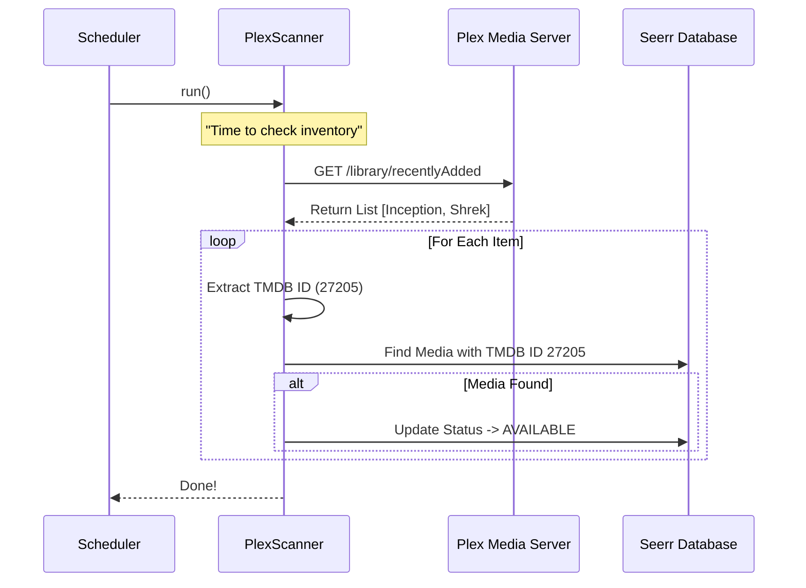

# Chapter 6: Library Scanners & Synchronization

Welcome to the sixth chapter of the **seerr** tutorial!

In the previous chapter, [Media Request Workflow](05_media_request_workflow.md), we successfully handled a user's request. We checked permissions, validated quotas, and sent the order to the download client (like Radarr or Sonarr).

But here is the problem: **Sending the order doesn't mean the movie is ready to watch.**

Downloading takes time. Even after the file is downloaded, **seerr** doesn't automatically know it exists. We need a way to look at your actual Media Server (Plex, Emby, or Jellyfin) and ask: *"Is this movie actually on the shelf yet?"*

This is the job of **Library Scanners & Synchronization**.

## The Motivation: The "Inventory Clerk" Analogy

Imagine **seerr** is an online store, and your Media Server (Plex) is the physical warehouse.

1.  **The User** orders a product on the website.
2.  **The Warehouse** receives the shipment (the download finishes).
3.  **The Problem:** The website still says "Pending" because nobody told the website the box is actually on the shelf.

We need an **Inventory Clerk** (The Scanner).
The Clerk wakes up every few minutes, walks through the warehouse aisles (your Plex Libraries), and writes down everything they see. Then, they update the website database: *"Item #550 is now in stock."*

Without this system, users would request movies that are already downloaded, and they would never see the "Play" button.

---

## The Use Case: "It's Downloaded, Now What?"

Let's trace the final step of a request:
1.  Radarr finishes downloading "Inception".
2.  Radarr tells Plex to scan the library.
3.  Plex adds "Inception" to its database.
4.  **Seerr's Scanner** runs, sees "Inception" in Plex, and updates the request status in Seerr from **Processing** to **Available**.

---

## Key Concepts

### 1. The Job Scheduler
You can't have a human sit there and click "Sync" every 5 minutes. We use a **Scheduler** (using a library called `node-schedule`) to run tasks automatically at specific intervals.

### 2. The Runnable Scanner
This is a class designed to perform the inventory check. It connects to the Media Server API, fetches a list of items, and processes them one by one.

### 3. The Matcher (GUIDs)
Plex knows a movie as "File on Disk at `/movies/inception.mkv`". Seerr knows it as "TMDB ID: 27205".
The Scanner's most important job is to translate the **Plex GUID** (Plex's ID) into a **TMDB ID** so Seerr can link the file to the request.

---

## How It Works: Scheduling the Clerk

We don't usually call scanners manually. They are set up when the server starts. Let's look at `server/job/schedule.ts`.

### Setting up the Schedule
We define jobs with a specific interval (e.g., every 5 minutes).

```typescript
// server/job/schedule.ts

// 1. Create a list to hold our jobs
export const scheduledJobs: ScheduledJob[] = [];

// 2. Define the job details
scheduledJobs.push({
  id: 'plex-recently-added-scan',
  name: 'Plex Recently Added Scan',
  cronSchedule: '*/5 * * * *', // Run every 5 minutes
  
  // 3. Define the action to take
  job: schedule.scheduleJob('*/5 * * * *', () => {
    // Wake up the scanner!
    plexRecentScanner.run();
  }),
});
```
*Explanation:* This code acts like an alarm clock. Every 5 minutes, it triggers `plexRecentScanner.run()`. This ensures Seerr is never more than 5 minutes behind your actual library.

---

## Under the Hood: The Scanning Process

What happens when that alarm goes off?

### The Flow Sequence



### Implementation Deep Dive

Let's look inside `server/lib/scanners/plex/index.ts` to see how the scanner works.

#### Step 1: Fetching the Library
The scanner connects to Plex and asks for items.

```typescript
// server/lib/scanners/plex/index.ts

public async run(): Promise<void> {
  // 1. Get the list of libraries we need to scan
  const libraries = settings.plex.libraries.filter((lib) => lib.enabled);

  for (const library of libraries) {
    // 2. Ask Plex for recently added items in this library
    const libraryItems = await this.plexClient.getRecentlyAdded(
      library.id, 
      { addedAt: library.lastScan } // Only ask for new stuff!
    );

    // 3. Process the list
    await this.loop(this.processItem.bind(this), { sessionId });
  }
}
```
*Explanation:* We iterate through every folder configured in settings. We specifically ask for "Recently Added" items to keep the scan fast and lightweight.

#### Step 2: Processing an Item
For every item Plex gives us, we need to identify it.

```typescript
// server/lib/scanners/plex/index.ts

private async processPlexMovie(plexitem: PlexLibraryItem) {
  // 1. Extract the IDs (The most critical step!)
  const mediaIds = await this.getMediaIds(plexitem);

  // 2. Save/Update the movie in Seerr's database
  await this.processMovie(mediaIds.tmdbId, {
    mediaAddedAt: new Date(plexitem.addedAt * 1000),
    ratingKey: plexitem.ratingKey, // Save Plex's internal ID
    title: plexitem.title,
  });
}
```
*Explanation:* `processPlexMovie` is the bridge. It takes the raw Plex data and sends it to `processMovie` (a helper in the base class) which talks to the database.

#### Step 3: The Matcher (`getMediaIds`)
How do we know that the file in Plex is actually "Inception"? We read the GUID.

```typescript
// server/lib/scanners/plex/index.ts

private async getMediaIds(plexitem: PlexLibraryItem): Promise<MediaIds> {
  // Plex returns IDs like "tmdb://27205" or "imdb://tt1375666"
  
  // 1. Check for TMDB ID directly
  if (plexitem.guid.match(/tmdb:\/\/([0-9]+)/)) {
     return { tmdbId: Number(match[1]) };
  }

  // 2. If only IMDb ID, ask TMDB API to convert it
  if (plexitem.guid.match(/imdb:\/\/(tt[0-9]+)/)) {
     const tmdbItem = await this.tmdb.getMediaByImdbId(match[1]);
     return { tmdbId: tmdbItem.id };
  }
}
```
*Explanation:* This allows **seerr** to be precise. Even if the file is named "Inception (2010).mkv", we rely on the numeric IDs provided by Plex agents, not the filename, ensuring perfect matching.

### Jellyfin Support
The logic for Jellyfin (`server/lib/scanners/jellyfin/index.ts`) is almost identical, but it speaks the Jellyfin API language instead of Plex. It extracts `ProviderIds.Tmdb` instead of parsing a GUID string.

---

## Conclusion

In this chapter, we learned how **seerr** stays in sync with reality.
1.  **Schedulers** wake up the scanners periodically.
2.  **Scanners** read the contents of the media server.
3.  **Matchers** link the files on disk to the metadata in our database using IDs.

Once the scanner runs, the status of our request changes from **Processing** to **Available**. The "Stock Clerk" has confirmed the item is on the shelf!

Now that the item is marked as Available, we need to tell the user the good news. We can't expect them to refresh the page every 5 minutes. We need to send them a notification.

[Next Chapter: Notification System](07_notification_system.md)

---

Generated by [Code IQ](https://github.com/adityasoni99/Code-IQ)