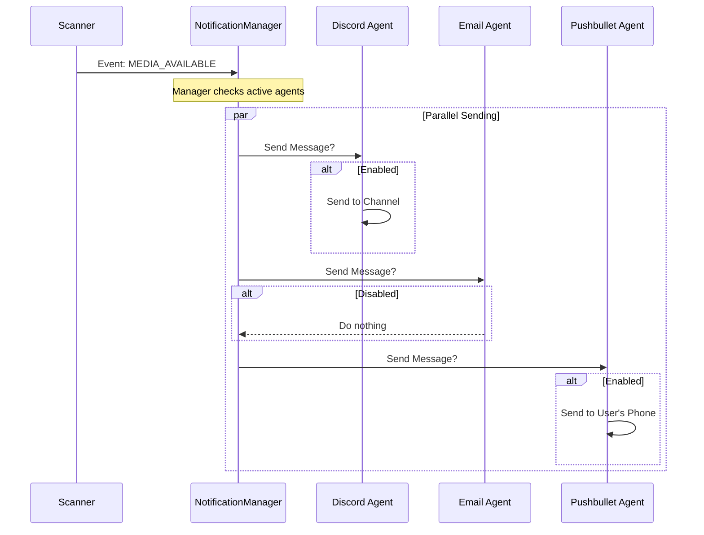

# Chapter 7: Notification System

Welcome to the seventh and final chapter of the **seerr** tutorial!

In the previous chapter, [Library Scanners & Synchronization](06_library_scanners___synchronization.md), we built the system that scans your media server to verify when a movie has actually finished downloading.

But there is one final problem: **The user doesn't know the movie is ready.**
Unless the user is refreshing the page every 5 minutes, they have no idea that their request for *Inception* is sitting on the server, ready to watch.

We need a way to tap them on the shoulder. This is the **Notification System**.

## The Motivation: The "Town Crier" Analogy

Imagine a medieval kingdom.
1.  **The King (The System)** signs a decree (Approves a request).
2.  **The King** does not run down to the village square to shout the news himself. That is not his job.
3.  Instead, he hands the scroll to the **Town Crier (Notification Manager)**.
4.  The Crier then decides how to broadcast it: ring a bell, put up a poster, or send a messenger pigeon.

In **seerr**, we decouple the act of *doing* something (downloading a movie) from the act of *telling* someone about it (sending a Discord message).

**The Problem:** If we wrote code to "Send Discord Message" inside the Library Scanner, and then later wanted to add Email support, we would have to edit the Scanner code again. It would become a mess.

**The Solution:** The Scanner simply tells the **Notification Manager**: "Hey, this movie is ready." The Manager handles the rest.

---

## Key Concepts

### 1. The Event (Notification Type)
This is the "News." It is a simple label describing what just happened.
*   `MEDIA_PENDING`: A user asked for something.
*   `MEDIA_APPROVED`: An admin said yes.
*   `MEDIA_AVAILABLE`: The file is downloaded and scanned.

### 2. The Agent
An **Agent** is a specific way of communicating.
*   **Discord Agent:** Knows how to format a message for a Discord channel.
*   **Email Agent:** Knows how to send an SMTP email.
*   **Pushbullet Agent:** Knows how to send a phone push notification.

### 3. The Manager
The **Manager** is the boss. It holds a list of all active Agents. When an event happens, it loops through the agents and says, "Do your job."

---

## How It Works: Sending a Message

Let's look at how we use this system from elsewhere in the application (like the Scanner from Chapter 6).

### The Usage

We import the manager and the event type, then fire the notification. We don't care *how* it gets sent; we just say *what* happened.

```typescript
// Somewhere in the Library Scanner code...
import notificationManager, { Notification } from '@server/lib/notifications';

// 1. We prepare the data (Payload)
const payload = {
  subject: 'Inception',
  message: 'Your movie has been downloaded!',
  image: 'https://image.tmdb.org/t/p/w600_and_h900_bestv2/...',
};

// 2. We tell the manager to broadcast it
notificationManager.sendNotification(Notification.MEDIA_AVAILABLE, payload);
```

*Explanation:* The Scanner finishes its job in 3 lines of code. It doesn't know if the user uses Discord or Email. It just reports the news.

---

## Under the Hood: The "Fan-Out" Process

What happens when `sendNotification` is called? The manager acts like a distribution center.

### The Flow Sequence



### Implementation Deep Dive

Let's look at the core logic in `server/lib/notifications/index.ts`.

#### 1. Defining the Events
We use a TypeScript `enum` (a numbered list) to define every possible event.

```typescript
// server/lib/notifications/index.ts

export enum Notification {
  NONE = 0,
  MEDIA_PENDING = 2,    // New request came in
  MEDIA_APPROVED = 4,   // Admin approved it
  MEDIA_AVAILABLE = 8,  // Download finished
  MEDIA_FAILED = 16,    // Something went wrong
  // ... other types
}
```
*Explanation:* These numbers act as IDs for the events.

#### 2. The Manager Class
This class manages the list of agents. It is a "Singleton," meaning there is only one Manager for the whole app.

```typescript
// server/lib/notifications/index.ts

class NotificationManager {
  // A list to hold our workers (Discord, Email, etc.)
  private activeAgents: NotificationAgent[] = [];

  // Used at startup to load the agents
  public registerAgents = (agents: NotificationAgent[]): void => {
    this.activeAgents = [...this.activeAgents, ...agents];
  };
}
```

#### 3. The Sending Logic
This is the heart of the system. It receives an event and "fans it out" to everyone.

```typescript
// server/lib/notifications/index.ts inside NotificationManager

public sendNotification(type: Notification, payload: NotificationPayload): void {
  // Log that we are starting work
  logger.info(`Sending notification(s) for ${Notification[type]}`);

  // Loop through every registered agent
  this.activeAgents.forEach((agent) => {
    // Check if this agent is enabled in settings
    if (agent.shouldSend()) {
      // Execute the send logic specific to that agent
      agent.send(type, payload);
    }
  });
}
```
*Explanation:* 
1.  **`this.activeAgents.forEach`**: We try every single communication method the app knows about.
2.  **`agent.shouldSend()`**: This checks the database settings. If the user hasn't set up Discord, the Discord agent returns `false`, and we skip it.
3.  **`agent.send()`**: If enabled, the agent takes over to format the message and make the API call to Discord/Email/etc.

#### 4. Smart Permissions
Sometimes, we shouldn't notify everyone. For example, if I request a movie for *myself*, I probably don't need an email telling me "A user requested a movie" (since I know I did it).

We have a helper function to check this:

```typescript
// server/lib/notifications/index.ts

export const shouldSendAdminNotification = (type, user, payload): boolean => {
  // Don't notify the user about their own actions!
  if (user.id === payload.notifyUser?.id) {
    return false;
  }
  
  // Only notify if they have the right permission (e.g. ADMIN)
  return user.hasPermission(getAdminPermission(type));
};
```
*Explanation:* This logic keeps our admins' inboxes clean. It prevents "Notification Spam" where you get notified for your own actions.

---

## Conclusion of the Tutorial

Congratulations! You have navigated through the entire architecture of **seerr**.

Let's recap the journey of a Media Request:
1.  **Frontend (Ch 1):** The user clicks "Request" on the dashboard.
2.  **API (Ch 2):** The request hits the server route.
3.  **Database (Ch 3):** The `MediaRequest` entity is created.
4.  **Workflow (Ch 5):** The system checks permissions and quotas.
5.  **Integration (Ch 4):** The system sends the movie to Sonarr/Radarr.
6.  **Scanner (Ch 6):** The system detects when the download finishes.
7.  **Notification (Ch 7):** The system alerts the user via Discord/Email.

You have now seen how a modern web application connects a visual interface, a robust database, external APIs, background jobs, and a notification system into one cohesive product.

Thank you for following the **seerr** developer journey!

---

Generated by [Code IQ](https://github.com/adityasoni99/Code-IQ)