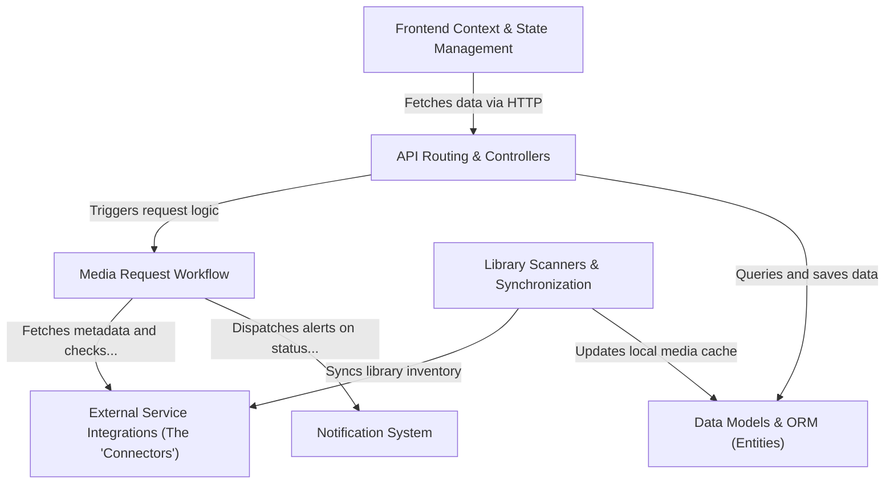

# Tutorial: seerr

Seerr is a **media discovery and request management application** that integrates with existing media servers like *Plex*, *Jellyfin*, and *Emby*. It allows users to browse and request **movies and TV shows** through a unified interface, which the system then validates against quotas and permissions before automating downloads via external services like *Sonarr* and *Radarr*.

**Source Repository:** [https://github.com/seerr-team/seerr](https://github.com/seerr-team/seerr)

## Chapters

1. [Frontend Context & State Management](01_frontend_context___state_management.md)
2. [API Routing & Controllers](02_api_routing___controllers.md)
3. [Data Models & ORM (Entities)](03_data_models___orm__entities_.md)
4. [External Service Integrations (The "Connectors")](04_external_service_integrations__the__connectors__.md)
5. [Media Request Workflow](05_media_request_workflow.md)
6. [Library Scanners & Synchronization](06_library_scanners___synchronization.md)
7. [Notification System](07_notification_system.md)

---

Generated by [Code IQ](https://github.com/adityasoni99/Code-IQ)