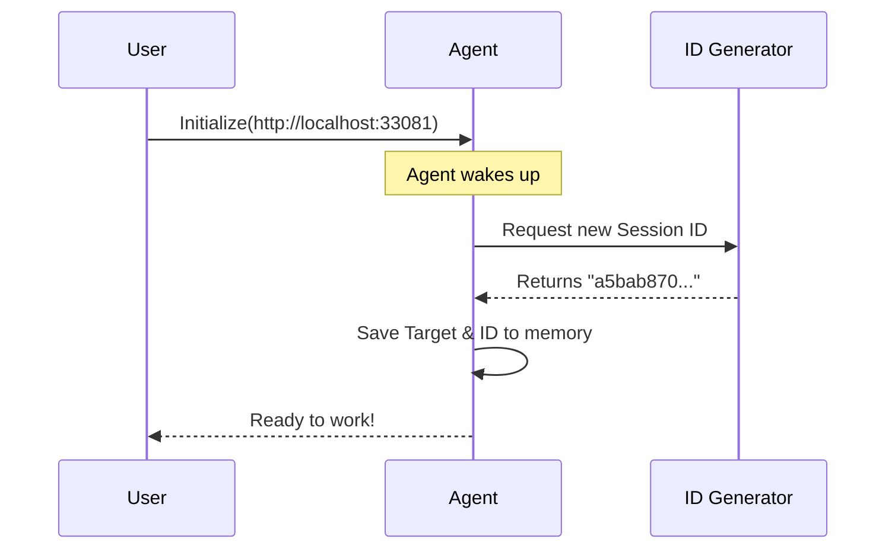

# Chapter 1: Agent Initialization

Welcome to the **Shannon** project tutorial! If you are new to automated security testing, you are in the right place. We are going to build your understanding step-by-step.

## Why do we need Agent Initialization?

Imagine you are hiring a private detective to investigate a building. You can't just tell them "Go!" and expect results. You need to give them two crucial pieces of information before they take a single step:
1.  **The Address:** Where should they go?
2.  **The Case File:** Where should they write down their notes so they don't lose them?

**Agent Initialization** is exactly this process. It is the moment we wake up our digital detective (the **Injection-Exploit Agent**), point it at a website (the target), and give it a unique ID to track its progress.

### The Use Case
We want to test a local website running at `http://localhost:33081` to see if it has security holes. To do this, we need to start a session so the agent knows exactly what to attack.

## Key Concepts

Before we write code, let's look at the three parts of this process:

1.  **The Agent**: This is the main program logic. Think of it as the "brain" that will eventually make decisions.
2.  **The Target**: The URL of the website we are testing.
3.  **The Session ID**: A unique string of characters (like `a5bab870...`). This allows us to pause, resume, or review the specific actions the agent took during this run.

## How to Initialize an Agent

Let's look at how to start the agent in code. It's surprisingly simple!

### Step 1: Define the Target
First, we simply tell the system where the target is located.

```python
# The URL we want to test
target_url = "http://localhost:33081"

print(f"Target selected: {target_url}")
```
*Output:* `Target selected: http://localhost:33081`

### Step 2: create the Agent
Now, we create the agent instance. Under the hood, this assigns a unique **Session ID**.

```python
from shannon.agents import InjectionExploitAgent

# Initialize the agent with our target
agent = InjectionExploitAgent(target=target_url)

# The agent now has a unique ID assigned automatically
print(f"Agent Active. Session ID: {agent.session_id}")
```

*Output:*
```text
Agent Active. Session ID: a5bab870-65d9-4768-975d-cb31e01218c1
```

Congratulations! You have successfully spun up an agent. It is now "alive," holding a specific session ID, and staring at the target URL waiting for instructions.

## Under the Hood: What happens?

You might be wondering, "How did it get that ID?" or "What happened when I ran that line of code?"

### The Workflow

When you initialize an agent, the system acts like a receptionist creating a visitor badge.



### Internal Implementation

Let's peek at the internal code (simplified) to see how `shannon` handles this. This usually happens in a file like `agent_core.py`.

The initialization relies on a standard Python library to generate random, unique IDs (UUIDs).

```python
import uuid

class InjectionExploitAgent:
    def __init__(self, target):
        # 1. Store the target URL
        self.target = target
        
        # 2. Generate a unique Session ID
        self.session_id = str(uuid.uuid4())
        
        # 3. Log the startup
        print(f"Agent initiated session {self.session_id}")
```

**Explanation:**
1.  `self.target`: Saves the URL so the agent remembers where to attack later.
2.  `uuid.uuid4()`: Creates that long string of characters (the Session ID). It ensures that every time you run the tool, you get a fresh, unique workspace.

## What's Next?

Right now, our agent is initialized. It has a **Target** and a **Session ID**, but it's just standing there. It doesn't know *what* to do yet. It has no plan.

In the next chapter, we will give the agent a brain by creating a plan of attack. We will learn how the agent decides what steps to take.

[Next Chapter: Strategy Formulation](02_strategy_formulation.md)

---

Generated by [Code IQ](https://github.com/adityasoni99/Code-IQ)