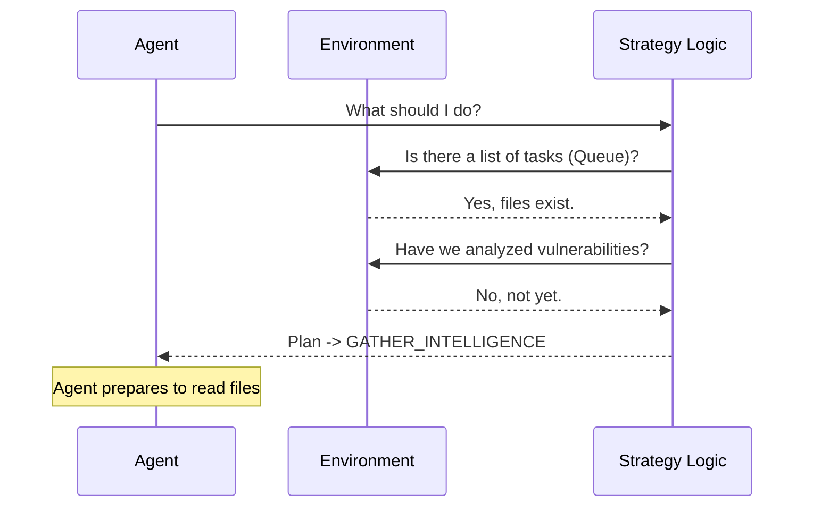

# Chapter 2: Strategy Formulation

In the previous chapter, [Agent Initialization](01_agent_initialization.md), we successfully woke up our digital detective and gave it a target. However, having a detective standing on the sidewalk isn't enough; they need a plan of action.

## Why do we need Strategy Formulation?

Imagine playing a game of chess. You don't just move pieces randomly. You look at the board, analyze your opponent's position, and formulate a strategy before you make a move.

**Strategy Formulation** is the "thinking" phase of our agent. Before the agent tries to hack anything (the "acting" phase), it must look at what information it already has and decide the smartest next step.

### The Use Case
Our agent is targeting `http://localhost:33081`. It shouldn't just start throwing random attacks. Instead, it needs to say:
1.  "Do I have any orders waiting for me?"
2.  "Have I gathered information (recon) about this target yet?"
3.  "If I have information, are there any weak spots (vulnerabilities)?"

This chapter teaches the agent how to ask these questions to build a plan.

## Key Concepts

1.  **Intelligence Gathering**: The process of checking existing files or reports ("deliverables") to see what we already know.
2.  **The Loop**: Automation isn't a straight line; it's a circle. The agent **Thinks** (Strategy), **Acts** (Tool Use), and **Observes** the results.
3.  **Prioritization**: The agent must decide that reading a "To-Do List" (Queue) is more important than randomly guessing passwords.

## How to Formulate a Strategy

In `shannon`, strategy formulation happens automatically when the agent runs its main loop. Let's simulate how the agent decides on a plan.

### Step 1: The Thinking Process

We call a method (function) that triggers the agent's decision-making logic.

```python
# Assuming 'agent' was created in Chapter 1

# Ask the agent to formulate a strategy based on current info
plan = agent.formulate_strategy()

print(f"Agent's Decision: {plan}")
```

*Output:*
```text
Agent's Decision: GATHER_INTELLIGENCE
```

### Step 2: Interpreting the Plan

The output `GATHER_INTELLIGENCE` is a signal. It tells the system: "I don't know enough yet to attack. I need to read the analysis deliverables first."

This simple decision triggers a chain reaction where the agent will subsequently choose to read specific files, such as the **Exploitation Queue** or **Recon Data**.

## Under the Hood: What happens?

How does the agent know it needs to gather intelligence? It uses a logic flow based on the availability of data.

### The Workflow

The agent looks at its "environment" (the files available to it) to make a decision.



### Internal Implementation

Let's look at a simplified version of the logic inside the `agent_brain.py` file. The agent checks for specific "Deliverables" (files created by other tools or previous steps).

```python
class StrategyModule:
    def formulate_strategy(self, context):
        # 1. Check if we have a queue of tasks waiting
        if context.has_exploitation_queue():
            return "READ_QUEUE"
            
        # 2. Check if we have reconnaissance data
        elif context.has_recon_data():
            return "ANALYZE_VULNERABILITIES"
            
        # 3. Default: If we know nothing, start looking
        else:
            return "GATHER_INTELLIGENCE"
```

**Explanation:**
1.  **`has_exploitation_queue()`**: The agent checks if a file exists that lists specific tasks to perform.
2.  **`has_recon_data()`**: The agent checks if it has a map of the website (URLs, parameters, etc.).
3.  **The Decision**: If the agent sees data but hasn't analyzed it, the strategy shifts to finding vulnerabilities. If it sees nothing, it defaults to gathering basic info.

## The Outcome

By the end of this step, the agent isn't just a "dumb" script anymore. It has realized that before it can launch an exploit, it must consume the available data.

Based on our Use Case, the Agent has decided to **Systematically Gather Intelligence**. This means it needs to use specific tools to read the data files.

## What's Next?

The agent has formulated a strategy: "I need to read the data." The first and most important piece of data to check is the **Exploitation Queue**—a list of high-priority tasks waiting for the agent.

In the next chapter, we will learn how the agent uses a tool to read this specific file.

[Next Chapter: Tool Use - Read Exploitation Queue](03_tool_use___read_exploitation_queue.md)

---

Generated by [Code IQ](https://github.com/adityasoni99/Code-IQ)