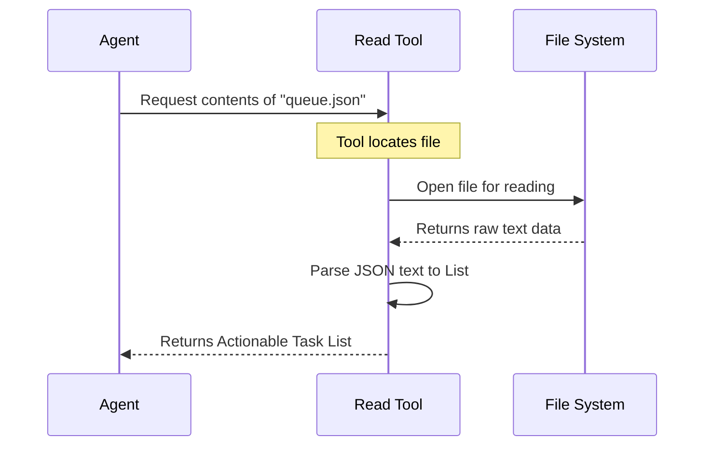

# Chapter 3: Tool Use - Read Exploitation Queue

Welcome back! In the previous chapter, [Strategy Formulation](02_strategy_formulation.md), our agent woke up and formulated a plan: **GATHER_INTELLIGENCE**.

Now, it is time to execute that plan. The agent needs to perform an action.

## Why do we need to Read the Exploitation Queue?

Imagine a chef walking into a kitchen. They know they need to cook (Strategy), but they don't know *what* to cook until they pick up the order tickets hanging on the rail.

In the world of **Shannon**, the **Exploitation Queue** is that line of order tickets. It is a specific file named `deliverables/injection_exploitation_queue.json`. This file contains a list of "jobs" or tasks that other automated tools have prepared for the agent.

### The Use Case
Our agent needs to know exactly which parts of the target website (`http://localhost:33081`) are suspected to be vulnerable. Instead of guessing, it reads the **Exploitation Queue** file to get a precise "To-Do List" of URLs and parameters to test.

## Key Concepts

Before we code, let's understand the three components here:

1.  **The Tool**: Think of a tool as a specific skill the agent possesses. In this chapter, the skill is "Reading a File."
2.  **The Queue**: A waiting list of tasks. In computer science, a "Queue" usually means items are handled First-In, First-Out (FIFO).
3.  **JSON**: The file format. Think of JSON (JavaScript Object Notation) as a structured way of writing text so that computers can easily read it—like a filled-out form rather than a messy paragraph.

## How to Use the Tool

The agent doesn't need to write complex code to open files; it simply uses its built-in toolset.

### Step 1: Identify the File
First, we tell the agent which file holds our "To-Do List."

```python
# The path to our specific deliverables file
queue_file_path = "deliverables/injection_exploitation_queue.json"

print(f"Looking for tasks in: {queue_file_path}")
```
*Output:* `Looking for tasks in: deliverables/injection_exploitation_queue.json`

### Step 2: Invoke the Tool
Now, we command the agent to use its file-reading tool to ingest the data.

```python
# The agent uses its 'read_json' tool
queue_data = agent.tools.read_json(queue_file_path)

# Let's see how many tasks we found
print(f"Tasks loaded: {len(queue_data)} tasks found.")
```

*Output:*
```text
Tasks loaded: 5 tasks found.
```

The agent has successfully opened the file, read the text, and converted it into a list of 5 actionable items stored in its memory.

## Under the Hood: What happens?

How does the agent go from a filename string to having actual data in memory?

### The Workflow

When the agent calls the tool, it acts like a librarian retrieving a book.



### Internal Implementation

Let's look at the simplified code inside `shannon/tools/file_reader.py`. This uses Python's built-in `json` library to handle the translation from text file to Python objects.

```python
import json

class FileTool:
    def read_json(self, file_path):
        # 1. Open the file in 'read' mode ('r')
        with open(file_path, 'r') as f:
            
            # 2. Load and parse the JSON content
            data = json.load(f)
            
        # 3. Return the clean Python list/dictionary
        return data
```

**Explanation:**
1.  **`open(file_path, 'r')`**: Connects to the operating system's file system and opens the file specifically for reading.
2.  **`json.load(f)`**: This is the magic step. It takes the text (which looks like `[{"url": "..."}]`) and converts it into a real Python List that the agent can loop through.
3.  **`return data`**: Hands the data back to the agent's brain.

## What's Next?

The agent has successfully read the **Exploitation Queue**. It now has a list of specific attacks it needs to perform.

However, a smart agent knows that context is king. Before it rushes to attack, it should check if there is any historical data available about what happened *before* the queue was created. Was there an earlier scan?

In the next chapter, we will use a different tool to read the data gathered before the main reconnaissance phase.

[Next Chapter: Tool Use - Read Pre-Recon Data](04_tool_use___read_pre_recon_data.md)

---

Generated by [Code IQ](https://github.com/adityasoni99/Code-IQ)