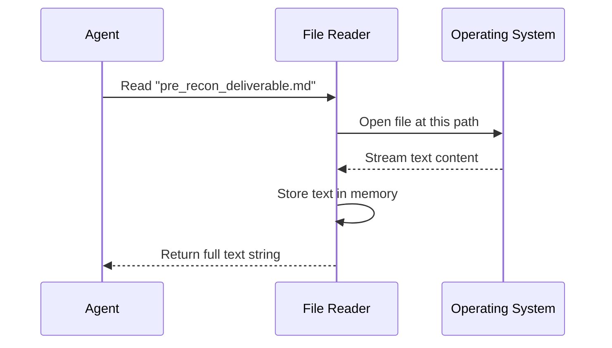

# Chapter 4: Tool Use - Read Pre-Recon Data

Welcome back! In the previous chapter, [Tool Use - Read Exploitation Queue](03_tool_use___read_exploitation_queue.md), our agent learned how to pick up its "To-Do List" of specific attacks.

However, a good detective doesn't just blindly follow a list. They need to understand the **context**. Before we start breaking into things, we need to read the initial background reports.

## Why do we need to Read Pre-Recon Data?

Imagine you are that detective again. You have a list of suspects to interview (The Exploitation Queue), but before you talk to them, you should probably read the initial police report filed by the first officer on the scene.

**Pre-Recon Data** is that initial police report. It stands for "Preliminary Reconnaissance." It contains high-level information gathered before the deep investigation started.

### The Use Case
Our agent is targeting `http://localhost:33081`. While the "Queue" tells the agent *where* to attack, the **Pre-Recon Data** might contain notes about what technologies the website uses (e.g., "This site uses PHP" or "The server is Apache").

The agent reads the file `deliverables/pre_recon_deliverable.md` to load this background context into its brain.

## Key Concepts

1.  **Context**: General information that helps the agent make better decisions. Knowing the website uses "PHP" might make the agent try PHP-specific attacks later.
2.  **Markdown (.md)**: Unlike the previous chapter where we read a JSON list, this data is stored in a Markdown file. This is a text format used for writing human-readable reports with headers and bullet points.
3.  **Unstructured Data**: The "Queue" was structured (strict rows and columns). "Pre-Recon" is unstructured (paragraphs and notes). The agent reads this differently.

## How to Use the Tool

Reading a text file is one of the most fundamental skills for an agent.

### Step 1: Define the File Path
We tell the agent where the initial report is located.

```python
# The path to the preliminary report
report_path = "deliverables/pre_recon_deliverable.md"

print(f"Reading background info from: {report_path}")
```
*Output:* `Reading background info from: deliverables/pre_recon_deliverable.md`

### Step 2: Read the File
We use the agent's file-reading tool. Notice that we are just reading raw text this time, not parsing a list.

```python
# The agent uses 'read_file' to get the text content
background_info = agent.tools.read_file(report_path)

# Let's peek at the first 50 characters
print(f"Report Start: {background_info[:50]}...")
```

*Output:*
```text
Report Start: # Initial Scan Results
Target: http://localhost:330...
```

The agent has now absorbed the report. It holds the text in its memory, ready to be analyzed or sent to a Large Language Model (LLM) to extract meaning.

## Under the Hood: What happens?

How does the agent physically open and read this report?

### The Workflow

This process is very similar to opening a document in Notepad, but it happens instantaneously via code.



### Internal Implementation

Let's look at the code inside `shannon/tools/file_reader.py`. This is even simpler than the JSON reader we saw in the last chapter.

```python
class FileTool:
    def read_file(self, file_path):
        # 1. Open the file in 'read' mode
        with open(file_path, 'r', encoding='utf-8') as f:
            
            # 2. Read the entire file into a single string
            content = f.read()
            
        # 3. Return the text
        return content
```

**Explanation:**
1.  **`encoding='utf-8'`**: This ensures that if the report contains special characters (like emojis or foreign languages), the agent reads them correctly without crashing.
2.  **`f.read()`**: This command grabs everything from the first letter to the very last period and stores it as one giant piece of text.

## What's Next?

Our agent is getting smarter. It has a list of tasks (from the Queue) and it has read the initial police report (Pre-Recon Data).

But there is one massive piece of evidence missing. We need the **Detailed Map** of the target—the deep reconnaissance data that lists every single page, image, and link on the website.

In the next chapter, we will learn how the agent ingests this massive dataset.

[Next Chapter: Tool Use - Read Recon Data](05_tool_use___read_recon_data.md)

---

Generated by [Code IQ](https://github.com/adityasoni99/Code-IQ)