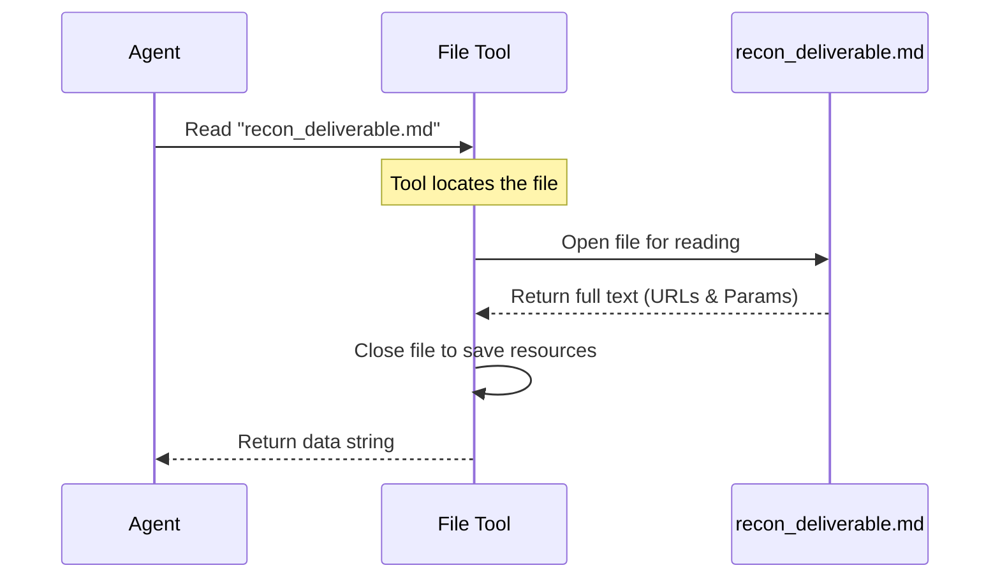

# Chapter 5: Tool Use - Read Recon Data

Welcome back! In the previous chapter, [Tool Use - Read Pre-Recon Data](04_tool_use___read_pre_recon_data.md), our agent learned how to read the initial, high-level background report about the target.

Now, we need to get specific. To find security holes, we need a detailed map of the website. We need to know every page, every link, and every input box. This is where **Recon Data** comes in.

## Why do we need to Read Recon Data?

Imagine you are an explorer entering an ancient temple.
*   **Pre-Recon (Chapter 4)** was like reading a sign outside that said: "This is a Stone Temple built in 1200 AD." It gives you the general idea.
*   **Recon Data (Chapter 5)** is the **blueprint**. It tells you: "There is a hallway on the left, a trapdoor in the center, and a treasure room on the right."

Without this detailed map, the agent is blind. It knows *what* the target is, but not *where* to step.

### The Use Case
Our agent is testing `http://localhost:33081`. A previous tool has already crawled this website and saved a list of every URL and parameter it found into a file called `deliverables/recon_deliverable.md`.

In this chapter, the agent will read this file to memorize the layout of the website.

## Key Concepts

1.  **Reconnaissance (Recon)**: The phase of hacking where we map out the target. We aren't attacking yet; we are just drawing a map.
2.  **The Crawler**: An automated bot that visits every link on a website to see where it goes. The output of a crawler is what we are reading today.
3.  **Data Ingestion**: The process of taking data from a file (storage) and moving it into the agent's active memory (RAM) so it can think about it.

## How to Use the Tool

Just like in the previous chapters, we use the agent's file-reading capabilities. However, the *value* of this step is in the specific file we target.

### Step 1: Locate the Blueprint
We define the path to the detailed reconnaissance file.

```python
# This file contains the full map of the website
recon_path = "deliverables/recon_deliverable.md"

print(f"Loading website blueprint from: {recon_path}")
```
*Output:* `Loading website blueprint from: deliverables/recon_deliverable.md`

### Step 2: Ingest the Data
We command the agent to read the file. This loads the map into the agent's brain.

```python
# The agent reads the file contents
recon_data = agent.tools.read_file(recon_path)

# Let's check the size of the data we found
print(f"Data loaded. File length: {len(recon_data)} characters.")
```

*Output:*
```text
Data loaded. File length: 4502 characters.
```

### Step 3: Verify the Content
To prove the agent really "sees" the map, let's print the first few lines.

```python
# Print the first 100 characters of the file
print(recon_data[:100])
```

*Output:*
```markdown
# Reconnaissance Report
## URLs Found
- http://localhost:33081/login.php
- http://localhost:33081/search.php?q=test
```

The agent now knows exactly which pages exist (`login.php`, `search.php`) and which parameters to test (`q=test`).

## Under the Hood: What happens?

What happens inside the system when we ask for this data?

### The Workflow

The agent acts as a data processor. It requests the file, and the file system serves it up.



### Internal Implementation

The code powering this is the same robust file reader we used in Chapter 4. It relies on Python's ability to safely open and close files using the `with` statement.

Let's look at `shannon/tools/file_reader.py` again, focusing on how it ensures the file is closed properly.

```python
class FileTool:
    def read_file(self, file_path):
        # 'with' acts like a safety wrapper
        with open(file_path, 'r') as f:
            
            # Read the map data
            content = f.read()
            
        # As soon as we exit the 'with' block, 
        # the file is automatically closed.
        return content
```

**Explanation:**
1.  **`with open(...)`**: This is a best practice in Python. It guarantees that even if an error happens while reading, the file won't get "stuck" open in the operating system.
2.  **`f.read()`**: Extracts the detailed list of URLs and parameters.
3.  **Return**: The data is passed back to the `Agent` class, which usually stores it in a variable like `self.context.recon_data`.

## Conclusion

Our agent is becoming formidable.
1.  It has a **Target** (Chapter 1).
2.  It has a **Plan** (Chapter 2).
3.  It has a **To-Do List** (Chapter 3).
4.  It has **Background Info** (Chapter 4).
5.  And now, it has the **Detailed Map** (Chapter 5).

The agent has almost all the information it needs. However, there is one final piece of intelligence that might be available: specific analysis on *how* to perform injections (hacking attempts) on this specific target.

In the next chapter, we will look at how the agent reads detailed vulnerability analysis reports.

[Next Chapter: Tool Use - Read Injection Analysis](06_tool_use___read_injection_analysis.md)

---

Generated by [Code IQ](https://github.com/adityasoni99/Code-IQ)