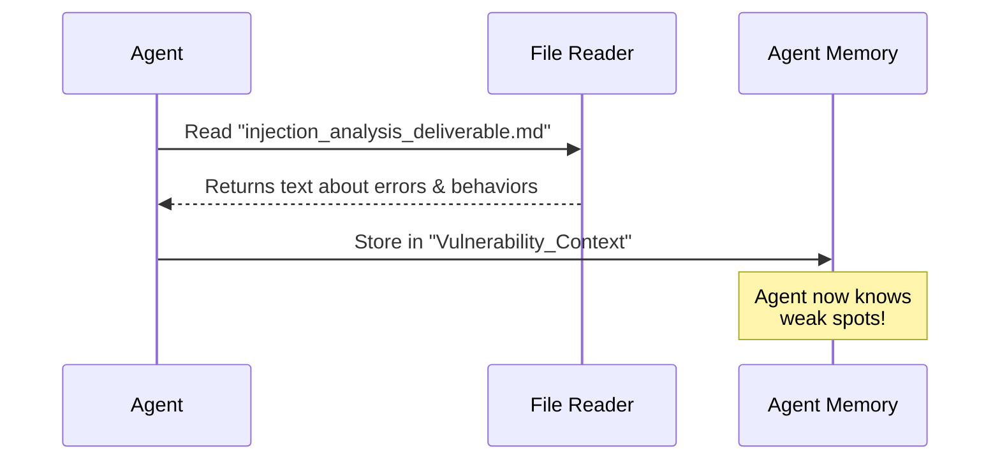

# Chapter 6: Tool Use - Read Injection Analysis

Welcome back! In the previous chapter, [Tool Use - Read Recon Data](05_tool_use___read_recon_data.md), our agent successfully loaded the "blueprint" of the website. It now knows where every page and input box is located.

But knowing *where* a door is located doesn't tell you if the lock is broken. We need deeper technical details. We need to know how the website reacts when we poke it.

## Why do we need to Read Injection Analysis?

Imagine you are a locksmith trying to open a locked safe.
1.  **Recon (Chapter 5)** told you: "There is a safe in the bedroom."
2.  **Injection Analysis (Chapter 6)** tells you: "When you turn the dial to the left, it makes a weird clicking sound."

That "clicking sound" is a clue. In software security, "Injection Analysis" is a report detailing how the website behaves when we send it confusing data (like unexpected symbols or code).

### The Use Case
Our agent is targeting `http://localhost:33081`. It knows there is a search bar (from Recon). Now, it needs to read a specific report (`deliverables/injection_analysis_deliverable.md`) to see if anyone has already tested that search bar for **Injection Vulnerabilities**—weaknesses that let us sneak commands into the server.

## Key Concepts

1.  **Injection**: A hacking technique where we "inject" malicious commands into a normal input field (like a login box).
2.  **Analysis Report**: A file containing technical observations. It might say, "The server takes 5 seconds to respond when we send a quote mark (`'`)." This suggests the server is confused—a potential weakness!
3.  **Context Loading**: The agent is effectively "studying" before the exam. It reads this file to understand the specific behaviors of this unique website.

## How to Use the Tool

We are going to use the agent's file-reading capability again. This time, we are targeting the most technical document in our arsenal.

### Step 1: Define the Analysis Path
We tell the agent where to find the technical analysis file.

```python
# The path to the deep analysis report
analysis_path = "deliverables/injection_analysis_deliverable.md"

print(f"Loading technical analysis from: {analysis_path}")
```
*Output:* `Loading technical analysis from: deliverables/injection_analysis_deliverable.md`

### Step 2: Read the Analysis
We command the agent to ingest the text.

```python
# The agent reads the file into its memory
analysis_data = agent.tools.read_file(analysis_path)

# Verify we got data
print(f"Analysis loaded. Size: {len(analysis_data)} characters.")
```

*Output:*
```text
Analysis loaded. Size: 3200 characters.
```

### Step 3: Peek at the Clues
Let's see what kind of information is inside this report.

```python
# Print the first few lines to check the content
print(analysis_data[:150])
```

*Output:*
```markdown
# Injection Analysis
## Parameter: 'id'
- Observation: Inputting ' caused a 500 Server Error.
- Potential: SQL Injection possible.
```

**Interpretation:** The agent just learned a crucial fact. The `id` parameter breaks the server when a single quote is used. This is the "broken lock" we were looking for!

## Under the Hood: What happens?

How does the agent distinguish this file from the others? Technically, the reading process is the same, but the *destination* in the agent's brain is different.

### The Workflow

The agent reads the file and categorizes it as "Vulnerability Context."



### Internal Implementation

The code uses the standard file reader we've seen before, but let's look at how the agent might decide to store this specific data. This logic usually lives in `shannon/agent_core.py`.

```python
class Agent:
    def gather_injection_data(self):
        path = "deliverables/injection_analysis_deliverable.md"
        
        # 1. Use the tool to get raw text
        content = self.tools.read_file(path)
        
        # 2. Save it to a specific part of memory
        self.knowledge_base["injection_analysis"] = content
        
        return "Analysis Ingested"
```

**Explanation:**
1.  **`self.tools.read_file(path)`**: This reuses the code from previous chapters to handle the operating system operations (opening/closing files).
2.  **`self.knowledge_base["injection_analysis"]`**: This is the key difference. The agent doesn't just read the text; it files it away in a specific "folder" in its brain labeled "Injection Analysis." When it needs to attack later, it will look in this specific folder for clues.

## What's Next?

Let's review what our Agent has:
1.  **Target URL** (Chapter 1)
2.  **A Plan** (Chapter 2)
3.  **A Task List** (Chapter 3)
4.  **A Map** (Chapter 5)
5.  **Technical Weakness Clues** (Chapter 6 - You are here)

The agent is now fully informed. It has studied the target completely. It is time to stop reading and start **thinking**.

The next step is to take all these clues (the map + the weakness report) and officially decide: "Yes, this is a vulnerability."

In the next chapter, we will learn how the agent processes this data to confirm a security hole.

[Next Chapter: Vulnerability Identification](07_vulnerability_identification.md)

---

Generated by [Code IQ](https://github.com/adityasoni99/Code-IQ)