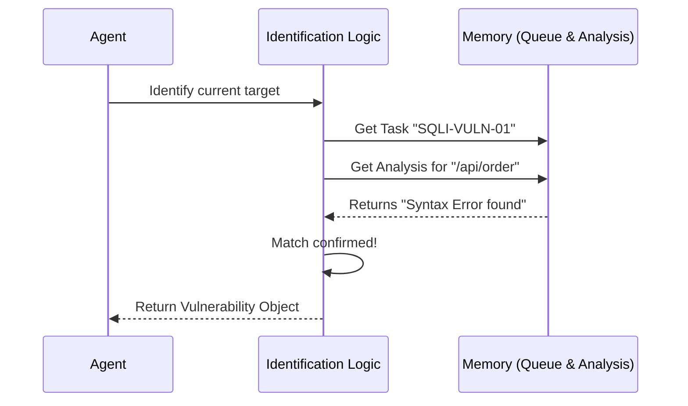

# Chapter 7: Vulnerability Identification

Welcome back! In the previous chapter, [Tool Use - Read Injection Analysis](06_tool_use___read_injection_analysis.md), our agent gathered technical clues about how the website reacts to strange inputs.

Now, we have reached a pivotal moment. We have the **Task List** (from Chapter 3) and the **Technical Evidence** (from Chapter 6). It is time to connect the dots.

## Why do we need Vulnerability Identification?

Imagine a detective has two things on their desk:
1.  A "Wanted" poster for a suspect named "SQL Injection" (The Queue).
2.  A lab report saying fingerprints were found on the safe (The Analysis).

**Vulnerability Identification** is the moment the detective stands up and says: *"The fingerprints match! We have a confirmed suspect."*

Reading data isn't enough. The agent must process that data to officially declare that a specific part of the website is broken and ready to be exploited.

### The Use Case
Our agent looks at its queue and sees a high-priority task labeled **SQLI-VULN-01**.
It cross-references this with the analysis report it just read. It confirms that the endpoint `/api/order` throws database errors when the `order_id` parameter is manipulated.
The agent formally identifies this as an **Authenticated SQL Injection**.

## Key Concepts

1.  **Correlation**: The process of matching a task ("Check this URL") with evidence ("This URL crashed").
2.  **The Vulnerability Object**: We stop treating the target as just a text string (URL). We convert it into a structured object that contains the URL, the specific parameter (`order_id`), and the type of attack (`SQL Injection`).
3.  **Confidence Score**: How sure is the agent? If the server crashed explicitly, confidence is **High**. If it just acted slightly weird, confidence might be **Low**.

## How to Identify a Vulnerability

This step is purely logical. We are taking data from the agent's memory and transforming it into a decision.

### Step 1: Select the Target
First, we pull the specific job we want to focus on from our queue.

```python
# Let's look at the first item in our task queue
current_task = queue_data[0]

print(f"Analyzing Task ID: {current_task['id']}")
print(f"Target Endpoint: {current_task['endpoint']}")
```
*Output:*
```text
Analyzing Task ID: SQLI-VULN-01
Target Endpoint: /api/order
```

### Step 2: Check the Evidence
The agent looks through the **Injection Analysis** data (loaded in Chapter 6) to see if this endpoint behaves badly.

```python
# We simulate checking the analysis for keywords
evidence = "Error: You have an error in your SQL syntax"

# Simple logic: Does the evidence suggest a break?
is_vulnerable = "SQL syntax" in evidence

print(f"Is {current_task['endpoint']} vulnerable? {is_vulnerable}")
```
*Output:* `Is /api/order vulnerable? True`

### Step 3: Create the Vulnerability Record
Now that we are sure, we package this information into a formal record. This is what the agent will use to launch the actual attack later.

```python
# Create a dictionary to represent the confirmed vulnerability
vulnerability = {
    "id": "SQLI-VULN-01",
    "url": "http://localhost:33081/api/order",
    "parameter": "order_id",
    "type": "SQL Injection",
    "confidence": "High"
}

print(f"VULNERABILITY CONFIRMED: {vulnerability['type']} on {vulnerability['parameter']}")
```
*Output:* `VULNERABILITY CONFIRMED: SQL Injection on order_id`

## Under the Hood: What happens?

This process happens entirely inside the agent's "brain" (CPU/Memory). It doesn't need to talk to the website or read a new file right now.

### The Workflow

The agent acts like a judge reviewing a case.



### Internal Implementation

Let's look at a simplified version of `shannon/core/analysis.py`. We define a class to hold our confirmed findings.

```python
class Vulnerability:
    def __init__(self, url, param, vuln_type):
        self.url = url
        self.parameter = param
        self.type = vuln_type
        self.confirmed = True

# The logic function
def identify_vulnerability(task, analysis_text):
    # 1. Check if the analysis text contains error markers
    if "SQL syntax" in analysis_text:
        
        # 2. Return a formal object
        return Vulnerability(
            url=task['url'],
            param="order_id", 
            vuln_type="SQL Injection"
        )
    return None
```

**Explanation:**
1.  **`class Vulnerability`**: This is a blueprint. Instead of passing loose variables around, we create a solid object that holds the `url`, `parameter`, and `type` together.
2.  **`identify_vulnerability`**: This function represents the agent's thinking. It takes the **Task** and the **Evidence** as inputs.
3.  **`if "SQL syntax"...`**: This is a simple detection rule. If the website threw a database error, we confirm the vulnerability.

## What's Next?

Our agent has successfully identified a high-priority target:
*   **Target:** `/api/order`
*   **Weakness:** SQL Injection
*   **Parameter:** `order_id`

We have a confirmed target. But before we launch the exploit script to prove it, we need to be responsible. We need to **log our progress**.

A good agent keeps a journal of its work so that if it crashes or stops, we know exactly what it has already finished.

In the next chapter, we will learn how the agent updates the system to mark this task as "In Progress."

[Next Chapter: Tool Use - Task Tracking](08_tool_use___task_tracking.md)

---

Generated by [Code IQ](https://github.com/adityasoni99/Code-IQ)