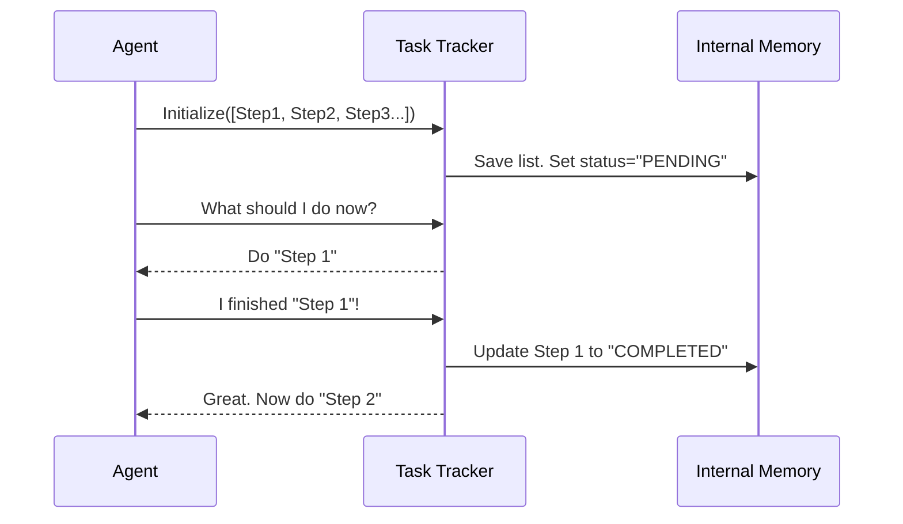

# Chapter 8: Tool Use - Task Tracking

Welcome back! In the previous chapter, [Vulnerability Identification](07_vulnerability_identification.md), our agent successfully identified a critical security hole (SQL Injection) in the target website.

We have a target. We know it is vulnerable. Now, we need to exploit it to prove the risk. But exploitation isn't just one big button press; it is a complex series of delicate steps.

## Why do we need Task Tracking?

Imagine you are planning a bank heist in a movie. You don't just run in screaming. You have a precise checklist:
1.  Disable the alarm.
2.  Pick the lock.
3.  Open the safe.
4.  Escape with the gold.

If you skip step 1, you get caught. If you skip step 3, you get no gold.

**Task Tracking** is the agent's way of managing this checklist. Instead of trying to do everything at once, the agent breaks the complex job of "Hacking the Database" into four specific, manageable sub-tasks.

### The Use Case
Our agent has confirmed that `/api/order` is vulnerable. To fully demonstrate the danger, it needs to perform the following **Execution Chain**:
1.  **Confirm Vulnerability**: Prove the injection works reliably.
2.  **Fingerprint Database**: Find out if it is MySQL, PostgreSQL, etc.
3.  **Enumerate Tables**: List the tables (e.g., `users`, `admin`).
4.  **Exfiltrate Data**: Actually extract the usernames and passwords.

This chapter teaches the agent how to create and manage this "Todo List."

## Key Concepts

1.  **Granularity**: Breaking a big goal (Exploitation) into smaller, bite-sized steps.
2.  **State Management**: Knowing exactly where we are in the process. Are we done with Step 1? Are we currently working on Step 2?
3.  **Persistence**: If the agent crashes or pauses, the Task Tracker remembers what has already been finished so we don't start over from zero.

## How to Initialize the Todo List

In `shannon`, the agent uses a specialized tool to initialize this workflow. It takes the big vulnerability we found and generates the four specific steps.

### Step 1: Define the Sub-Tasks
First, we define the standard operating procedure for an SQL Injection attack.

```python
# The standard workflow for SQL Injection
exploit_steps = [
    "step_1_confirm_vulnerability",
    "step_2_fingerprint_database",
    "step_3_enumerate_tables",
    "step_4_exfiltrate_data"
]

print("Exploitation Plan Created.")
```
*Output:* `Exploitation Plan Created.`

### Step 2: Initialize the Tracker
Now, we load these steps into the agent's tracking tool. This creates a formal "Todo List" in the agent's memory.

```python
# Initialize the tracker with our specific steps
agent.tracker.initialize_tasks(exploit_steps)

# Verify the first task is ready
current_task = agent.tracker.get_current_task()
print(f"Current Objective: {current_task}")
```

*Output:*
```text
Current Objective: step_1_confirm_vulnerability
```

### Step 3: marking Progress
As the agent works (which we will see in the next chapter), it updates this list. Let's simulate completing the first step.

```python
# We pretend we successfully confirmed the bug
agent.tracker.mark_complete("step_1_confirm_vulnerability")

# The tracker automatically moves to the next step
next_task = agent.tracker.get_current_task()
print(f"New Objective: {next_task}")
```

*Output:*
```text
New Objective: step_2_fingerprint_database
```

The agent effectively checked off the first item and automatically focused on the second.

## Under the Hood: What happens?

How does the agent manage this list internally? It uses a simple state machine.

### The Workflow

The `TaskTracker` acts like a project manager holding a clipboard.



### Internal Implementation

Let's look at a simplified version of `shannon/tools/task_tracker.py`. It uses a Python list and a dictionary to track the status of every item.

```python
class TaskTracker:
    def __init__(self):
        self.queue = []      # The list of steps
        self.status = {}     # The status of each step

    def initialize_tasks(self, steps):
        self.queue = steps
        # Set all tasks to 'PENDING' initially
        for step in steps:
            self.status[step] = "PENDING"
            
    def get_current_task(self):
        # Find the first task that isn't finished
        for step in self.queue:
            if self.status[step] == "PENDING":
                return step
        return "ALL_TASKS_COMPLETE"
```

**Explanation:**
1.  **`initialize_tasks`**: Takes our list of 4 steps and saves them. It marks them all as waiting to be done.
2.  **`get_current_task`**: Loops through the list from top to bottom. The first one it finds that hasn't been done yet is returned as the current order. This ensures the agent never skips a step.

## Why is this vital for the next step?

We are about to start the actual hacking (Execution). This involves running complex commands in the terminal.

If we tried to run the "Steal Data" command before we ran the "Find Database Version" command, the attack would likely fail because we wouldn't know the correct syntax for that database.

By enforcing this specific order via **Task Tracking**, we ensure the agent builds its knowledge logically:
1.  **Confirm** -> "Yes, the door is open."
2.  **Fingerprint** -> "The room inside is a library."
3.  **Enumerate** -> "The safe is behind the painting."
4.  **Exfiltrate** -> "I have the gold."

## What's Next?

Our agent is fully prepared.
1.  It knows the target.
2.  It found the vulnerability.
3.  It has a prioritized checklist of 4 specific exploitation steps.

The planning phase is over. It is time for action. The agent needs to execute real system commands to interact with the target server and perform these steps.

In the final chapter of this tutorial, we will learn how the agent uses the Bash Execution tool to run these commands and complete the mission.

[Next Chapter: Tool Use - Bash Execution](09_tool_use___bash_execution.md)

---

Generated by [Code IQ](https://github.com/adityasoni99/Code-IQ)