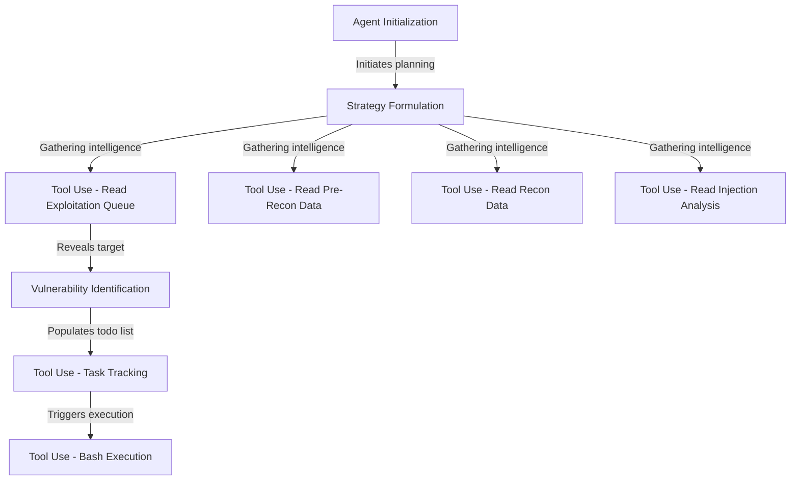

# Tutorial: shannon

This project functions as an **autonomous cybersecurity agent** designed to simulate cyber attacks for security testing. It systematically gathers intelligence from various data sources, formulates a *strategy*, and actively executes commands (such as **SQL injection** payloads) to identify and verify vulnerabilities like an *ethical hacker* would.

**Source Repository:** [https://github.com/KeygraphHQ/shannon](https://github.com/KeygraphHQ/shannon)

## Chapters

1. [Agent Initialization](01_agent_initialization.md)
2. [Strategy Formulation](02_strategy_formulation.md)
3. [Tool Use - Read Exploitation Queue](03_tool_use___read_exploitation_queue.md)
4. [Tool Use - Read Pre-Recon Data](04_tool_use___read_pre_recon_data.md)
5. [Tool Use - Read Recon Data](05_tool_use___read_recon_data.md)
6. [Tool Use - Read Injection Analysis](06_tool_use___read_injection_analysis.md)
7. [Vulnerability Identification](07_vulnerability_identification.md)
8. [Tool Use - Task Tracking](08_tool_use___task_tracking.md)
9. [Tool Use - Bash Execution](09_tool_use___bash_execution.md)

---

Generated by [Code IQ](https://github.com/adityasoni99/Code-IQ)