# Chapter 1: The Coordinator (CLI)

Welcome to the first chapter of the **Squad** tutorial! Before we meet the AI agents that will help you write code, we need to build the house they will live in.

In this chapter, we will explore **The Coordinator**.

## What is The Coordinator?

Imagine you are hiring a team of experts to work in an office. You have the experts (AI agents), but you also need a **Property Manager**. This manager doesn't do the actual work—they don't code or write documentation—but they:
1.  **Build the office** (set up folders).
2.  **Renovate the building** (upgrade files).
3.  **Assign desks** to specific workers (like the `@copilot` agent).
4.  **Move the office** to a new location (export/import).

In technical terms, The Coordinator is the **Command Line Interface (CLI)** tool. It is the engine that sets up the environment where your AI agents reside.

### The Core Use Case: Setting Up Your Team
The most common problem the Coordinator solves is **Initialization**. You have a coding project, and you want to bring in an AI team. How do you start?

You don't need to manually create a dozen text files. You just ask the Coordinator to do it.

#### Step 1: Initialize
To set up your team, you run the default command in your terminal:

```bash
# This creates the .ai-team folder and necessary files
npx github:bradygaster/squad
```

#### Step 2: What Happened?
The Coordinator created a directory called `.ai-team/` in your project. This is the "physical" office. Inside, it placed the "Charters" (job descriptions) and "Memory" (logs) that the AI needs to function.

## Key Concepts

Let's break down the main jobs the Coordinator performs.

### 1. Initialization (`init`)
This is the "Big Bang" for your AI team. It checks if a team already exists. If not, it copies a set of templates into your project. It creates the stage for the actors.

### 2. Upgrade (`upgrade`)
Software changes fast. When the Squad project releases a new version with better prompts or new features, you run the upgrade command.

**Crucial Detail:** The Coordinator is smart. It acts like a careful renovator. It updates the *structure* (templates) but **never** touches the *memory* (history) or decisions your team has made.

```bash
# Updates templates, keeps your team's memory safe
npx squad upgrade
```

### 3. Copilot Management (`copilot`)
GitHub Copilot is a powerful AI, but sometimes you need to give it a specific role. The Coordinator can officially "hire" Copilot onto the squad, adding it to the team roster and giving it special instructions.

```bash
# Adds @copilot to the team roster
npx squad copilot
```

### 4. Export & Import
If you want to move your AI team to a different project, or back them up, the Coordinator acts like a moving company. It packs up everything—skills, history, and roles—into a single JSON file.

## How It Works: Under the Hood

To understand how the Coordinator works, let's look at a simple flow. The Coordinator is essentially a traffic controller and a file copier.

Here is what happens when you run `squad init`:

```mermaid
sequenceDiagram
    participant User
    participant CLI as The Coordinator
    participant FS as File System
    participant Tmpl as Templates

    User->>CLI: Run "npx squad"
    CLI->>FS: Does ".ai-team/" exist?
    
    alt Team Exists
        FS-->>CLI: Yes
        CLI-->>User: Do nothing (safe!)
    else No Team
        FS-->>CLI: No
        CLI->>Tmpl: Read standard roles & charters
        CLI->>FS: Create .ai-team/ directory
        CLI->>FS: Copy files into .ai-team/
        CLI-->>User: "Squad is ready!"
    end
```



### Internal Implementation

The Coordinator is written in Node.js. It's a script that reads your command and performs file system operations (`fs`).

Let's look at the actual code (simplified) to see how it routes your requests.

#### 1. The Entry Point
The script starts by looking at `process.argv` (the arguments you typed in the terminal) to decide which "Manager" hat to wear.

```javascript
// index.js (Simplified)
const cmd = process.argv[2]; // Get the command user typed

if (cmd === 'upgrade') {
  // Run the renovation logic
  console.log('Upgrading Squad...');
} else if (cmd === 'copilot') {
  // Run the hiring logic
  console.log('Managing Copilot...');
} else {
  // Default: Build the office (Init)
  console.log('Initializing Squad...');
}
```
*This simple `if/else` block is the brain of the Coordinator. It directs traffic based on what you want to do.*

#### 2. The Builder (Copying Files)
When initializing, the Coordinator uses a recursive copy function. This ensures that every sub-folder (like `agents/` or `skills/`) is copied correctly.

```javascript
// A helper to copy folders recursively
function copyRecursive(src, target) {
  if (fs.statSync(src).isDirectory()) {
    fs.mkdirSync(target, { recursive: true });
    // Loop through every file in the template folder
    for (const entry of fs.readdirSync(src)) {
      copyRecursive(path.join(src, entry), path.join(target, entry));
    }
  } else {
    // It's a file, just copy it
    fs.copyFileSync(src, target);
  }
}
```
*This function walks through the template folder provided by the Squad package and replicates it exactly inside your project.*

#### 3. Managing the Roster (Copilot)
When you run `squad copilot`, the Coordinator edits the `team.md` file. This is like writing a name on the company directory in the lobby.

```javascript
// Adding Copilot to the team roster
if (cmd === 'copilot') {
  const teamMd = path.join(process.cwd(), '.ai-team', 'team.md');
  let content = fs.readFileSync(teamMd, 'utf8');
  
  // Append the Copilot section to the file
  const copilotSection = `\n## Coding Agent\n| @copilot | Coding Agent | ... |`;
  
  fs.writeFileSync(teamMd, content + copilotSection);
  console.log('Added @copilot to the roster');
}
```
*It reads the file, adds the specific text block defining Copilot's role, and saves it back. Now the other agents know Copilot is part of the team.*

## Conclusion

The Coordinator (CLI) is the foundation of the Squad project. It ensures that the **structure** exists so that the **intelligence** has a place to live. It handles the messy work of creating folders, moving files, and upgrading templates so you don't have to.

Now that our "office" is built (`.ai-team/`), it's time to meet the workers who will live there.

In the next chapter, we will look at the **Agents** themselves—who they are, what they do, and how their jobs are defined.

[Next Chapter: The Agent Model (Cast & Charters)](02_the_agent_model__cast___charters_.md)

---

Generated by [Code IQ](https://github.com/adityasoni99/Code-IQ)