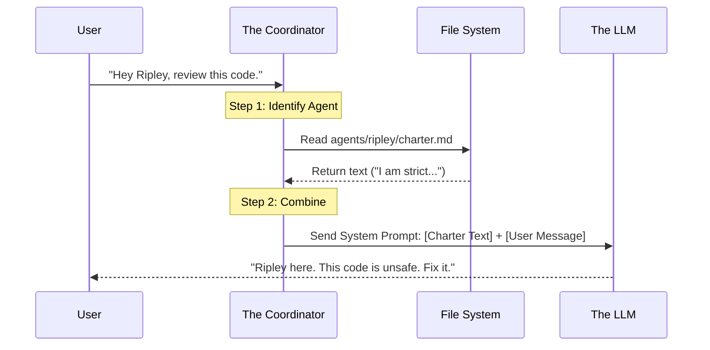

# Chapter 2: The Agent Model (Cast & Charters)

In the previous chapter, [The Coordinator (CLI)](01_the_coordinator__cli_.md), we built the "office" (`.ai-team/`) where our digital employees will live. Now, it's time to meet the employees themselves.

## The Problem: The "Amnesiac" Chatbot

If you have used ChatGPT or standard Copilot, you know the drill:
1. You start a chat.
2. You tell it: *"Act as a senior Python developer who hates spaghetti code."*
3. It writes good code.
4. You close the window.
5. **Poof.** The persona is gone.

Next time, you have to explain everything again.

## The Solution: Agents as Files

In **Squad**, an "Agent" is **not** a temporary chat session. An Agent is a persistent set of text files.

Think of it like a **Role-Playing Game (RPG)** character sheet, or an **HR Personnel File**.
*   **The Roster** (`team.md`) tells us who works here.
*   **The Charter** (`charter.md`) tells us who they *are*.

Because these are just files inside your Git repository, your team is **portable**. If you push your code to GitHub and your friend clones it, they get the exact same team, with the exact same personalities and roles.

## Key Concept 1: The Casting System (Universes)

When you first ran `squad init`, you might have noticed your agents have specific names (like *Ripley*, *Dallas*, *Kane*).

Squad uses a **Casting System**. It doesn't just call them "Agent 1" and "Agent 2." It picks a fictional universe (like *Alien*, *Ocean's Eleven*, or *The Usual Suspects*) to name your team.

**Why?**
It is much easier to remember that *"Ripley is the strict Team Lead"* than *"Agent A is the lead."* These names act as persistent handles for the AI.

## Key Concept 2: The Roster (`team.md`)

Inside your `.ai-team/` folder, there is a file called `team.md`. This is the company directory.

It lists every active agent and their high-level role.

```markdown
<!-- .ai-team/team.md -->
# Team Roster

## Members
| Name    | Role         | Status    |
|---------|--------------|-----------|
| Ripley  | Team Lead    | ✅ Active |
| Dallas  | Frontend Dev | ✅ Active |
| Kane    | Backend Dev  | ✅ Active |
| Lambert | Tester       | ✅ Active |
```
*This file tells the Coordinator who is available to work.*

## Key Concept 3: The Charter (`charter.md`)

This is the most important file. Every agent has their own folder (e.g., `.ai-team/agents/ripley/`). Inside is `charter.md`.

This file defines the agent's **Prompt Persona**. It tells the AI how to behave.

```markdown
<!-- .ai-team/agents/ripley/charter.md -->
# Ripley — Team Lead

## Identity
- **Expertise:** System architecture, code review.
- **Style:** Strict, safety-first, no-nonsense.

## Boundaries
**I handle:** High-level decisions and final reviews.
**I don't handle:** Writing CSS or database queries directly.

## Voice
"Opinionated about safety. Will push back if tests are skipped. 
Prefers clarity over cleverness."
```

### Why this matters
When you talk to Ripley, Squad reads this file. Because the charter says she is "Strict" and "Safety-first," she won't just write code blindly—she might critique your lack of error handling.

**You can edit this!** If you want Ripley to be nicer, you literally open this text file, change "Strict" to "Encouraging," and save it. You have just "retrained" your agent.

## Use Case: Customizing Your Team

Let's say your project requires a specific coding style. You don't want to type "Use TypeScript strict mode" in every single chat message.

Instead, you edit the charter.

### Step 1: Open the Charter
Open `.ai-team/agents/dallas/charter.md` (your Frontend dev).

### Step 2: Add a Rule
Add your preference under "How I Work".

```markdown
## How I Work

- Always use functional components.
- **ALWAYS** use TypeScript strict mode.
- Prefer Tailwind CSS over standard CSS.
```

### Step 3: Save
That's it. Now, every time Dallas writes code for you—today, tomorrow, or next month—he will follow these rules. You have permanently onboarded him.

## How It Works: Under the Hood

When you send a message to an agent, the Coordinator acts like a director handing a script to an actor.



### Internal Implementation

The code behind this is a simple text injection system.

#### 1. Loading the Agent
The Coordinator looks up the agent by name and reads their specific markdown file.

```javascript
// Simplified logic for loading an agent
function loadAgentCharter(agentName) {
  // Construct path: .ai-team/agents/ripley/charter.md
  const charterPath = path.join('.ai-team', 'agents', agentName, 'charter.md');
  
  // Read the file content
  const charterText = fs.readFileSync(charterPath, 'utf8');
  return charterText;
}
```
*It simply grabs the text you wrote in the file.*

#### 2. Constructing the Prompt
This is where the magic happens. The text from the file becomes the "System Prompt" (the hidden instructions given to the AI).

```javascript
// Creating the message for the AI
async function talkToAgent(agentName, userMessage) {
  const charter = loadAgentCharter(agentName);

  const messages = [
    { role: "system", content: charter }, // The identity
    { role: "user", content: userMessage } // Your request
  ];

  // Send to Copilot/LLM
  return await sendToLLM(messages);
}
```
*By injecting the `charter` as the `system` message, the AI "becomes" that person for the duration of the request.*

## Summary

In this chapter, we learned:
1.  **Agents are Files:** They aren't magic ghosts; they are folders and text files in `.ai-team/`.
2.  **Team Roster:** `team.md` lists who is hired.
3.  **Charters:** `charter.md` defines personality and rules.
4.  **Portability:** Because they are files, they live in Git with your code.

Now we have a team with names and personalities. But a team that can't remember what they did yesterday isn't very useful.

In the next chapter, we will learn how Squad gives these agents **Memory**.

[Next Chapter: The Memory Layer (History & Decisions)](03_the_memory_layer__history___decisions_.md)

---

Generated by [Code IQ](https://github.com/adityasoni99/Code-IQ)