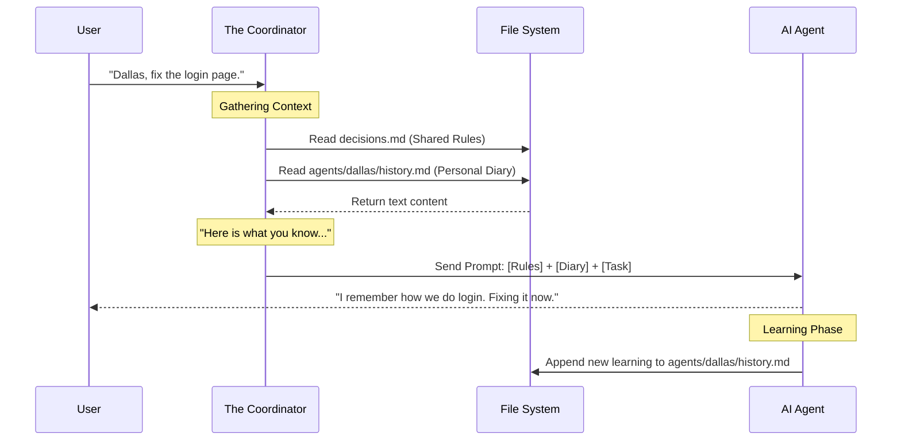

# Chapter 3: The Memory Layer (History & Decisions)

In the previous chapter, [The Agent Model (Cast & Charters)](02_the_agent_model__cast___charters_.md), we hired our team. We gave them names (like Ripley and Dallas) and personalities (Charters).

But currently, our team has a major flaw: **They have amnesia.**

Every time you start a new session, they forget everything they did yesterday. In this chapter, we will fix that by exploring the **Memory Layer**.

## The Problem: "Wait, what stack are we using?"

Imagine hiring a developer. On Monday, you tell them: *"We use TypeScript, not JavaScript."* They say "Okay!" and write TypeScript.

On Tuesday, they come back and ask: *"Hey, should I use JavaScript?"*

You would be frustrated. You want your AI team to learn, remember, and get smarter over time. In **Squad**, we solve this with two types of text files that act as the team's brain.

## Key Concept 1: Shared Memory (`decisions.md`)
**The Analogy:** The Office Bulletin Board.

This file is located at `.ai-team/decisions.md`. It contains the "Laws of the Land." **Every** agent reads this file before they start working.

Use this for high-level rules that apply to everyone.

### Example Use Case
You want to enforce a coding style. Instead of repeating yourself in every prompt, you add a **Directive**.

**Input (User Action):**
You edit `.ai-team/decisions.md` or tell the leader:
> "Always use arrow functions for callbacks."

**Output (The File):**
```markdown
### 2023-10-27: directive: Use Arrow Functions
**type:** directive
**scope:** team
**summary:** Always use arrow functions for callbacks.
```

Now, when **Dallas** (Frontend) or **Kane** (Backend) writes code, they both see this rule and obey it.

## Key Concept 2: Personal Memory (`history.md`)
**The Analogy:** A Personal Work Diary.

Every agent has their own folder (e.g., `.ai-team/agents/dallas/`). Inside, there is a `history.md` file.

Use this for specific learnings that only that specific agent needs to know.

### Example Use Case
Dallas spends an hour fixing a tricky bug in a CSS button. He learned that `z-index: 99` was necessary. He records this in his diary.

**Output (`agents/dallas/history.md`):**
```markdown
### 2023-10-28: memory: Fixed CSS Button Z-Index
**type:** memory
**summary:** The primary button gets hidden by the navbar unless z-index is 99.
```

Next time you ask Dallas to fix the button, he reads his diary, remembers the `z-index` issue, and fixes it instantly. **Kane** (the database guy) doesn't read this file because he doesn't care about CSS.

## The Format: Squad Entry Markdown (SEM)

You might notice the memory entries look structured. This format is called **SEM**. It is designed to be readable by humans but easy for the AI to scan quickly.

It usually consists of:
1.  **Header:** Date and Title.
2.  **Metadata:** Type (Decision/Memory) and Scope.
3.  **Details:** The actual content.

## How It Works: Under the Hood

When you ask an agent to do a task, the Coordinator acts like a librarian gathering books before the agent starts reading.

1.  **Fetch the Rules:** It grabs the Shared Memory (`decisions.md`).
2.  **Fetch the Experience:** It grabs the Agent's Personal Memory (`history.md`).
3.  **Combine:** It sticks them together and sends them to the AI.

Here is the flow:



### Internal Implementation

Let's look at the simplified code that makes this happen. It is essentially file concatenation.

#### 1. Gathering the Context
Before the AI answers, we build the "System Prompt" by reading files.

```javascript
// Function to prepare the AI's brain
function buildContext(agentName) {
  // 1. Get the shared team rules
  const decisions = fs.readFileSync('.ai-team/decisions.md', 'utf8');

  // 2. Get the specific agent's diary
  const historyPath = path.join('.ai-team', 'agents', agentName, 'history.md');
  const history = fs.readFileSync(historyPath, 'utf8');

  // 3. Combine them
  return `TEAM RULES:\n${decisions}\n\nYOUR MEMORY:\n${history}`;
}
```
*We simply load two text files and paste them together. This string is then sent to the AI as "Context."*

#### 2. Writing to Memory
After the agent finishes a task, it generates a summary of what it learned. We append this to the file.

```javascript
// Function to save a new memory
function saveMemory(agentName, newEntry) {
  const historyPath = path.join('.ai-team', 'agents', agentName, 'history.md');
  
  // Append to the bottom of the file
  fs.appendFileSync(historyPath, '\n' + newEntry);
  
  console.log(`Saved memory for ${agentName}`);
}
```
*By using `appendFileSync`, we ensure we never overwrite the past. The history file just grows longer, like a logbook.*

## The "Inbox" Pattern

You might wonder: *What if two agents try to write a decision at the same time?*

To prevent conflicts, Squad uses an **Inbox** system (`.ai-team/decisions/inbox/`).
1.  Agents write new ideas to small, temporary files in the inbox.
2.  A special process (often the "Scribe" agent) reads the inbox, cleans it up, and merges it into the main `decisions.md` file.

This keeps the main memory file clean and organized.

## Summary

In this chapter, we gave our team a brain.

1.  **Shared Memory (`decisions.md`):** The bulletin board for team-wide rules.
2.  **Personal Memory (`history.md`):** The diary for individual agent experience.
3.  **Context Injection:** The Coordinator reads these files *before* every task so the agent knows what to do.

Now your agents have personalities (Chapter 2) and memories (Chapter 3). But they still don't know *how* to do specific technical tasks, like deploying to AWS or running a database migration.

For that, they need **Skills**.

[Next Chapter: The Skills System](04_the_skills_system.md)

---

Generated by [Code IQ](https://github.com/adityasoni99/Code-IQ)