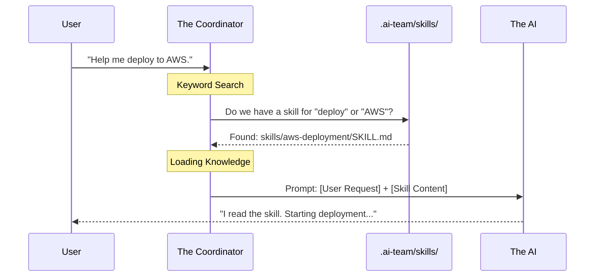

# Chapter 4: The Skills System

In the previous chapter, [The Memory Layer (History & Decisions)](03_the_memory_layer__history___decisions_.md), we gave our agents a memory. They can remember what happened yesterday ("I fixed the login bug") and the rules of the team ("Always use TypeScript").

However, there is a difference between **remembering an event** and **knowing a skill**.

## The Problem: "How do I do that again?"

Imagine **Kane**, our Backend Developer agent. Last week, he spent 3 hours figuring out the complex command to deploy your app to AWS.

If you ask him to deploy again today, he might search his `history.md` (his diary) and find a messy log of trial and error. Or worse, he might try to figure it out from scratch again.

You don't want a diary of mistakes. You want a **Instruction Manual**.

## The Solution: Skills as "Merit Badges"

In **Squad**, a **Skill** is a specific file that teaches an agent *how* to perform a specific task.

Think of them like **Merit Badges** in the Scouts or a **Recipe in a Cookbook**.
*   **History (`history.md`):** A chronological diary. ("I cooked lasagna on Tuesday.")
*   **Skill (`SKILL.md`):** A reusable recipe. ("Here is the exact recipe for lasagna.")

When an agent learns a new trick, they write a Skill file. The next time *any* agent needs to do that task, they read the file and instantly become an expert.

## Key Concept 1: The Skill Library

Skills live in their own directory inside your team folder:

```text
.ai-team/
└── skills/
    ├── aws-deployment/
    │   └── SKILL.md
    └── run-database-migrations/
        └── SKILL.md
```

Each folder represents one specific capability. Because they are files, you can copy-paste a skill from one project to another!

## Key Concept 2: The Skill File Structure

Let's look at what is inside a skill file. It uses a mix of metadata (frontmatter) and instructions.

```markdown
<!-- .ai-team/skills/aws-deployment/SKILL.md -->
---
name: "AWS Deployment"
confidence: "high"
---

## The Procedure
1. Install the CLI: `pip install awscli`
2. Login: `aws configure`
3. Deploy: `aws s3 sync ./dist s3://my-bucket`

## Common Errors
- If you get "Access Denied", check the IAM user policy.
```

### The Confidence Level
Notice the `confidence: "high"` line?
*   **Low:** The agent just figured this out once. It might be flaky.
*   **High:** This has been used many times successfully. It is a trusted standard.

## Use Case: Teaching the Team

Let's say you have a specific way you want unit tests to be run. You don't want to explain it every time.

### Step 1: Create the Skill
You (or the agent) creates a file at `.ai-team/skills/run-tests/SKILL.md`.

```markdown
---
name: "Run Unit Tests"
description: "How to run the test suite locally"
---

## Command
Run `npm test -- --watch`

## Pattern
- ALWAYS write a failing test first (Red-Green-Refactor).
- Mock database calls using `jest.mock`.
```

### Step 2: The Magic
The next time you say: *"Ripley, run the tests,"* the Coordinator sees the keyword "tests." It loads this file and feeds it to Ripley. She instantly knows to use `jest.mock` without being told.

## How It Works: Under the Hood

When you talk to an agent, the system acts like a Librarian looking for relevant books.



### Internal Implementation

The Coordinator scans the `skills` directory. Let's look at how the code (simplified from `index.js`) discovers these capabilities during an export or run.

#### 1. Discovering Skills
The system iterates through the folders in `.ai-team/skills/` to see what badges the team has earned.

```javascript
// Reading the library of skills
const skillsDir = path.join(dest, '.ai-team', 'skills');
const skills = [];

// Loop through every folder in /skills
for (const entry of fs.readdirSync(skillsDir)) {
  // Find the SKILL.md file inside
  const skillFile = path.join(skillsDir, entry, 'SKILL.md');
  
  if (fs.existsSync(skillFile)) {
    // Read the content to send to the Agent later
    skills.push(fs.readFileSync(skillFile, 'utf8'));
  }
}
```
*This loop builds a library of knowledge that is ready to be injected into the AI's context window whenever needed.*

#### 2. Skill-Aware Routing
While the full routing logic happens inside the AI provider (like Copilot), the Coordinator prepares the data. It checks if an agent has a "Skill Match."

If you ask for "Deployment," and the **DevOps Agent** has a high-confidence skill for it, the Coordinator knows that agent is the best person for the job.

## Conclusion

The Skills System turns your AI team from temporary helpers into **experts**.
1.  **History** records the past.
2.  **Skills** define the future capabilities.
3.  **Confidence** ensures the team trusts proven methods over guesses.

At this point, your team has:
*   **Roles** (Chapter 2)
*   **Memories** (Chapter 3)
*   **Skills** (Chapter 4)

However, there is still one major limitation: **They are trapped in a box.** They can write code and tell you what to do, but they can't actually *click the deploy button* or *check your Jira ticket*.

In the next chapter, we will give them hands and eyes to interact with the outside world.

[Next Chapter: External Integration (MCP & Workflows)](05_external_integration__mcp___workflows_.md)

---

Generated by [Code IQ](https://github.com/adityasoni99/Code-IQ)