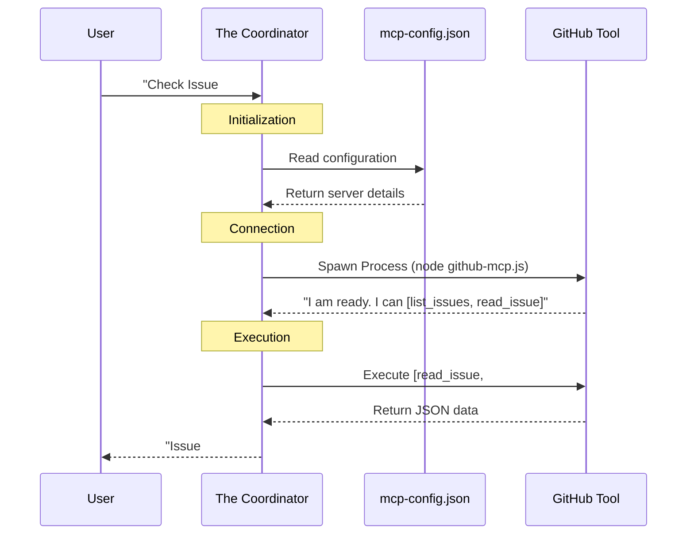

# Chapter 5: External Integration (MCP & Workflows)

In the previous chapter, [The Skills System](04_the_skills_system.md), we taught our agents *how* to do things by giving them "Skill Books" (like how to deploy code or run tests).

However, there is still a big problem: our agents are **"Brains in a Jar."**

They are very smart, but they are locked inside a text file. They cannot see your Trello board, they cannot check your live GitHub Issues, and they cannot hear you unless you open a chat window.

In this chapter, we will give the agents:
1.  **Hands & Eyes (MCP):** To reach out and grab data from external tools.
2.  **Ears (Workflows):** To listen for events and react automatically, even when you are asleep.

## The Problem: "Copy-Paste Fatigue"

Without integration, working with AI feels like this:
1.  You go to GitHub and see Issue #42.
2.  You copy the text.
3.  You paste it into the chat: *"Hey Agent, fix this..."*
4.  The agent writes code.
5.  You copy the code and paste it into a file.

This is tedious. We want the agent to just **see** Issue #42 and **fix** it directly.

## Key Concept 1: The "Hands" (MCP)

**MCP** stands for **Model Context Protocol**. Think of it like a **Universal USB Port** for AI.

Before MCP, if you wanted an AI to talk to Trello, you had to write complex custom code. With MCP, you just "plug in" the Trello server, and suddenly your agent knows how to read cards and move lists.

### Configuration: `mcp-config.json`

To give your squad hands, you create a configuration file. This tells the Coordinator which tools are allowed.

This file lives at `.copilot/mcp-config.json` (or `.vscode/settings.json`).

```json
{
  "mcpServers": {
    "github": {
      "command": "node",
      "args": ["path/to/github-mcp.js"],
      "env": {
        "GITHUB_TOKEN": "$GITHUB_TOKEN"
      }
    }
  }
}
```

**What is happening here?**
1.  We define a server named `github`.
2.  We tell the system where the script is (`github-mcp.js`).
3.  We pass a security token (`GITHUB_TOKEN`) so the agent has permission to log in.

### The Result
Once this file exists, you can say:
> *"Squad, look at the open issues on GitHub and summarize them."*

The agent effectively "plugs in" to GitHub, fetches the live data, and reads it. You didn't have to copy-paste anything.

## Key Concept 2: The "Ears" (Workflows)

MCP allows the agent to reach out, but **GitHub Workflows** allow the outside world to poke the agent.

Imagine a **Receptionist** at your office. When a client walks in (a new Issue is created), the receptionist calls the correct agent on the phone. You don't need to be there for this to happen.

### The Triage Workflow

Squad comes with a template called `squad-triage.yml`. It is a GitHub Action that runs every time a specific event happens in your repository.

```yaml
name: Squad Triage
on:
  issues:
    types: [labeled] # Listen for labels

jobs:
  triage:
    if: github.event.label.name == 'squad' # Only if label is 'squad'
    runs-on: ubuntu-latest
    steps:
      - uses: actions/checkout@v4
      - name: Wake up the Team
        uses: actions/github-script@v7
        # Script follows...
```

**What is happening here?**
1.  **Event:** Someone applies the label `squad` to an issue.
2.  **Trigger:** GitHub wakes up the workflow.
3.  **Action:** The workflow runs a script that reads your Team Roster (Chapter 2) and assigns the right agent.

## Use Case: Automating Your Backlog

Let's combine these concepts into a real-world flow.

1.  **You** create a bug report: "Login page CSS is broken."
2.  **You** add the label `squad`.
3.  **Workflow (Ears)** activates. It reads the issue text.
4.  **Workflow** sees the word "CSS" and checks the roster.
5.  **Workflow** assigns **Dallas** (Frontend Agent).
6.  **Dallas (Hands)** uses MCP to read the full issue details and starts working (conceptually).

## How It Works: Under the Hood

Let's look at how the **MCP** connection is established when you start a chat.



### Internal Implementation: Reading MCP Config

The Coordinator needs to safely read your configuration to know what tools are available. It parses the JSON and checks for errors.

```javascript
// Simplified from test/mcp-config.test.js logic
function loadMcpConfig(dir) {
  const configPath = path.join(dir, '.copilot', 'mcp-config.json');
  
  if (!fs.existsSync(configPath)) {
    return {}; // No tools configured
  }

  // Read and parse the JSON file
  const content = fs.readFileSync(configPath, 'utf8');
  return JSON.parse(content);
}
```

*This simple function is the gateway. If the file exists, the Coordinator loads the definitions. If not, the agents work in "offline" mode.*

### Internal Implementation: The Workflow Logic

The `squad-triage.yml` workflow actually runs a piece of JavaScript directly on GitHub servers. It acts as a bridge between the "Event" and your "Team Roster."

Here is a simplified view of how the workflow reads your team:

```javascript
// Simplified from templates/workflows/squad-triage.yml
const teamFile = '.ai-team/team.md';
const content = fs.readFileSync(teamFile, 'utf8');

// Look for the Frontend role
if (issueBody.includes('css') || issueBody.includes('ui')) {
    // Find the member with "Frontend" role in the text
    const member = findMemberByRole(content, 'Frontend');
    
    // Apply the label to assign them
    github.issues.addLabels({
        issue_number: context.issue.number,
        labels: [`squad:${member.name}`]
    });
}
```

**Explanation:**
1.  **Read:** It opens the `team.md` file (which is just text in your repo!).
2.  **Analyze:** It checks if the issue is about "CSS".
3.  **Route:** It looks for who holds the "Frontend" title in the text file.
4.  **Assign:** It tells GitHub to tag that specific agent.

## Conclusion

In this chapter, we connected our agents to the outside world.

1.  **MCP (Hands):** Allows agents to pull data from tools like GitHub, Trello, or Databases via a config file.
2.  **Workflows (Ears):** Allows the system to react to events (like new issues) and automatically assign work.

Now your agents are connected and aware. But when a new issue arrives, **who exactly should work on it?** Should the "Frontend" agent take it, or the "Team Lead"? How do we handle complex requests that require multiple agents?

In the final chapter, we will explore the logic of distributing work.

[Next Chapter: Work Routing & Triage](06_work_routing___triage.md)

---

Generated by [Code IQ](https://github.com/adityasoni99/Code-IQ)