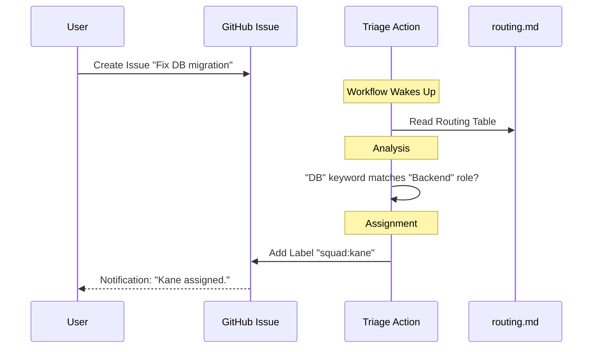

# Chapter 6: Work Routing & Triage

In the previous chapter, [External Integration (MCP & Workflows)](05_external_integration__mcp___workflows_.md), we gave our agents "hands" to use tools and "ears" to listen for GitHub events.

Now we have a team that is ready to work. But when a new task arrives—say, a bug report about a database error—who should handle it? Should the Frontend agent look at it? Probably not.

In this final chapter, we will explore **Work Routing & Triage**. This is the brain that directs traffic, ensuring the right expert handles the right job.

## The Problem: The "Reply All" Chaos

Imagine you email a team of 5 people saying, "The website is down!"

Two things usually happen:
1.  **Everyone responds:** They step on each other's toes.
2.  **No one responds:** Everyone assumes someone else is handling it.

We need a **Dispatcher**. We need a system that looks at the work, identifies the topic (e.g., "Database"), and hands it to the specific specialist (e.g., "Kane").

## The Solution: The Routing Table

In **Squad**, routing isn't magic; it is a simple set of rules defined in a file called `routing.md`.

Think of this file as a **Mailroom Sorting Guide**. It tells the Coordinator exactly where to send specific types of files or requests.

## Key Concept 1: The Routing Strategies

The Coordinator decides who works on what using three simple strategies, in this specific order:

### 1. Named Routing (Explicit)
This is when you point your finger at a specific agent.
> **You:** "Dallas, fix the button color."
> **System:** Routes directly to **Dallas**.

### 2. Domain Routing (Pattern Matching)
This is based on file paths. If a task involves a specific folder, the owner of that folder gets the job.
> **You:** "Fix the bug in `src/api/user.ts`."
> **System:** Sees `src/api/`, looks up the owner (Backend), and routes to **Kane**.

### 3. Skill-Aware Routing (Capability)
If the system can't match a file path, it looks at the **Skills** (from [The Skills System](04_the_skills_system.md)).
> **You:** "Deploy this to AWS."
> **System:** Sees that **Ripley** has the `aws-deployment` skill badge and routes to her.

## Key Concept 2: The Routing Table (`routing.md`)

This file lives at `.ai-team/routing.md`. It is the source of truth for **Domain Routing**.

```markdown
<!-- .ai-team/routing.md -->
## Routing Table

| Pattern | Owner | Reason |
|---------|-------|--------|
| `src/frontend/**` | Frontend | UI components |
| `src/backend/**`  | Backend  | Server logic |
| `*.test.js`       | Tester   | Test files |
| `docs/**`         | DevRel   | Documentation |
```

If you add a file to `src/frontend/`, the system automatically knows this is a job for the **Frontend** agent (Dallas).

## Key Concept 3: GitHub Labels as Nametags

How does the agent know they have been picked? Squad uses **GitHub Labels**.

When a routing decision is made, the system applies a label to the Issue:
*   `squad:dallas`
*   `squad:kane`

The agents watch for their own names. If Dallas sees a label `squad:dallas`, he wakes up. If he sees `squad:kane`, he ignores it.

## Use Case: Creating a New Rule

Let's say you just hired a new agent named **Ash** to handle all security work. You want any file named `auth.ts` to go to him.

### Step 1: Open the Routing File
Open `.ai-team/routing.md`.

### Step 2: Add the Rule
Add a new row to the table.

```markdown
| `**/auth.ts` | Security | Login logic |
```

### Step 3: The Result
The next time a user opens a GitHub Issue saying "There is a bug in `auth.ts`," the Coordinator will:
1.  Read the table.
2.  Match `auth.ts` to the **Security** role.
3.  Check the Roster (`team.md`) to see that **Ash** is the Security agent.
4.  Apply the label `squad:ash`.

## How It Works: Under the Hood

When a new Issue is created, the GitHub Workflow we set up in Chapter 5 acts as the Dispatcher.



### Internal Implementation

The routing logic is a script running inside the GitHub Action. It parses text to find the best match.

Let's look at a simplified version of how the script decides on a role based on keywords.

#### 1. Analyze the Text
The script looks at the body of your issue for keywords that match roles in `team.md` or patterns in `routing.md`.

```javascript
// Simplified logic inside squad-triage.yml
const issueText = context.payload.issue.body.toLowerCase();

// Simple keyword matching for roles
if (issueText.includes('css') || issueText.includes('ui')) {
  assignRole('Frontend'); 
} else if (issueText.includes('database') || issueText.includes('api')) {
  assignRole('Backend');
} else {
  assignRole('Lead'); // Fallback to the boss
}
```
*This `if/else` block acts as the first line of defense. It looks for obvious clues about where the work belongs.*

#### 2. Applying the Label
Once a role is identified (e.g., "Frontend"), we need to find the specific agent's name and tag them.

```javascript
// Find the agent name from the role
const agent = teamRoster.find(member => member.role === 'Frontend');

// Apply the label to the GitHub Issue
await github.rest.issues.addLabels({
  issue_number: issue.number,
  labels: [`squad:${agent.name.toLowerCase()}`]
});
```
*The `addLabels` function effectively "pages" the agent. This label triggers the specific agent to start their work loop using the tools from Chapter 5.*

## The "Fallback" to Lead

What if the routing table has no match? What if the issue just says "Something is weird"?

The logic includes a **Fallback**. If no specific rule matches, the work is routed to the **Team Lead** (Ripley).

Ripley's job isn't to fix the code, but to **Triange**:
1.  She reads the issue.
2.  She decides who should fix it.
3.  She re-assigns the label manually (e.g., changes `squad:ripley` to `squad:dallas`).

This mimics a real engineering manager distributing work.

## Conclusion

Congratulations! You have completed the **Squad** tutorial.

You have built a fully functional AI software team:
1.  **The Office:** Created with the CLI ([Chapter 1](01_the_coordinator__cli_.md)).
2.  **The Team:** Hired with Rosters and Charters ([Chapter 2](02_the_agent_model__cast___charters_.md)).
3.  **The Brain:** Given context with Memory ([Chapter 3](03_the_memory_layer__history___decisions_.md)).
4.  **The Expertise:** Taught via Skills ([Chapter 4](04_the_skills_system.md)).
5.  **The Hands:** Connected to tools via MCP ([Chapter 5](05_external_integration__mcp___workflows_.md)).
6.  **The Manager:** Organized via Routing (Chapter 6).

Your Squad is now ready to code. They will listen for issues, route them to the right expert, read the documentation, remember past decisions, and submit Pull Requests.

Go forth and build! 🚀

---

Generated by [Code IQ](https://github.com/adityasoni99/Code-IQ)