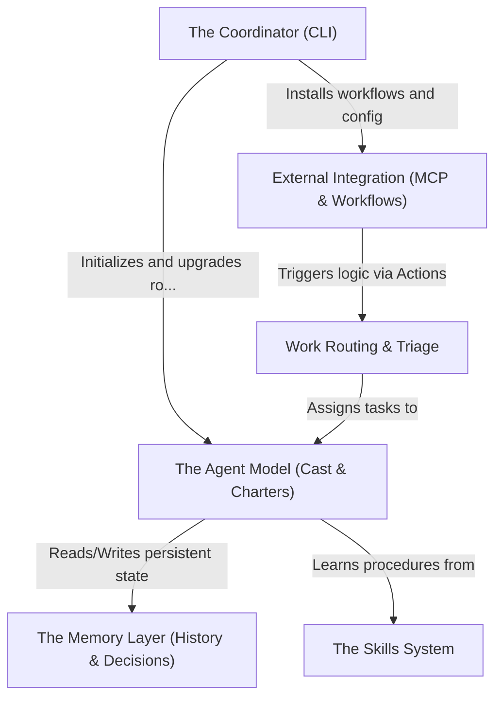

# Tutorial: squad

Squad transforms ephemeral AI chats into a **persistent, file-based development team** living directly in your repository. It manages **AI agents** with specific roles (like Frontend or Tester) that possess long-term memory and distinct personalities, allowing them to collaborate on code, follow shared rules, and autonomously handle **GitHub Issues** through automated workflows.

**Source Repository:** [https://github.com/bradygaster/squad](https://github.com/bradygaster/squad)

## Chapters

1. [The Coordinator (CLI)](01_the_coordinator__cli_.md)
2. [The Agent Model (Cast & Charters)](02_the_agent_model__cast___charters_.md)
3. [The Memory Layer (History & Decisions)](03_the_memory_layer__history___decisions_.md)
4. [The Skills System](04_the_skills_system.md)
5. [External Integration (MCP & Workflows)](05_external_integration__mcp___workflows_.md)
6. [Work Routing & Triage](06_work_routing___triage.md)

---

Generated by [Code IQ](https://github.com/adityasoni99/Code-IQ)