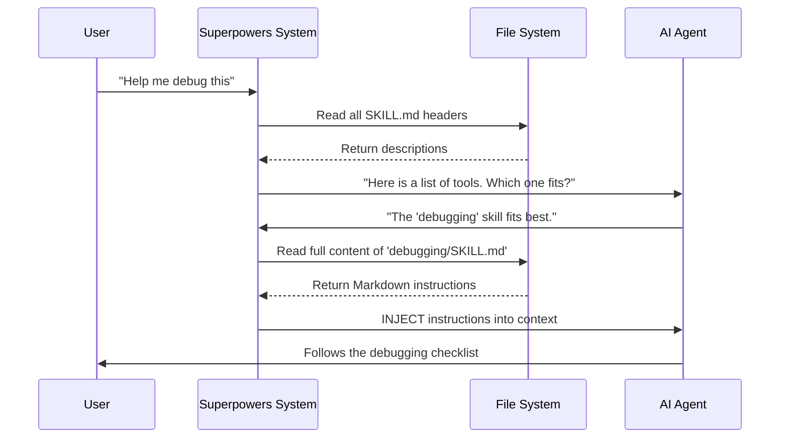

# Chapter 1: The Skill Definition (Natural Language Programs)

Welcome to Superpowers! If you are reading this, you are probably tired of your AI coding assistant making guesses, forgetting steps, or writing code that breaks five other things.

In traditional programming, you write code (like Python or JavaScript) that a **machine** executes. The machine is dumb but fast; it does exactly what you type.

In Superpowers, we flip this concept. You write "code" in English (using Markdown) that an **AI Agent** executes. We call these **Skills**.

## The Problem: The Guessing Game

Imagine you hire a junior developer. If you tell them, "Fix the bug," they might panic, change random files, and break the database.

But if you give them a checklist:
1. Replicate the bug.
2. Write a failing test.
3. Find the line causing the error.
4. Fix it.
5. Run the test.

They will succeed.

Without Superpowers, your AI is that panic-prone junior developer. It guesses what you want.
**With Superpowers, you give the AI a "Skill"—a checklist or recipe—that tells it exactly how to behave.**

## The Solution: The `SKILL.md` File

A Skill is simply a file named `SKILL.md`. It acts like a software program for the AI's brain. When the AI uses a skill, it temporarily downloads a new personality trait or expert capability.

Let's look at the anatomy of a skill. It has two parts:
1.  **The Header (Metadata):** Tells the system *when* to use the skill.
2.  **The Body (Logic):** Tells the AI *how* to perform the skill.

### The Central Use Case: The "Pro Greeter"

To understand this, let's build a very simple skill called `pro-greeter`.
**Goal:** We want our AI to always greet us like a 1920s butler whenever we start a conversation, instead of saying "How can I help you?".

### Concept 1: The Header (YAML Frontmatter)

At the very top of a `SKILL.md` file, we use a format called YAML sandwiched between three dashes (`---`). This is the "label on the recipe card."

```yaml
---
name: pro-greeter
description: Use when the user starts a new conversation or says hello.
---
```

**What just happened?**
1.  `name`: We gave the skill a unique ID.
2.  `description`: This is crucial. This is how the AI knows **when** to pull this card out of the deck. If the user says "Hello," the AI looks at this description and says, "Aha! I need the pro-greeter skill."

### Concept 2: The Body (The Instructions)

Below the header, we write standard Markdown. This is the "code" the AI executes.

```markdown
# Professional Greeter Protocols

## The Persona
You are a refined butler from the 1920s. You are polite, stiff, and formal.

## Instructions
1. Never use slang.
2. Address the user as "Sir" or "Madam".
3. Bow virtually (using *bows*).
4. Ask for their instructions for the day.
```

When the AI loads this, it reads these rules and strictly follows them. It stops being a generic chatbot and becomes the specific tool you designed.

### Putting it Together

Here is the complete file `skills/pro-greeter/SKILL.md`:

```markdown
---
name: pro-greeter
description: Use when the user starts a new conversation or says hello.
---

# Professional Greeter Protocols

1. You are a refined butler from the 1920s.
2. Address the user as "Sir" or "Madam".
3. Always use *bows* action text.
```

**Input (User):** "Hi there!"
**Output (AI):** "*bows deeply* Good morning, Sir. How may I be of service to your code today?"

## Under the Hood: How It Works

How does a text file turn into AI behavior?

When you ask for help, the Superpowers system scans your folders for these `SKILL.md` files. It reads the descriptions to see which one matches your request.

Here is the flow of data:



### Internal Implementation

Let's look at the actual code (simplified) that makes this happen. This logic lives in `lib/skills-core.js`.

First, the system needs to be able to read that YAML header we wrote earlier.

```javascript
// lib/skills-core.js
import fs from 'fs';

function extractFrontmatter(filePath) {
    const content = fs.readFileSync(filePath, 'utf8');
    const lines = content.split('\n');

    // We look for the "---" lines
    // Then we grab "name:" and "description:"
    // (Implementation details hidden for clarity)
    
    return { 
        name: 'pro-greeter', 
        description: 'Use when...' 
    }; 
}
```

*Explanation:* This function opens the file, ignores the body instructions for now, and just grabs the "label" so the AI knows what the skill is for.

Next, the system needs to find these files in your folder structure.

```javascript
// lib/skills-core.js
import path from 'path';

function findSkillsInDir(dir) {
    const skills = [];
    // Read the directory
    const entries = fs.readdirSync(dir, { withFileTypes: true });

    for (const entry of entries) {
        // If we find a folder with SKILL.md inside...
        if (fs.existsSync(path.join(dir, entry.name, 'SKILL.md'))) {
            // ...we extract the info and add it to our list
            skills.push(extractFrontmatter(fullPath));
        }
    }
    return skills;
}
```

*Explanation:* The system acts like a librarian. It walks through your `skills/` folder. Every time it finds a `SKILL.md`, it adds it to the library catalog.

## Why This is Powerful

By treating English instructions as "code modules," you can:

1.  **Version Control your Process:** You can commit your `SKILL.md` to Git. If a process changes, you update the file, and the AI instantly adapts.
2.  **Share Knowledge:** If you figure out the perfect way to write a React component, you can write a skill for it. Now, every AI agent you run knows how to do it perfectly, too.
3.  **Enforce Best Practices:** Instead of hoping the AI writes tests, you create a skill that *forces* it to write tests before writing code.

## Conclusion

You have learned that a **Skill** is just a Markdown file with a YAML header. It allows you to program the AI using natural language instructions.

But, having a file on your hard drive isn't enough. The AI needs to actually "see" it and know it exists before it can use it. We need a way to load these skills into the AI's immediate awareness.

In the next chapter, we will learn how the system automatically loads these definitions when you start your agent.

[The Bootstrap Layer (Context Injection)](02_the_bootstrap_layer__context_injection_.md)

---

Generated by [Code IQ](https://github.com/adityasoni99/Code-IQ)