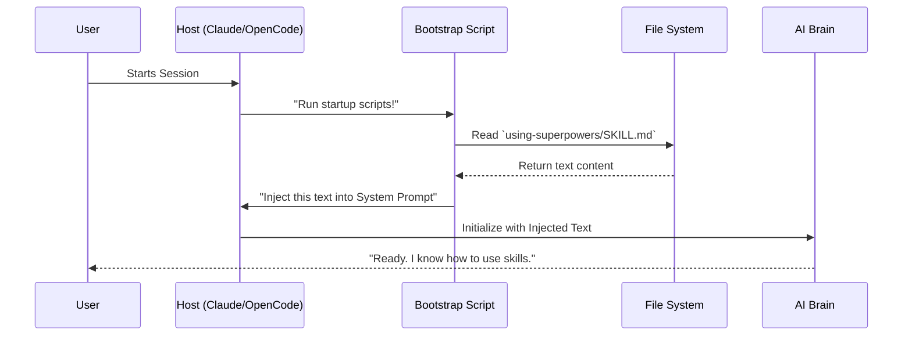

# Chapter 2: The Bootstrap Layer (Context Injection)

In [Chapter 1: The Skill Definition (Natural Language Programs)](01_the_skill_definition__natural_language_programs_.md), we learned that a **Skill** is just a Markdown file that gives the AI a specific procedure to follow.

But here is the catch: **A file sitting on your hard drive does nothing by itself.**

If you start a session with Claude Code or OpenCode and immediately ask it to "debug this," it won't know that you have a meticulously crafted `debugging/SKILL.md` file waiting for it. It will just revert to its default behavior and guess.

We need a way to force the AI to "wake up" knowing that it has superpowers. We need to install an Operating System before we run the apps.

## The Problem: The Amnesiac Agent

Every time you start a new chat session with an AI, it is born yesterday. It has no memory of your files, your preferences, or your rules.

Without a Bootstrap Layer, your conversation would look like this:

1.  **You:** "Start session."
2.  **You:** "Please read `skills/using-superpowers/SKILL.md` and follow it. Also, please look at my `skills` folder to see what tools I have."
3.  **AI:** "Okay, I have read them. Now, how can I help?"
4.  **You:** "Fix the bug."

That setup step is tedious. We want to automate it so the AI wakes up already knowing the rules.

## The Solution: The "Matrix" Download

Think of the scene in *The Matrix* where the operator uploads a combat training program directly into Neo's brain. Neo wakes up, blinks, and says, *"I know Kung Fu."*

This is exactly what the **Bootstrap Layer** does.

1.  **The Hook:** A script runs automatically when the agent starts.
2.  **The Payload:** It reads a special skill called `using-superpowers`.
3.  **The Injection:** It inserts those instructions silently into the AI's "System Prompt" (its subconscious definition of who it is).

## Central Use Case: The "Using-Superpowers" Skill

The specific file we inject is `skills/using-superpowers/SKILL.md`. This is the "Master Skill" or the "God Skill."

It doesn't tell the AI how to write code. **It tells the AI how to use the other skills.**

Here is a simplified version of what's inside that file:

```markdown
<EXTREMELY-IMPORTANT>
You have access to a library of "Skills".
Before you answer the user, you MUST check if a Skill applies.
If the user says "Fix bug", look for a "debugging" skill.
Do not guess. Use the tools.
</EXTREMELY-IMPORTANT>
```

By injecting this text at the very start, the AI enters the chat ready to work.

## Concept 1: The Hook (The Doorman)

Different AI environments (Claude Code, OpenCode, Codex) have different ways of letting us run code at startup. We call these **Hooks**.

A Hook is just a script that the environment runs before it lets the user type.

### Example: The Bash Hook (Claude Code)

In Claude Code (and similar command-line tools), we use a bash script located at `hooks/session-start.sh`.

Imagine this logic:

```bash
#!/bin/bash

# 1. Find the Master Skill file
SKILL_FILE="skills/using-superpowers/SKILL.md"

# 2. Read the text inside it
CONTENT=$(cat $SKILL_FILE)

# 3. Print it out in a format the Agent understands
# (We pretend to be the system handing over data)
echo "Here is your starting context: $CONTENT"
```

*Explanation:* When you type `claude`, this script runs instantly. It grabs the text from your hard drive and prepares it for the agent.

## Concept 2: Context Injection

"Context" is the AI's short-term memory. "Injection" means putting text there that the user didn't type.

Usually, the Context looks like this:
1.  **System:** "You are a helpful assistant."
2.  **User:** "Hi."

After we use the Bootstrap Layer, the Context looks like this:
1.  **System:** "You are a helpful assistant. <EXTREMELY_IMPORTANT> You have Superpowers. You must look for skills... [Content of SKILL.md] ... </EXTREMELY_IMPORTANT>"
2.  **User:** "Hi."

The AI now "thinks" these instructions are part of its core personality.

## Under the Hood: Implementation Walkthrough

Let's see how this works step-by-step using a diagram.



### The Code Implementation

Let's look at real examples of how this is done in the Superpowers project.

#### 1. The OpenCode Plugin (JavaScript)

OpenCode allows us to write plugins in JavaScript. We use a "transform" to edit the system prompt.

*File: `.opencode/plugins/superpowers.js` (Simplified)*

```javascript
// We need to read files from the disk
import fs from 'fs';

// This function runs every time the AI prepares to speak
export const SuperpowersPlugin = async () => {
  return {
    'experimental.chat.system.transform': async (input, output) => {
      
      // 1. Read the Master Skill from the disk
      const skill = fs.readFileSync('skills/using-superpowers/SKILL.md', 'utf8');

      // 2. Push it into the AI's system prompt list
      output.system.push(`<IMPORTANT>You have superpowers: ${skill}</IMPORTANT>`);
    }
  };
};
```

**Explanation:**
1.  We define a plugin that taps into the `chat.system.transform` event.
2.  We read the `SKILL.md` file using standard JavaScript file reading (`fs`).
3.  We append that text to the `output.system` array. Now, OpenCode sends this text to the LLM (Large Language Model) automatically.

#### 2. The Command Line Hook (Bash)

For environments that just run shell scripts (like Claude Code's `CLAUDE_HOOKS`), we output JSON data that the tool reads.

*File: `hooks/session-start.sh` (Simplified)*

```bash
#!/usr/bin/env bash

# 1. Read the file content
CONTENT=$(cat skills/using-superpowers/SKILL.md)

# 2. Output a JSON object that the Host tool expects
# This tells the tool: "Add this text to the conversation context"
cat <<EOF
{
  "hookSpecificOutput": {
    "additionalContext": "<EXTREMELY_IMPORTANT> ${CONTENT} </EXTREMELY_IMPORTANT>"
  }
}
EOF
```

**Explanation:**
1.  `cat` reads the file.
2.  The script prints JSON to the standard output (stdout).
3.  The Host tool (Claude Code) captures this output, parses the JSON, and sees `additionalContext`. It takes that text and silently feeds it to the AI.

## Why "using-superpowers" is Special

You might wonder: *Why don't we inject ALL the skills at startup?*

If you have 50 skills, that is too much text. The AI's brain (context window) will get cluttered, and it will get expensive.

Instead, we only inject **One Skill to Rule Them All**: `using-superpowers`.

*   **The Problem:** The AI doesn't know skills exist.
*   **The Fix:** Inject `using-superpowers`.
*   **The Result:** The AI now knows: "I should check the `skills/` folder to see if I have a tool for this job."

It is a pointer system. We inject the *instruction on how to find tools*, not the tools themselves.

## Conclusion

The Bootstrap Layer is the invisible hand that sets up the environment. By using Hooks and Context Injection, we ensure the AI is disciplined and aware of its capabilities from the very first second.

You don't need to explain the rules to the AI anymore. The Bootstrap Layer does it for you.

Now that the AI knows it *has* skills and knows it *should* look for them, how does it actually find the specific one it needs?

[Skill Discovery & Core Library](03_skill_discovery___core_library.md)

---

Generated by [Code IQ](https://github.com/adityasoni99/Code-IQ)